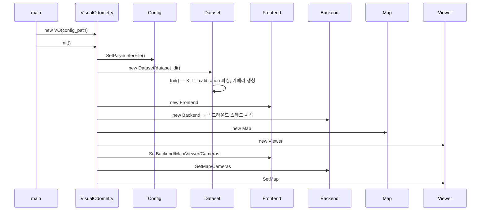
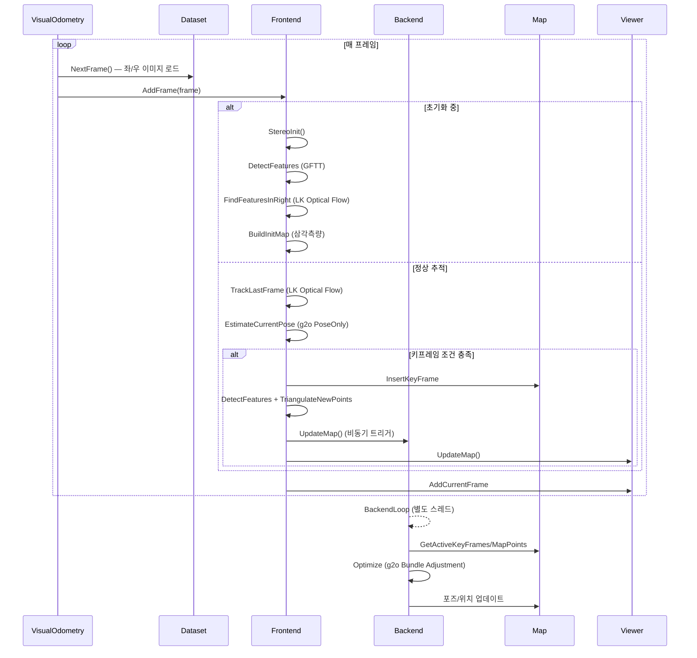
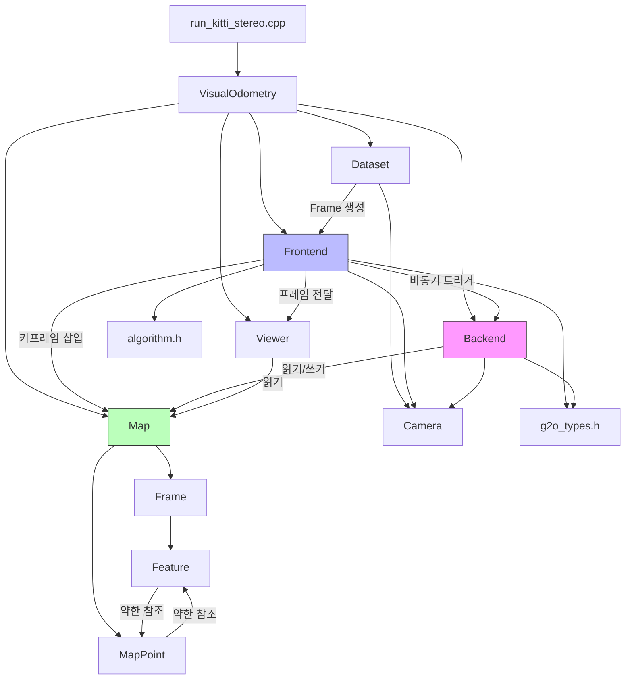

# Slambook2 전체 분석

## Phase 1: 프로젝트 개요

### 프로젝트 목적

"视觉SLAM十四讲：从理论到实践 (Visual SLAM: From Theory to Practice)" 2판 교재의 예제 코드 저장소다.
시각적 동시 위치추정 및 지도작성(Visual SLAM)의 수학적 이론을 C++로 단계별 구현하며,
Gauss-Newton 최적화부터 완전한 스테레오 비전 SLAM 시스템까지 점진적으로 다룬다.

### 기술 스택

| 구분 | 내용 |
|------|------|
| 언어 | C++11/14 |
| 빌드 | CMake |
| 선형대수 | Eigen3 |
| 컴퓨터 비전 | OpenCV 3.1+ |
| Lie 군 | Sophus (SE3, SO3) |
| 비선형 최적화 | g2o (graph-based), Ceres Solver |
| 시각화 | Pangolin |
| 루프 클로저/어휘 트리 | DBoW3 |
| 덴스 매핑 | Octomap |
| 단위 테스트 | GoogleTest |
| 로깅 | glog, gflags |

### 디렉토리 구조

```
slambook2/
├── 3rdparty/           # 서드파티 라이브러리 (서브모듈)
│   ├── ceres-solver/   # Ceres 비선형 최적화
│   ├── DBoW3/          # 이진 어휘 트리 (루프 클로저)
│   ├── g2o/            # 그래프 최적화
│   ├── googletest/     # 단위 테스트
│   ├── Pangolin/       # OpenGL 시각화
│   └── Sophus/         # Lie 군 구현
├── ch2/                # CMake & C++ 기초
├── ch3/                # Eigen 행렬, SO3/SE3 기하학
├── ch4/                # Sophus를 이용한 Lie 군/대수
├── ch5/                # 카메라 모델, OpenCV 기초, 스테레오/RGB-D
├── ch6/                # 비선형 최적화 (Gauss-Newton, g2o, Ceres)
├── ch7/                # 특징점법 VO (ORB, PnP, ICP, 삼각측량)
├── ch8/                # 직접법 VO (광류, 직접법)
├── ch9/                # 백엔드 최적화 (Bundle Adjustment)
├── ch10/               # 포즈 그래프 최적화
├── ch11/               # 루프 클로저 검출 (DBoW3)
├── ch12/               # 덴스 맵핑 (단안, RGB-D, Surfel)
├── ch13/               # 완전한 SLAM 시스템 (myslam)
│   ├── app/            # 실행 진입점
│   ├── config/         # YAML 설정
│   ├── include/myslam/ # 헤더 파일
│   ├── src/            # 소스 구현
│   └── test/           # 단위 테스트
├── figures/            # 책 표지 이미지
├── errata.tex/.pdf     # 정오표
└── README.md
```

### 아키텍처 패턴

- **교육적 점진 구조**: 각 챕터가 이전 챕터의 개념 위에 구축됨
- **Factory Method 패턴**: `Frame::CreateFrame()`, `MapPoint::CreateNewMappoint()`
- **Observer/Callback 패턴**: Frontend → Backend 비동기 트리거
- **Active Map 윈도우**: 슬라이딩 윈도우 방식으로 최근 N개 키프레임만 최적화
- **Producer-Consumer 패턴**: Frontend(생산) ↔ Backend(소비) 멀티스레드 구조

---

## Phase 2: 진입점 및 실행 흐름

### 진입점

`ch13/app/run_kitti_stereo.cpp` — 완성된 SLAM 시스템의 유일한 실행 진입점

```cpp
int main(int argc, char **argv) {
    google::ParseCommandLineFlags(&argc, &argv, true);
    myslam::VisualOdometry::Ptr vo(new myslam::VisualOdometry(FLAGS_config_file));
    assert(vo->Init() == true);
    vo->Run();
    return 0;
}
```

### 주요 유스케이스 1: SLAM 시스템 초기화



### 주요 유스케이스 2: 프레임 처리 (Tracking)



---

## Phase 3: 핵심 모듈 심층 분석

### ch13/src/visual_odometry.cpp

**책임**: VO 시스템의 최상위 오케스트레이터 — 컴포넌트 초기화 및 메인 루프 제어

**주요 인터페이스**:
- `Init()` — Config 읽기, Dataset/Frontend/Backend/Map/Viewer 생성 및 연결
- `Run()` — `Step()`을 반복 호출하는 무한 루프
- `Step()` — 단일 프레임 진행 (NextFrame → AddFrame)

### ch13/src/frontend.cpp (393줄, 최대 파일)

**책임**: 프레임별 포즈 추정, 특징점 추출/추적, 키프레임 관리

**상태 머신**:
```
INITING → TRACKING_GOOD ↔ TRACKING_BAD → LOST → Reset → INITING
```

**핵심 알고리즘**:
1. **특징 검출**: OpenCV `GFTTDetector` (Good Features To Track)
2. **특징 추적**: `cv::calcOpticalFlowPyrLK` (Lucas-Kanade 광류)
3. **포즈 추정**: g2o `EdgeProjectionPoseOnly` — 3D-2D 재투영 오차 최소화
4. **삼각측량**: SVD 기반 선형 삼각측량 (`algorithm.h::triangulation`)

**키프레임 결정 기준**: `tracking_inliers_ < num_features_needed_for_keyframe_ (80)`

### ch13/src/backend.cpp (180줄)

**책임**: 별도 스레드에서 슬라이딩 윈도우 Bundle Adjustment 수행

**핵심 알고리즘 (Bundle Adjustment)**:
1. 활성 키프레임을 `VertexPose` (SE3, 6-DOF)로 추가
2. 활성 맵 포인트를 `VertexXYZ` (3D, 3-DOF)로 추가
3. `EdgeProjectionPoseOnly` 또는 `EdgeProjection` (좌/우 카메라)으로 재투영 엣지 추가
4. Huber Robust Kernel (chi2 임계값 5.991) 적용
5. Levenberg-Marquardt 알고리즘으로 10회 반복 최적화
6. outlier 엣지 제거 후 결과를 Map에 반영

### ch13/include/myslam/g2o_types.h (156줄)

**책임**: g2o 최적화를 위한 커스텀 정점(vertex) 및 엣지(edge) 정의

| 클래스 | 종류 | 설명 |
|--------|------|------|
| `VertexPose` | BaseVertex<6, SE3> | 카메라 포즈 (Lie 군 섭동) |
| `VertexXYZ` | BaseVertex<3, Vec3> | 3D 맵 포인트 |
| `EdgeProjectionPoseOnly` | BaseUnaryEdge<2, Vec2, VertexPose> | 포즈만 최적화 |
| `EdgeProjection` | BaseBinaryEdge<2, Vec2, VertexPose, VertexXYZ> | 포즈+포인트 공동 최적화 |

### ch13/include/myslam/map.h

**책임**: 전체 및 활성 키프레임/맵포인트 저장소 관리

**Active Window 전략**: 최근 7개 키프레임(`num_active_keyframes_`)만 활성화, 이전 프레임은 비활성화

### ch9/common.h, rotation.h

**책임**: ch9 Bundle Adjustment 독립 구현 — BAL 데이터셋 파일 포맷 파서 및 SO3 회전 유틸리티

---

## Phase 4: 모듈 관계도



**주의**: `Feature` ↔ `MapPoint` 사이의 순환 참조는 `std::weak_ptr`로 안전하게 처리됨.

---

## Phase 5: 상태 관리 및 데이터 흐름

### 전역 상태

| 컴포넌트 | 상태 | 보호 수단 |
|----------|------|----------|
| `Map::landmarks_` | 전체 맵 포인트 | `std::mutex data_mutex_` |
| `Map::keyframes_` | 전체 키프레임 | `std::mutex data_mutex_` |
| `Frame::pose_` | 프레임 포즈 (SE3) | `std::mutex pose_mutex_` |
| `MapPoint::pos_` | 3D 위치 | `std::mutex data_mutex_` |
| `Backend::backend_running_` | 스레드 제어 | `std::atomic<bool>` |

### 데이터 흐름

```
KITTI 데이터셋 (이미지 파일)
    ↓ Dataset::NextFrame()
Frame (left_img_, right_img_)
    ↓ Frontend::AddFrame()
Feature 추출/추적
    ↓ EstimateCurrentPose()
Frame::pose_ (SE3) 업데이트
    ↓ [키프레임 조건]
Map 삽입 → Backend::UpdateMap() 신호
    ↓ [별도 스레드]
g2o BA 최적화
    ↓
Map의 포즈/포인트 갱신
    ↓ Viewer
Pangolin 3D 시각화
```

### 스레드 구조

- **메인 스레드**: Dataset 읽기 → Frontend 처리 → Viewer 업데이트
- **Backend 스레드**: `std::condition_variable`로 대기, 키프레임 삽입 시 깨어남
- **Viewer 스레드**: Pangolin OpenGL 렌더링 루프

---

## Phase 6: 설정 및 환경

### 주요 설정 (`ch13/config/default.yaml`)

```yaml
dataset_dir: /path/to/KITTI/sequences/05   # KITTI 시퀀스 경로
camera.fx: 517.3                            # 카메라 초점거리 x
camera.fy: 516.5                            # 카메라 초점거리 y
camera.cx: 325.1                            # 주점 x
camera.cy: 249.7                            # 주점 y
num_features: 150                           # 최대 특징점 수
num_features_init: 50                       # 초기화용 최소 특징점
num_features_tracking: 50                   # 추적 유지 기준
```

### 빌드 방법

```bash
cd ch13
mkdir build && cd build
cmake ..
make -j4
./bin/run_kitti_stereo --config_file ../config/default.yaml
```

### 의존성 (ch13 기준)

```
Eigen3, OpenCV 3.1+, Pangolin, Sophus, g2o, glog, gtest, gflags, CSparse
```

---

## Phase 7: 코드 품질 관찰

### 잘된 점

1. **점진적 교육 설계**: 챕터마다 하나의 개념에 집중. ch6의 가우스-뉴턴 수작업 구현 → ch9의 g2o Bundle Adjustment로 자연스럽게 확장됨.
2. **스레드 안전성**: 공유 상태(`Map`, `Frame::pose_`, `MapPoint::pos_`)에 모두 mutex 적용. `backend_running_`은 `std::atomic<bool>` 사용.
3. **약한 참조로 순환 방지**: `Feature ↔ MapPoint` 간 `std::weak_ptr` 사용으로 메모리 누수 방지.
4. **Factory Method 패턴**: `Frame::CreateFrame()`, `MapPoint::CreateNewMappoint()`로 ID 할당을 중앙화.
5. **공통 타입 정의**: `common_include.h`에 Eigen 행렬 typedef 집중화로 코드 일관성 유지.

### 개선 가능한 점

1. **config.yaml 미완성**: `ch13/config/default.yaml`에 `camera.baseline`, `num_features_tracking_bad`, `num_features_needed_for_keyframe` 등 코드에서 사용하는 파라미터가 빠져 있음. 기본값에 의존.
2. **ch13 하드코딩된 경로**: `CMakeLists.txt`에서 Eigen 경로를 `/usr/include/eigen3`로 하드코딩 — 플랫폼 이식성 문제.
3. **Viewer 비동기 처리 부재**: Viewer가 메인 스레드에서 실행되어 rendering 지연이 tracking 성능에 영향 줄 수 있음.
4. **재초기화(Reset) 미구현**: `Frontend::Reset()`이 선언되었으나 비어 있음 — LOST 상태에서 복구 불가.
5. **`common_include.h` 비대화**: 필요 이상으로 많은 Eigen 타입 정의가 포함됨 (ch13에서는 일부만 사용).

### 복잡도가 높은 영역

| 파일 | 이유 |
|------|------|
| `ch13/src/frontend.cpp` (393줄) | 상태 머신 + 특징 추출/추적 + 포즈 추정 + 키프레임 관리가 혼재 |
| `ch13/include/myslam/g2o_types.h` (156줄) | g2o Jacobian 수작업 계산 (`linearizeOplus`) — 수식 이해 없이 읽기 어려움 |
| `ch12/dense_mono/dense_mapping.cpp` (487줄) | Epipolar Search + NCC 정합 + 깊이 융합이 단일 파일에 집중 |
| `ch9/rotation.h` (158줄) | Rodrigues, Quaternion, AngleAxis 간 수작업 변환 — Sophus 없이 직접 구현 |

### 잠재적 이슈

1. **성능**: Frontend와 Backend가 `Map`의 `active_keyframes_`를 공유하면서 mutex lock 경합이 발생할 수 있음.
2. **메모리**: `Map::landmarks_`가 무제한 성장 — 장기 실행 시 `CleanMap()`이 충분히 호출되지 않으면 메모리 증가.
3. **ch9 데이터**: BAL 데이터셋 형식 파서(`common.cpp`, 283줄)가 파일 오류 처리 없음.

---

## Phase 8: 빠른 참조 가이드

### 필수 파일 읽기 순서 (프로젝트 이해용)

1. [README.md](../../README.md) — 프로젝트 목적 및 책 링크
2. [ch13/include/myslam/common_include.h](../../ch13/include/myslam/common_include.h) — 전체 타입 시스템 이해
3. [ch13/include/myslam/visual_odometry.h](../../ch13/include/myslam/visual_odometry.h) — 시스템 최상위 구조
4. [ch13/include/myslam/frontend.h](../../ch13/include/myslam/frontend.h) — 핵심 추적 로직의 인터페이스
5. [ch13/src/backend.cpp](../../ch13/src/backend.cpp) — Bundle Adjustment 구현

### 핵심 용어 사전

| 용어 | 정의 |
|------|------|
| **SE3** | 3D 강체 변환 (회전+평행이동), Lie 군 |
| **SO3** | 3D 순수 회전, Lie 군 |
| **Keyframe (키프레임)** | 추적 인라이어가 충분히 줄었을 때 선택하는 참조 프레임 |
| **MapPoint (맵 포인트)** | 삼각측량으로 복원된 3D 환경 랜드마크 |
| **Bundle Adjustment (BA)** | 카메라 포즈와 3D 점을 동시에 최적화하는 방법 |
| **Active Landmarks** | 슬라이딩 윈도우 내 최근 키프레임에서 보이는 맵 포인트 |
| **Inlier** | 포즈 추정 시 재투영 오차가 임계값 이하인 특징점 |
| **LK Optical Flow** | Lucas-Kanade 피라미드 광류 — 특징점 추적에 사용 |
| **GFTT** | Good Features to Track — 코너 검출기 (Shi-Tomasi 기반) |
| **Epipolar Geometry** | 두 뷰 사이의 기하학적 제약 (기본 행렬 F, 본질 행렬 E) |

### 자주 수정되는 파일

| 목적 | 파일 |
|------|------|
| 추적 파라미터 튜닝 | [ch13/config/default.yaml](../../ch13/config/default.yaml) |
| 키프레임 결정 로직 | [ch13/src/frontend.cpp:InsertKeyframe()](../../ch13/src/frontend.cpp) |
| BA 최적화 조건 | [ch13/src/backend.cpp:Optimize()](../../ch13/src/backend.cpp) |
| 맵 윈도우 크기 | [ch13/include/myslam/map.h](../../ch13/include/myslam/map.h) (`num_active_keyframes_`) |
| g2o 엣지/정점 | [ch13/include/myslam/g2o_types.h](../../ch13/include/myslam/g2o_types.h) |

### 디버깅 팁

1. **추적 실패 시**: `tracking_inliers_` 로그 확인 → `num_features_tracking` 파라미터 조정
2. **초기화 실패 시**: `StereoInit()` 내 `BuildInitMap()` 리턴값 확인 — 초기 맵 포인트 수 부족
3. **Backend 지연 시**: `map_update_.wait()` 조건 확인 — Frontend와 Backend의 mutex 경합 가능성
4. **시각화 미표시**: Pangolin이 OpenGL 환경 요구 — SSH 원격 환경에서는 X11 포워딩 필요
5. **빌드 오류**: `cmake_modules/` 디렉토리의 `FindXXX.cmake` 파일로 라이브러리 경로 수동 지정 가능
