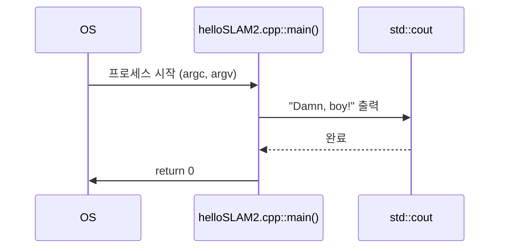
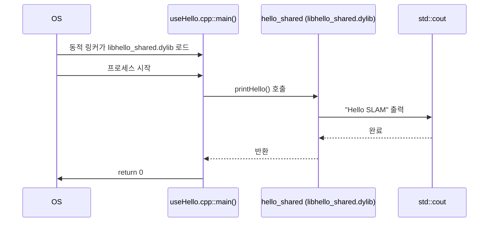
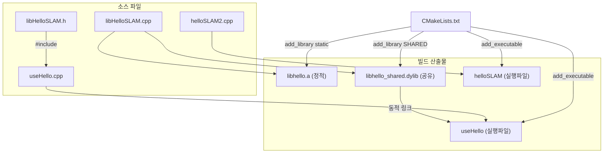

# slambook2/ch2 전체 분석

## Phase 1: 프로젝트 개요

### 프로젝트 목적

이 코드는 "视觉SLAM十四讲 (Visual SLAM: From Theory to Practice, 2nd Edition)" 교재의 **2장 예제**로, C++ 프로젝트를 CMake로 빌드하는 기초를 다룬다. 실행 파일, 정적 라이브러리, 공유 라이브러리를 CMake로 구성하고 링크하는 방법을 소개하는 Hello World 수준의 입문 예제다.

### 기술 스택

| 항목 | 내용 |
|------|------|
| 언어 | C++ (표준 iostream 사용) |
| 빌드 시스템 | CMake 2.8+ |
| 외부 의존성 | 없음 |

### 디렉토리 구조

```
ch2/
├── CMakeLists.txt       # CMake 빌드 설정
├── helloSLAM.cpp        # 단순 Hello SLAM 실행파일 소스 (원본, 빌드에서 제외됨)
├── helloSLAM2.cpp       # 수정된 Hello 실행파일 소스 (현재 빌드 대상)
├── libHelloSLAM.cpp     # 라이브러리 구현 파일
├── libHelloSLAM.h       # 라이브러리 헤더 (include guard 포함)
├── useHello.cpp         # 공유 라이브러리를 사용하는 실행파일
├── helloSLAM            # 빌드된 실행 바이너리 (helloSLAM2 기반)
├── Makefile             # CMake 생성 Makefile
├── CMakeCache.txt       # CMake 캐시
└── CMakeFiles/          # CMake 내부 빌드 파일
```

### 아키텍처 패턴

- **단일 디렉토리 단순 CMake 프로젝트**: 모든 소스가 루트에 위치
- 교재 예제 특성상 패턴 분리 없이 CMake 빌드 개념 설명에 집중

---

## Phase 2: 진입점 및 실행 흐름

### 진입점 목록

| 타겟 | 소스 | 역할 |
|------|------|------|
| `helloSLAM` | `helloSLAM2.cpp` | "Damn, boy!" 출력 후 종료 |
| `useHello` | `useHello.cpp` | `printHello()` 호출 후 종료 |

### 실행 흐름 1: `helloSLAM` 실행파일



### 실행 흐름 2: `useHello` 실행파일 (공유 라이브러리 사용)



---

## Phase 3: 핵심 모듈 심층 분석

### `libHelloSLAM.h` + `libHelloSLAM.cpp` — 예제 라이브러리

**책임**: `printHello()` 함수 하나를 선언/구현하는 예제 라이브러리

| 항목 | 내용 |
|------|------|
| Export | `void printHello()` |
| 의존성 | `<iostream>` (표준 라이브러리) |
| Include guard | `#ifndef LIBHELLOSLAM_H_` / `#define LIBHELLOSLAM_H_` |

```cpp
// libHelloSLAM.h — 인터페이스
#ifndef LIBHELLOSLAM_H_
#define LIBHELLOSLAM_H_
void printHello();
#endif

// libHelloSLAM.cpp — 구현
void printHello() {
  cout << "Hello SLAM" << endl;
}
```

### `CMakeLists.txt` — 빌드 설정

**책임**: 3종의 빌드 타겟(실행파일, 정적 라이브러리, 공유 라이브러리)을 정의하고 의존 관계 설정

```cmake
add_executable(helloSLAM helloSLAM2.cpp)          # 실행파일
add_library(hello libHelloSLAM.cpp)                # 정적 라이브러리
add_library(hello_shared SHARED libHelloSLAM.cpp)  # 공유(동적) 라이브러리
add_executable(useHello useHello.cpp)
target_link_libraries(useHello hello_shared)       # 동적 링크
set(CMAKE_BUILD_TYPE "Debug")                      # 디버그 빌드
```

---

## Phase 4: 모듈 관계도



---

## Phase 5: 상태 관리 및 데이터 흐름

- **전역 상태**: 없음 (모든 함수는 stdout 출력만 수행)
- **데이터 흐름**: 단방향, 단순 출력
- **외부 연동**: 없음 (파일 I/O, 네트워크, DB 없음)

---

## Phase 6: 설정 및 환경

### 빌드 방법

```bash
# ch2 디렉토리에서 (이미 cmake가 실행된 상태)
make

# 클린 빌드 권장
mkdir build && cd build
cmake ..
make
./helloSLAM      # "Damn, boy!" 출력
./useHello       # "Hello SLAM" 출력
```

### 주요 CMake 설정

| 변수 | 값 | 의미 |
|------|-----|------|
| `CMAKE_BUILD_TYPE` | `Debug` | 디버그 심볼 포함, 최적화 없음 |
| CMake 최소 버전 | 2.8 | 매우 낮은 요구사항 (현재 권장은 3.x) |

### 빌드 타겟 요약

| 타겟 이름 | 종류 | 소스 파일 |
|-----------|------|-----------|
| `helloSLAM` | 실행파일 | `helloSLAM2.cpp` |
| `hello` | 정적 라이브러리 (`libhello.a`) | `libHelloSLAM.cpp` |
| `hello_shared` | 공유 라이브러리 (`libhello_shared.dylib`) | `libHelloSLAM.cpp` |
| `useHello` | 실행파일 | `useHello.cpp` |

---

## Phase 7: 코드 품질 관찰

### 잘된 점

- **Include guard 사용**: `libHelloSLAM.h`에서 `#ifndef`/`#define`/`#endif` 패턴을 올바르게 적용
- **헤더/구현 분리**: `.h`와 `.cpp`를 명확하게 분리 — 교육 목적에 적합
- **정적/공유 라이브러리 비교**: 동일 소스로 두 종류의 라이브러리를 빌드하는 차이를 한 번에 보여줌

### 개선 가능한 점

- **`helloSLAM.cpp`가 빌드에서 제외된 이유 불명확**: `helloSLAM.cpp`가 주석 처리되고 `helloSLAM2.cpp`로 교체된 이유가 CMakeLists.txt 주석에만 암시됨 — 두 파일의 차이(`"Hello SLAM!"` vs `"Damn, boy!"`)가 교재에서 수정 실습을 의도한 것으로 보임
- **`using namespace std;` 전역 사용**: 교육 코드지만 실제 프로젝트에서는 네임스페이스 충돌 가능 — `std::cout` 명시 권장
- **CMake 최소 버전 2.8**: 현재 CMake 권장 버전(3.x)과 크게 차이남

### 복잡도

- **매우 낮음**: 전체 소스 33줄. 복잡한 로직 없음

### 잠재적 이슈

- 특별한 이슈 없음 (순수 교육용 최소 예제)

---

## Phase 8: 빠른 참조 가이드

### 필수 파일 읽기 순서

1. [CMakeLists.txt](../../ch2/CMakeLists.txt) — 전체 빌드 구조 파악
2. [libHelloSLAM.h](../../ch2/libHelloSLAM.h) — 라이브러리 인터페이스
3. [libHelloSLAM.cpp](../../ch2/libHelloSLAM.cpp) — 라이브러리 구현
4. [useHello.cpp](../../ch2/useHello.cpp) — 라이브러리 사용 방법
5. [helloSLAM2.cpp](../../ch2/helloSLAM2.cpp) — 단독 실행파일 예제

### 핵심 용어 사전

| 용어 | 설명 |
|------|------|
| **SLAM** | Simultaneous Localization and Mapping — 로봇/카메라가 미지의 환경에서 동시에 자신의 위치를 추정하고 지도를 작성하는 기술 |
| **정적 라이브러리** | 컴파일 시 실행파일에 포함되는 라이브러리 (`.a`) |
| **공유 라이브러리** | 런타임에 동적으로 로드되는 라이브러리 (`.so` / `.dylib`) |
| **CMake 타겟** | `add_executable` / `add_library`로 정의되는 빌드 단위 |
| **include guard** | 헤더 파일 중복 포함을 막는 `#ifndef`/`#define`/`#endif` 패턴 |

### 자주 수정되는 파일

- [CMakeLists.txt](../../ch2/CMakeLists.txt) — 새 소스 파일 추가, 타겟 추가 시
- [libHelloSLAM.cpp](../../ch2/libHelloSLAM.cpp) / [libHelloSLAM.h](../../ch2/libHelloSLAM.h) — 라이브러리 기능 수정 시

### 디버깅 팁

- **빌드 에러 시**: `make VERBOSE=1`로 컴파일러 명령어 전체 확인
- **링크 에러 (`undefined reference`)**: `target_link_libraries()`에서 올바른 라이브러리 타겟 이름 확인
- **공유 라이브러리 로드 실패 시**: `otool -L useHello` (macOS) 또는 `ldd useHello` (Linux)로 링크 경로 확인
- **CMake 캐시 문제 시**: `CMakeCache.txt` 삭제 후 cmake 재실행
