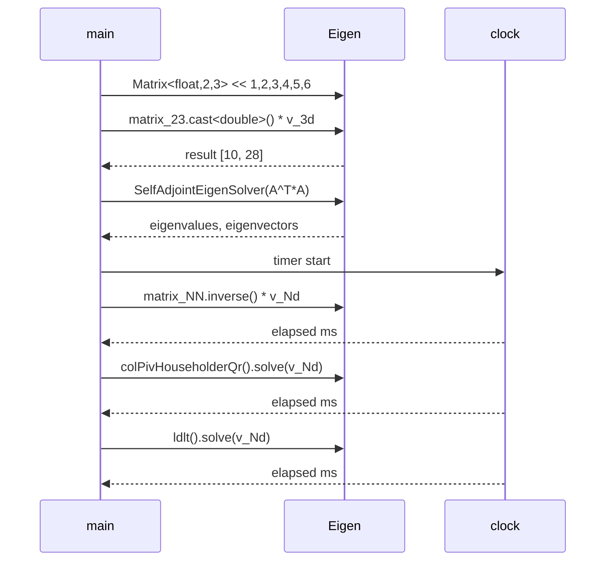
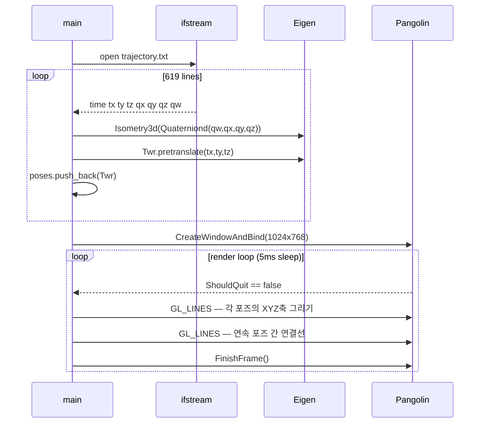
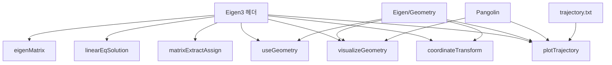

# Chapter 3 전체 분석 — 3D 회전과 좌표 변환

## Phase 1: 프로젝트 개요

### 프로젝트 목적

이 디렉토리는 **"视觉SLAM十四讲 (Introduction to Visual SLAM: From Theory to Practice)"** 교재 Chapter 3의 예제 코드 모음이다. 3D 공간에서의 회전(Rotation) 표현 방법(회전행렬, 사원수, 오일러각, 축-각도)과 선형 대수 연산(Eigen 라이브러리)을 실습하는 독립 실행형 C++ 예제들로 구성되어 있다.

### 기술 스택

| 항목 | 내용 |
|------|------|
| 언어 | C++11 |
| 빌드 | CMake 2.8+ |
| 선형대수 | Eigen 3 (header-only) |
| 시각화 | Pangolin (OpenGL 기반 SLAM 시각화 라이브러리) |

### 디렉토리 구조

```
ch3/
├── CMakeLists.txt            # 루트 빌드 설정 — 4개 서브프로젝트 등록
├── useEigen/                 # Eigen 행렬 연산 실습
│   ├── eigenMatrix.cpp       # 기본 행렬 연산 및 성능 비교
│   ├── linearEqSolution.cpp  # 다양한 선형방정식 풀이법
│   └── matrixExtractAssign.cpp # 블록 추출 및 할당
├── useGeometry/              # Eigen Geometry 모듈 — 회전 표현 변환
│   └── useGeometry.cpp
├── visualizeGeometry/        # Pangolin GUI — 회전 표현 실시간 시각화
│   └── visualizeGeometry.cpp
└── examples/                 # 응용 예제
    ├── coordinateTransform.cpp # 두 좌표계 간 점 변환
    ├── plotTrajectory.cpp      # TUM 형식 궤적 파일 시각화
    └── trajectory.txt          # 619개 포즈 데이터 (TUM RGB-D 형식)
```

### 아키텍처 패턴

각 `.cpp` 파일이 독립 `main()` 함수를 가진 **단일 실행 바이너리** 구조. 공유 라이브러리나 헤더 없이 각 예제가 완전히 독립적인 교육용 "실습 단계별 점층" 패턴.

---

## Phase 2: 진입점 및 실행 흐름

### 흐름 1: `eigenMatrix` — 행렬 연산 및 성능 벤치마크



### 흐름 2: `plotTrajectory` — 궤적 파일 로드 및 Pangolin 렌더링



---

## Phase 3: 핵심 모듈 심층 분석

### `useEigen/eigenMatrix.cpp` (116줄)

**책임**: Eigen 기본 타입 선언, 초기화, 사칙연산, 행렬 분해, 성능 비교 데모.

| 주제 | 내용 |
|------|------|
| 타입 시스템 | `Matrix<float,2,3>`, `Vector3d`, `Matrix3d`, `MatrixXd` 비교 |
| 타입 캐스팅 | `.cast<double>()` — 이종 타입 혼합 불가 시 명시 변환 |
| 행렬 연산 | transpose, sum, trace, inverse, determinant |
| 고유값 | `SelfAdjointEigenSolver` (A^T*A — 실대칭 행렬) |
| 선형방정식 | 직접 역행렬 vs QR(`colPivHouseholderQr`) vs Cholesky(`ldlt`) 속도 비교 |

**핵심**: 50×50 행렬에서 역행렬 직접 계산은 QR/LDLT 대비 수배 느림.

---

### `useEigen/linearEqSolution.cpp` (147줄)

**책임**: 3×3 선형방정식 `Ax=b`를 6가지 방법으로 풀어 결과 비교.

| 방법 | Eigen API |
|------|-----------|
| 가우스 소거 (자체 구현) | `gaussianElimination()` |
| LU (부분 피벗) | `A.partialPivLu().solve(b)` |
| LU (완전) | `A.lu().solve(b)` |
| Cholesky (LLT) | `LLT<Matrix3d>(A).solve(b)` — 양정치 행렬 전용 |
| QR (Householder) | `HouseholderQR<MatrixXd>(A).solve(b)` |
| SVD | `JacobiSVD(..., ComputeThinU|ComputeThinV).solve(b)` |
| 고유값 분해 | `EigenSolver` → `V*Λ⁻¹*V⁻¹*b` 수동 계산 |

**주목**: A를 `B^T*B + 0.1*I`로 만들어 양정치 보장 → LLT 적용 가능.

---

### `useEigen/matrixExtractAssign.cpp` (46줄)

**책임**: 큰 행렬에서 블록 추출 및 값 할당 데모.

- `bigMatrix.block<3,3>(0,0)` — 복사 추출 (원본 불변)
- `extractedBlock.setIdentity()` — 추출 블록 단위행렬 변환

---

### `useGeometry/useGeometry.cpp` (64줄)

**책임**: `Eigen/Geometry` 모듈의 회전 표현 4종 상호 변환 데모.

| 표현 | Eigen 타입 | 주요 연산 |
|------|-----------|----------|
| 축-각도 | `AngleAxisd` | `rotation_vector * v` |
| 회전행렬 | `Matrix3d` | `rotation_matrix * v` |
| 오일러각 | `Vector3d` | `eulerAngles(2,1,0)` ZYX=yaw-pitch-roll |
| 등거리변환 | `Isometry3d` | `T * v` → `R*v + t` |
| 사원수 | `Quaterniond` | `q * v` → 내부적으로 `q*v*q⁻¹` |

---

### `visualizeGeometry/visualizeGeometry.cpp` (125줄)

**책임**: Pangolin GUI로 카메라를 마우스 드래그하면 현재 pose의 R/t/오일러각/사원수를 실시간 패널에 표시.

**커스텀 구조체** (Pangolin UI 바인딩용):
- `RotationMatrix` — `Matrix3d` 래퍼, `operator<<` 오버로딩
- `TranslationVector` — `Vector3d` 래퍼
- `QuaternionDraw` — `Quaterniond` 래퍼

**핵심 루프**:
1. `s_cam.GetModelViewMatrix()` → 4×4 view matrix (column-major)
2. 행렬에서 R 추출 후 `t = -R * m_trans`로 월드 좌표 이동 복원
3. `R.eulerAngles(2,1,0)` → ZYX 오일러각
4. `Quaterniond(R)` → 사원수
5. Pangolin 변수 갱신 → 좌측 패널 자동 업데이트

---

### `examples/coordinateTransform.cpp` (23줄)

**책임**: 두 카메라 좌표계 간 점 변환 (`p2 = T2w * T1w⁻¹ * p1`).

생성자 순서 주의: `Quaterniond(w, x, y, z)`.

---

### `examples/plotTrajectory.cpp` (86줄)

**책임**: TUM RGB-D 형식 궤적 파일(619 poses)을 읽어 Pangolin으로 3D 렌더링.

**데이터 형식**: `timestamp tx ty tz qx qy qz qw`

**렌더링**: 각 포즈에 RGB 좌표축 (0.1 크기) + 연속 포즈 간 검정 연결선.

---

## Phase 4: 모듈 관계도



순환 의존 없음. 모든 의존은 외부 라이브러리 방향으로 단방향.

---

## Phase 5: 상태 관리 및 데이터 흐름

- **전역 상태 없음**: 모든 예제가 `main()` 로컬 변수 기반
- **데이터 흐름**:
  - 행렬 연산 예제: 인-메모리 → stdout
  - `visualizeGeometry`: Pangolin ModelView → Pangolin 패널 변수 → GPU 렌더링
  - `plotTrajectory`: 파일 I/O → `std::vector<Isometry3d>` → OpenGL draw calls
- **외부 연동**: `plotTrajectory`만 파일 I/O (`trajectory.txt`, TUM RGB-D 형식)

---

## Phase 6: 설정 및 환경

### 의존성 설치

```bash
# Eigen3
sudo apt-get install libeigen3-dev

# Pangolin 의존성 및 빌드
sudo apt-get install libglew-dev
git clone https://github.com/stevenlovegrove/Pangolin
cd Pangolin && mkdir build && cd build && cmake .. && make && sudo make install && ldconfig
```

### 빌드 및 실행

```bash
cd ch3 && mkdir build && cd build
cmake .. && make
./useEigen/eigenMatrix
./useGeometry/eigenGeometry
./visualizeGeometry/visualizeGeometry
./examples/coordinateTransform
./examples/plotTrajectory   # ch3/ 루트에서 실행해야 trajectory.txt 경로 정상
```

### 환경 변수

없음. `plotTrajectory.cpp`의 trajectory 파일 경로가 소스 내 하드코딩 (`"./examples/trajectory.txt"`) — 실행 위치에 주의 필요.

---

## Phase 7: 코드 품질 관찰

### 잘된 점

- **점진적 학습 구조**: eigenMatrix → linearEqSolution → useGeometry → visualizeGeometry 순으로 자연스럽게 난이도 상승
- **다양한 방법 비교**: 동일 문제(Ax=b)를 6가지 방법으로 풀어 tradeoff 직접 체감
- **실용적 데이터**: 실제 TUM RGB-D 데이터셋 형식 궤적 파일 활용
- **안전한 난수**: `std::random_device` 사용 + `srand(time(0))` 위험성 주석 설명

### 개선 가능한 점

- `plotTrajectory.cpp:9`의 하드코딩 경로 → `argv[1]`로 받으면 유연성 향상
- `gaussianElimination`의 pivot 체크 위치: 외부 루프(`k`)가 아닌 내부 루프(`i`)에서 검사 — 안정성 낮은 구현

### 잠재적 이슈

| 이슈 | 위치 | 심각도 |
|------|------|--------|
| Out-of-bounds: `poses[i+1]` 마지막 인덱스 접근 | plotTrajectory.cpp:67 | 중간 — 런타임 크래시 |
| 가우스 소거 pivot==0 시 `exit()` 강제 종료 | linearEqSolution.cpp:22 | 낮음 (교육 코드) |

---

## Phase 8: 빠른 참조 가이드

### 필수 파일 읽기 순서

1. [useEigen/eigenMatrix.cpp](../../ch3/useEigen/eigenMatrix.cpp) — Eigen 기본 타입과 연산
2. [useGeometry/useGeometry.cpp](../../ch3/useGeometry/useGeometry.cpp) — 회전 표현 4종 변환
3. [examples/coordinateTransform.cpp](../../ch3/examples/coordinateTransform.cpp) — 실전 좌표 변환 패턴
4. [visualizeGeometry/visualizeGeometry.cpp](../../ch3/visualizeGeometry/visualizeGeometry.cpp) — Pangolin GUI + 회전 실시간 확인
5. [examples/plotTrajectory.cpp](../../ch3/examples/plotTrajectory.cpp) — TUM 궤적 시각화

### 핵심 용어 사전

| 용어 | 설명 |
|------|------|
| `Isometry3d` | 4×4 강체변환 행렬. 회전+이동만 포함 |
| `AngleAxisd` | 축-각도 표현. Rodrigues 공식 기반 |
| `eulerAngles(2,1,0)` | ZYX 순서 = yaw-pitch-roll (0=X, 1=Y, 2=Z) |
| `coeffs()` | 사원수 `(x,y,z,w)` 반환 — 생성자는 `(w,x,y,z)` 순서 주의 |
| `pretranslate` | 현재 변환 앞에 이동 추가 (T = trans * T) |
| TUM 형식 | `timestamp tx ty tz qx qy qz qw` — TUM RGB-D 데이터셋 포즈 포맷 |

### 디버깅 팁

- **Eigen 타입 불일치**: 컴파일 타임 에러. `float`↔`double` 혼용 시 `.cast<double>()` 명시
- **Pangolin 가상머신 이슈**: [Pangolin Issue #74](https://github.com/stevenlovegrove/Pangolin/issues/74) — `paulinus` 언급 두 줄 주석 처리 후 재빌드
- **`plotTrajectory` 파일 못 찾음**: `ch3/` 루트에서 실행 (`./examples/trajectory.txt` 상대 경로)
- **사원수 순서 혼동**: 생성자 `Quaterniond(w,x,y,z)`, `coeffs()`는 `(x,y,z,w)` 반환
