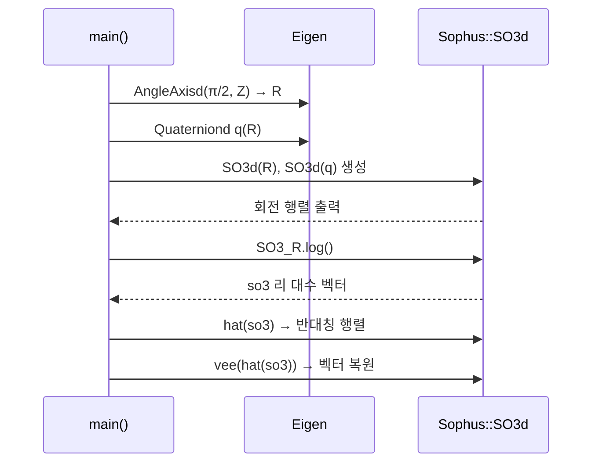
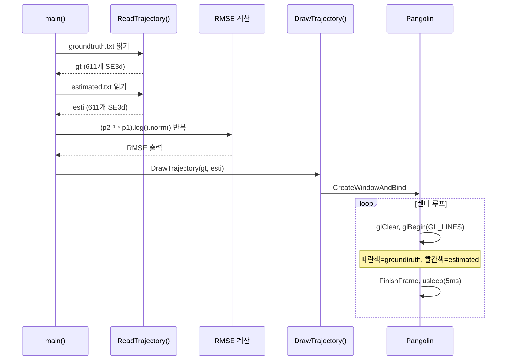
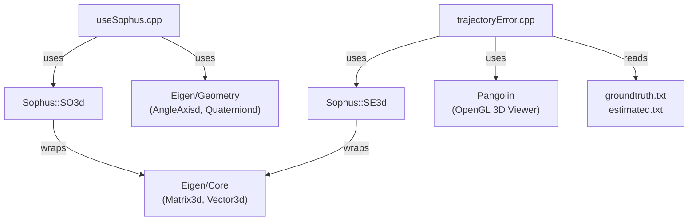

# slambook2 Chapter 4 분석: 리 군(Lie Group)과 궤적 오차

## Phase 1: 프로젝트 개요

### 프로젝트 목적

Chapter 4는 SLAM(Simultaneous Localization and Mapping) 교재 *《SLAM 14강》* (slambook2)의 실습 코드로, **리 군(Lie Group) / 리 대수(Lie Algebra)** 를 이용한 강체 변환 표현 방법과, 실제 SLAM 시스템의 **궤적 추정 오차(Trajectory Error)** 를 계산·시각화하는 두 가지 예제를 다룬다. Sophus 라이브러리를 활용해 SO(3)/SE(3) 군 연산을 실습하며, 추정 궤적과 그라운드 트루스를 Pangolin으로 3D 비교한다.

### 기술 스택

| 항목 | 내용 |
|------|------|
| 언어 | C++14 |
| 빌드 | CMake 3.0+ |
| 수학 라이브러리 | Eigen 3 (선형대수) |
| 리 군 라이브러리 | Sophus (SO3d, SE3d) |
| 시각화 | Pangolin (OpenGL 기반 3D 뷰어) |
| 데이터 | TUM RGB-D 형식 trajectory 파일 (.txt) |

### 디렉토리 구조

```
ch4/
├── CMakeLists.txt          # 최상위 빌드 설정 (useSophus 타겟 + example 서브디렉토리)
├── useSophus.cpp           # SO(3)/SE(3) 기본 연산 예제
└── example/
    ├── CMakeLists.txt      # trajectoryError 빌드 설정 (Pangolin 의존)
    ├── trajectoryError.cpp # RMSE 계산 + 3D 궤적 시각화
    ├── groundtruth.txt     # 그라운드 트루스 궤적 (611 프레임, TUM 형식)
    └── estimated.txt       # 추정 궤적 (611 프레임, TUM 형식)
```

### 아키텍처 패턴

- **독립 실행 예제 패턴**: 각 `.cpp`가 독립적인 `main()`을 가지는 단일 파일 프로그램
- **순차적 데이터 처리**: 파일 → 파싱 → 연산 → 시각화의 선형 파이프라인
- **Sophus 래퍼 패턴**: Eigen 행렬/쿼터니언 → Sophus 군 객체로 변환 후 리 대수 연산

---

## Phase 2: 진입점 및 실행 흐름

### 예제 1: `useSophus` — SO(3)/SE(3) 기본 연산

```
main()
  ├── AngleAxisd(π/2, Z축) → Matrix3d R 생성
  ├── Quaterniond q(R) 생성
  ├── Sophus::SO3d SO3_R(R), SO3_q(q) 구성
  ├── SO3_R.log() → so3 (리 대수 벡터) 추출
  ├── SO3d::hat(so3)   → 반대칭 행렬 변환
  ├── SO3d::vee(...)   → 벡터 복원
  └── 증분 섭동 update_so3 선언 (미완성)
```



### 예제 2: `trajectoryError` — 궤적 RMSE 계산 + 시각화

```
main()
  ├── ReadTrajectory("groundtruth.txt") → TrajectoryType gt
  ├── ReadTrajectory("estimated.txt")  → TrajectoryType esti
  ├── RMSE 계산 루프:
  │     error_i = ||(p2⁻¹ * p1).log()||  (SE3 상대 오차의 리 대수 노름)
  │     rmse = sqrt(Σ error_i² / N)
  └── DrawTrajectory(gt, esti)       → Pangolin 3D 시각화
```



---

## Phase 3: 핵심 모듈 심층 분석

### 3-1. `useSophus.cpp`

**책임**: Sophus 라이브러리를 이용해 SO(3) 군의 구성, 로그 사상(log map), hat/vee 연산자를 실습한다.

**핵심 알고리즘**:

| 연산 | 코드 | 수학적 의미 |
|------|------|------------|
| 군 구성 | `Sophus::SO3d SO3_R(R)` | 회전 행렬 → SO(3) 원소 |
| 로그 사상 | `SO3_R.log()` | R ∈ SO(3) → φ ∈ ℝ³ (축-각 벡터) |
| hat 연산자 | `SO3d::hat(so3)` | φ ∈ ℝ³ → φ^ ∈ so(3) (반대칭 행렬) |
| vee 연산자 | `SO3d::vee(Φ)` | φ^ ∈ so(3) → φ ∈ ℝ³ (역변환) |

**미완성 부분**: `update_so3` 섭동 모델 업데이트 로직이 선언만 되고 구현되지 않았다 (원서 코드 일부 누락).

**의존 관계**: `Eigen/Core`, `Eigen/Geometry`, `sophus/se3.hpp`

---

### 3-2. `trajectoryError.cpp`

**책임**: TUM 형식 궤적 파일을 읽어 SE(3) 공간에서 RMSE를 계산하고 Pangolin으로 시각화한다.

**주요 타입**:
```cpp
typedef vector<Sophus::SE3d, Eigen::aligned_allocator<Sophus::SE3d>> TrajectoryType;
// Eigen aligned_allocator: SE3d는 내부적으로 SIMD 정렬이 필요한 Quaterniond를 포함
```

**핵심 알고리즘 — SE(3) RMSE**:

```
error_i = ||(p2_i⁻¹ * p1_i).log()||₂

1. p2⁻¹ * p1  : 두 포즈의 상대 변환 (SE(3) 곱셈)
2. .log()      : SE(3) → se(3)로 로그 사상 → ℝ⁶ 벡터 (회전 3 + 평행이동 3)
3. .norm()     : ℝ⁶ 노름 (리만 거리 근사)
4. RMSE = sqrt(Σ error_i² / N)
```

이 방식은 단순 유클리드 거리가 아니라 **SE(3) 리만 거리**를 사용하므로, 회전 오차와 평행이동 오차를 동시에 고려한다.

**데이터 형식 (TUM RGB-D)**:
```
timestamp tx ty tz qx qy qz qw
```
611개 프레임, 타임스탬프 단위: Unix 초(µs 정밀도)

**Pangolin 시각화**:
- 파란색 선: groundtruth 궤적
- 빨간색 선: estimated 궤적
- `usleep(5000)`: 5ms 슬립 → ~200fps 렌더 루프

**의존 관계**: `pangolin/pangolin.h`, `sophus/se3.hpp`, `fstream`, `unistd.h`

---

## Phase 4: 모듈 관계도



순환 의존: 없음

---

## Phase 5: 상태 관리 및 데이터 흐름

```
[파일 I/O]
  groundtruth.txt ──┐
                    ├──► ReadTrajectory() ──► TrajectoryType (vector<SE3d>)
  estimated.txt   ──┘                              │
                                                   │
                                             [RMSE 계산]
                                          (p2⁻¹*p1).log().norm()
                                                   │
                                             [stdout 출력]
                                                   │
                                         [Pangolin 렌더 루프]
                                         (전역 상태 없음, 루프 내 지역 변수)
```

- **전역 상태**: `groundtruth_file`, `estimated_file` 두 문자열 상수만 존재
- **데이터 흐름**: 단방향 (파일 → 메모리 → 연산 → 시각화)
- **외부 I/O**: `ifstream`으로 파일 읽기, Pangolin OpenGL 창으로 출력

---

## Phase 6: 설정 및 환경

### 빌드 의존성

| 패키지 | 용도 | 설치 |
|--------|------|------|
| CMake 3.0+ | 빌드 시스템 | `apt install cmake` |
| Eigen 3 | 선형대수 | `apt install libeigen3-dev` |
| Sophus | 리 군 연산 | [github.com/strasdat/Sophus](https://github.com/strasdat/Sophus) |
| Pangolin | 3D 시각화 | [github.com/stevenlovegrove/Pangolin](https://github.com/stevenlovegrove/Pangolin) |
| fmt (선택) | Ubuntu 20.04에서 Pangolin 링킹 시 필요 | `apt install libfmt-dev` |

### 빌드 및 실행

```bash
mkdir -p ch4/build && cd ch4/build
cmake .. [-DUSE_UBUNTU_20=ON]  # Ubuntu 20.04이면 ON
make -j4

# 예제 1: Sophus 기본 연산
./useSophus

# 예제 2: 궤적 오차 (실행 위치가 ch4/ 이어야 함 — 상대경로 사용)
cd ..
./build/example/trajectoryError
```

> **주의**: `trajectoryError`는 `./example/groundtruth.txt` 상대경로를 하드코딩하므로, **ch4/ 디렉토리에서 실행**해야 한다.

---

## Phase 7: 코드 품질 관찰

### 잘된 점

1. **aligned_allocator 사용**: `vector<SE3d, Eigen::aligned_allocator<SE3d>>`로 SIMD 정렬 요구사항을 올바르게 처리
2. **SE(3) RMSE**: 단순 유클리드 거리 대신 SE(3) 리만 거리 사용 — SLAM 논문 표준과 일치
3. **assertion 활용**: 궤적 크기 불일치를 조기에 탐지

### 개선 가능한 점

1. **하드코딩된 경로**: `groundtruth_file`, `estimated_file`을 `argv`로 받으면 재사용성 향상
2. **useSophus.cpp 미완성**: `update_so3` 섭동 업데이트 예제가 구현되지 않았음 (SE3 예제도 없음)
3. **오류 처리 부재**: `ReadTrajectory`에서 파일 오픈 실패 시 `cerr`만 출력하고 빈 벡터 반환 — `main`의 `assert`에서 크래시

### 잠재적 이슈

- **RMSE 스케일 혼합**: SE(3) 로그의 ℝ⁶ 벡터는 회전(rad)과 평행이동(m)이 혼합된다. 단위 불일치로 인해 RMSE 값의 물리적 해석에 주의 필요
- **while (!fin.eof())** 패턴: 마지막 줄 후 빈 줄이 있으면 쓰레기 데이터가 한 번 더 파싱될 수 있음 (`while (fin >> time >> ...)` 패턴이 더 안전)

---

## Phase 8: 빠른 참조 가이드

### 필수 파일 읽기 순서

1. `ch4/CMakeLists.txt` — 빌드 구조 파악
2. `ch4/useSophus.cpp` — SO(3) 군 기본 연산 이해
3. `ch4/example/trajectoryError.cpp` — SE(3) RMSE 계산 핵심 로직
4. `ch4/example/groundtruth.txt` (앞 5줄) — 입력 데이터 형식 확인

### 핵심 용어 사전

| 용어 | 정의 |
|------|------|
| SO(3) | 3D 회전군. 행렬 표현: 3×3 직교행렬, det=1 |
| SE(3) | 3D 강체 변환군 (회전 + 평행이동). 4×4 동차 행렬 |
| so(3) / se(3) | SO(3)/SE(3)의 리 대수 (접선공간). ℝ³ / ℝ⁶ 벡터 |
| 로그 사상 (log map) | 군 원소 → 리 대수 벡터 변환 (역: 지수 사상 exp) |
| hat (^) | ℝ³ 벡터 → 3×3 반대칭 행렬 변환 |
| vee (∨) | 3×3 반대칭 행렬 → ℝ³ 벡터 (hat의 역) |
| RMSE | Root Mean Square Error. 추정 궤적의 평균 제곱근 오차 |
| TUM 형식 | `timestamp tx ty tz qx qy qz qw` 형식의 궤적 파일 표준 |
| TrajectoryType | `vector<SE3d, aligned_allocator<SE3d>>` typedef |

### 자주 수정되는 파일

- `useSophus.cpp`: SO(3)/SE(3) 연산 실습 확장 시
- `trajectoryError.cpp`: 새 오차 메트릭 추가 또는 시각화 변경 시

### 디버깅 팁

1. **"trajectory not found" 오류** → ch4/ 디렉토리에서 실행하고 있는지 확인
2. **Pangolin 창이 안 열림** → `find_package(Pangolin)` 실패 여부 빌드 로그 확인; Ubuntu 20.04이면 `-DUSE_UBUNTU_20=ON` 추가
3. **Sophus 찾기 실패** → `find_package(Sophus)` 경로 확인; `CMAKE_PREFIX_PATH`에 Sophus 설치 경로 추가
4. **RMSE 값 이상** → estimated.txt와 groundtruth.txt의 프레임 수가 611로 같은지, 타임스탬프 정렬 여부 확인
