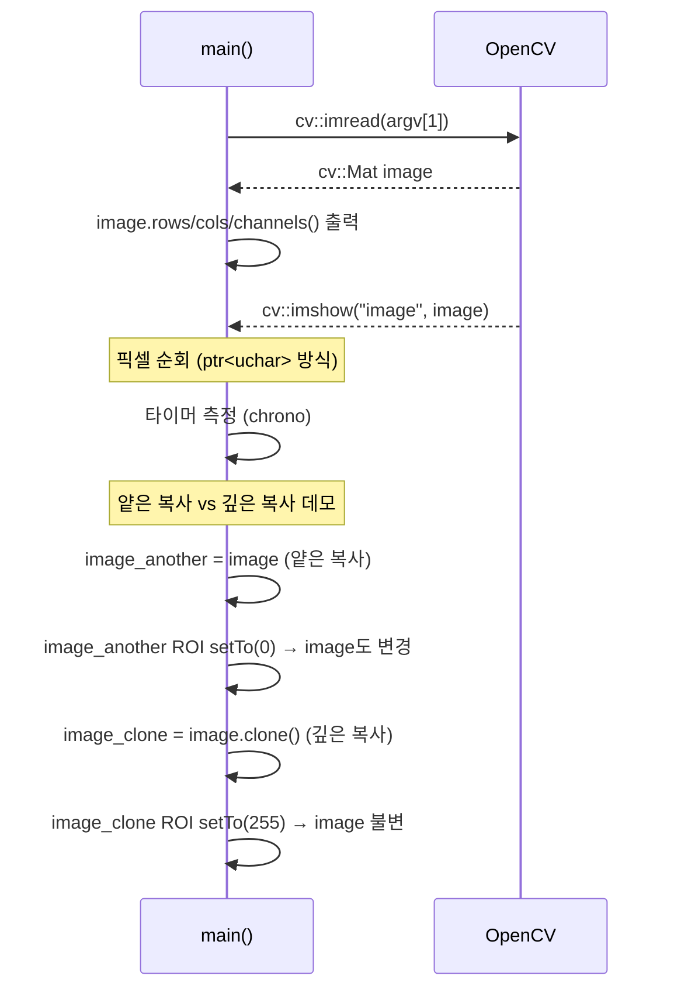
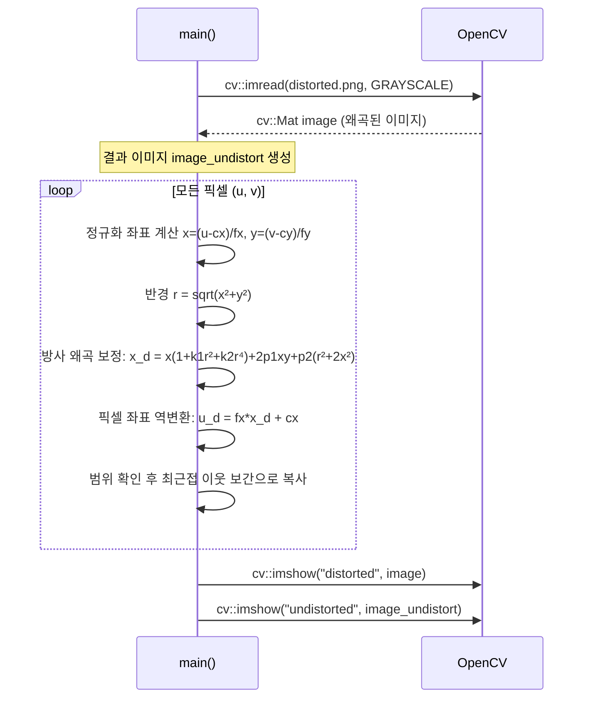
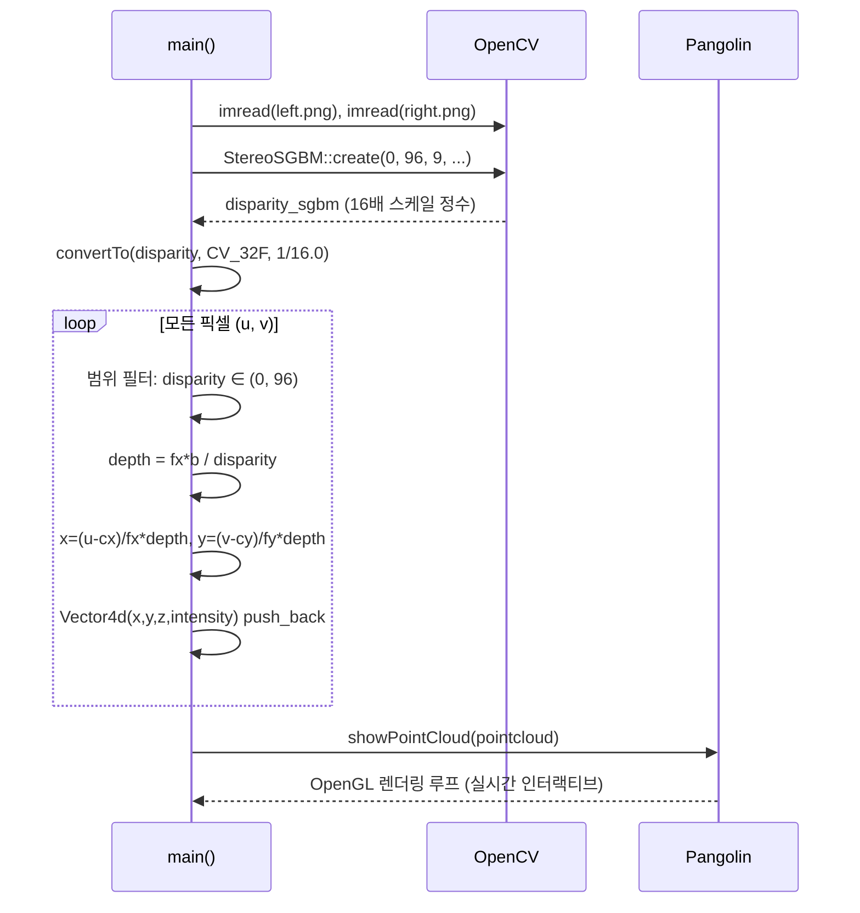
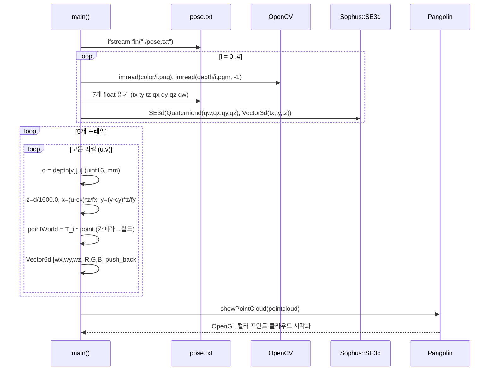
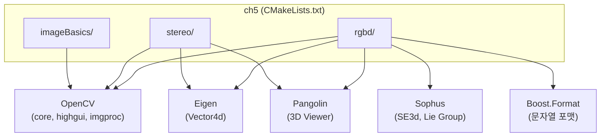

# ch5: 카메라와 이미지 (Camera and Image)

## 1. 프로젝트 개요

### 프로젝트 목적
"Introduction to Visual SLAM: From Theory to Practice (2nd Edition)" 교재 5장의 실습 코드.
카메라 모델(핀홀, 왜곡)에 대한 이론적 기초를 코드로 구현하며, OpenCV를 활용한 이미지 기본 조작,
렌즈 왜곡 보정, 스테레오 카메라 깊이 추정, RGB-D 카메라 포인트 클라우드 결합 등을 다룬다.

### 기술 스택
| 항목 | 내용 |
|------|------|
| 언어 | C++11 |
| 빌드 | CMake 2.8+ |
| 핵심 라이브러리 | OpenCV (이미지 처리), Eigen (선형대수), Sophus (Lie Group SE3), Pangolin (3D 시각화) |
| 보조 라이브러리 | Boost.Format (문자열 포맷) |

### 디렉토리 구조
```
ch5/
├── CMakeLists.txt           # 최상위 빌드 설정 (OpenCV, Eigen 포함)
├── imageBasics/             # 이미지 기초 조작 및 왜곡 보정
│   ├── CMakeLists.txt
│   ├── imageBasics.cpp      # cv::Mat 기초 조작 데모
│   ├── undistortImage.cpp   # 방사·접선 왜곡 보정 수동 구현
│   ├── ubuntu.png           # 테스트용 컬러 이미지
│   └── distorted.png        # 왜곡된 그레이스케일 이미지
├── stereo/                  # 스테레오 카메라 → 포인트 클라우드
│   ├── CMakeLists.txt
│   ├── stereoVision.cpp     # SGBM 시차 → 3D 포인트 클라우드
│   ├── left.png             # 왼쪽 스테레오 이미지
│   └── right.png            # 오른쪽 스테레오 이미지
└── rgbd/                    # RGB-D 카메라 → 글로벌 포인트 맵
    ├── CMakeLists.txt
    ├── joinMap.cpp           # 5프레임 RGB-D → SE3 포즈로 글로벌 맵 결합
    ├── pose.txt              # 각 프레임의 카메라 포즈 (tx ty tz qx qy qz qw)
    ├── color/               # 컬러 이미지 5장 (1~5.png)
    └── depth/               # 깊이 이미지 5장 (1~5.pgm, uint16, mm 단위)
```

### 아키텍처 패턴
각 서브모듈은 독립적인 단일 `main()` 실행 파일로 구성된 **교육용 데모 패턴**.
공유 라이브러리나 헤더 없이 각 `.cpp` 파일이 완결된 프로그램이다.

---

## 2. 진입점 및 실행 흐름

### 2-1. imageBasics: cv::Mat 기초 조작



### 2-2. undistortImage: 수동 왜곡 보정



### 2-3. stereoVision: 스테레오 → 포인트 클라우드



### 2-4. joinMap: RGB-D 멀티프레임 맵 결합



---

## 3. 핵심 모듈 심층 분석

### 3-1. imageBasics.cpp

**책임**: cv::Mat의 메모리 구조와 픽셀 접근 방식을 실험을 통해 보여주는 데모 프로그램.

**핵심 개념**:
- `image.ptr<uchar>(y)` — 행 포인터 방식의 효율적 픽셀 접근 (캐시 친화적)
- `row_ptr[x * channels + c]` — 채널별 명시적 인덱싱
- 얕은 복사: `Mat B = A` → 같은 데이터 블록 공유 (레퍼런스 카운팅)
- 깊은 복사: `A.clone()` → 독립적인 메모리 복사본

**내부 파라미터**: 없음 (커맨드라인 argv[1]로 이미지 경로 입력)

---

### 3-2. undistortImage.cpp

**책임**: 카메라 내부 파라미터와 왜곡 계수를 사용해 렌즈 왜곡을 수동으로 보정.

**왜곡 모델** (OpenCV 표준 모델):
```
r = sqrt(x² + y²)   (정규화 좌표에서의 반경)

방사 왜곡 (Radial):
  x_d = x · (1 + k1·r² + k2·r⁴)

접선 왜곡 (Tangential):
  x_d += 2·p1·x·y + p2·(r² + 2x²)
  y_d += p1·(r² + 2y²) + 2·p2·x·y
```

**사용된 카메라 파라미터**:
| 파라미터 | 값 | 설명 |
|---------|-----|------|
| fx | 458.654 | x축 초점 거리 (px) |
| fy | 457.296 | y축 초점 거리 (px) |
| cx | 367.215 | 주점 x 좌표 |
| cy | 248.375 | 주점 y 좌표 |
| k1 | -0.28340811 | 방사 왜곡 1차 계수 |
| k2 | 0.07395907 | 방사 왜곡 2차 계수 |
| p1 | 0.00019359 | 접선 왜곡 계수 1 |
| p2 | 1.76187114e-05 | 접선 왜곡 계수 2 |

**보간 방식**: 최근접 이웃(Nearest Neighbor) — 구현 단순화를 위해 선택

---

### 3-3. stereoVision.cpp

**책임**: 스테레오 카메라의 좌우 이미지에서 SGBM 시차 맵을 계산하고 3D 포인트 클라우드를 생성.

**스테레오 기하학 (삼각측량)**:
```
depth = fx · b / disparity

x = (u - cx) / fx · depth
y = (v - cy) / fy · depth
```

**사용된 카메라 파라미터**:
| 파라미터 | 값 | 설명 |
|---------|-----|------|
| fx = fy | 718.856 | 초점 거리 |
| cx | 607.1928 | 주점 x |
| cy | 185.2157 | 주점 y |
| b | 0.573 m | 스테레오 기선 거리 |

**SGBM 파라미터**:
- minDisparity: 0, numDisparities: 96, blockSize: 9
- P1 = 8×9×9 = 648, P2 = 32×9×9 = 2592
- 출력 시차는 16배 스케일 정수 → 실수 변환 필요

**데이터 구조**: `Vector4d(x, y, z, intensity)` — Eigen aligned_allocator 사용

---

### 3-4. joinMap.cpp

**책임**: 5프레임의 RGB-D 이미지를 각 프레임의 SE3 포즈로 월드 좌표계에 변환·결합하여 컬러 포인트 클라우드 맵 생성.

**포즈 파일 형식** (pose.txt, 행당 7개 값):
```
tx ty tz qx qy qz qw
```
→ `Sophus::SE3d(Quaterniond(qw,qx,qy,qz), Vector3d(tx,ty,tz))`

**RGB-D 역투영 공식**:
```
z = depth[v][u] / depthScale  (depthScale = 1000.0, mm→m)
x = (u - cx) · z / fx
y = (v - cy) · z / fy
P_world = T_cam · [x, y, z]ᵀ
```

**카메라 파라미터**: fx=518.0, fy=519.0, cx=325.5, cy=253.5

**데이터 구조**: `Vector6d [wx, wy, wz, R, G, B]`
- 주의: 배열 인덱스 순서가 BGR 순서임 (p[3]=R, p[4]=G, p[5]=B)

---

## 4. 모듈 관계도



---

## 5. 상태 관리 및 데이터 흐름

- **전역 상태 없음** — 각 프로그램은 `main()` 스코프 내 로컬 변수만 사용
- **데이터 흐름**: 단방향 파이프라인 (파일 → 처리 → 시각화)
  ```
  이미지 파일 / pose.txt
      ↓
  OpenCV Mat / Sophus SE3d (메모리 내 표현)
      ↓
  픽셀 순회 + 기하학 변환
      ↓
  pointcloud: vector<Vector4d/6d>
      ↓
  Pangolin OpenGL 렌더링
  ```
- **외부 I/O**:
  - 입력: PNG/PGM 이미지 파일, TXT 포즈 파일 (상대 경로)
  - 출력: 화면 표시 (cv::imshow, Pangolin 창)
  - 저장 없음 (포인트 클라우드를 파일로 저장하지 않음)

---

## 6. 설정 및 환경

### 빌드 설정
```cmake
CMAKE_BUILD_TYPE = "Release"
CXX_FLAGS = "-std=c++11 -O2"
```

### 의존성
| 라이브러리 | 용도 | 설치 방법 (Ubuntu) |
|-----------|------|-------------------|
| OpenCV    | 이미지 처리, SGBM | `apt install libopencv-dev` |
| Eigen3    | 선형대수          | `/usr/include/eigen3` (하드코딩) |
| Pangolin  | 3D 시각화         | 소스 빌드 필요 |
| Sophus    | SE3 Lie Group    | 소스 빌드 필요 |
| Boost     | Format 유틸       | `apt install libboost-dev` |

### 빌드 및 실행
```bash
cd ch5 && mkdir build && cd build
cmake .. && make -j4

# imageBasics
./imageBasics/imageBasics ../imageBasics/ubuntu.png

# undistortImage (실행 디렉토리가 distorted.png 위치여야 함)
cd ../imageBasics && ../build/imageBasics/undistortImage

# stereoVision (실행 디렉토리가 left/right.png 위치여야 함)
cd ../stereo && ../build/stereo/stereoVision

# joinMap (실행 디렉토리가 pose.txt, color/, depth/ 위치여야 함)
cd ../rgbd && ../build/rgbd/joinMap
```

---

## 7. 코드 품질 관찰

### 잘된 점
1. **효율적인 픽셀 접근**: `ptr<uchar>(y)` 방식으로 캐시 친화적 행 순회 — 랜덤 접근(`at<>`)보다 빠름
2. **Eigen aligned_allocator**: `vector<Vector4d, Eigen::aligned_allocator<Vector4d>>` — SIMD 정렬 요구사항 준수
3. **왜곡 보정 직접 구현**: OpenCV `undistort()` 대신 수식을 직접 구현하여 교육적 가치 극대화
4. **포인트 클라우드 예약**: `pointcloud.reserve(1000000)` (joinMap) — 재할당 방지

### 개선 가능한 점
1. **joinMap의 BGR 인덱싱 주석 부재**: `p[3]=R, p[4]=G, p[5]=B`이지만 `color.channels()` 순서가 BGR임에도 변수명이 직관적이지 않음
2. **하드코딩된 파일 경로**: 모든 파일 경로가 상대 경로로 하드코딩 — 실행 디렉토리가 소스 디렉토리여야 함
3. **joinMap의 `d == 0` 필터**: 0뿐만 아니라 최대값(65535) 필터도 추가하면 더 견고함
4. **stereoVision의 시차 범위 필터**: `<= 0.0 || >= 96.0` 조건이 numDisparities와 연동되지 않아 파라미터 변경 시 수동 수정 필요

### 복잡도가 높은 영역
- **joinMap의 SE3 적용**: `T_cam * point` — Sophus SE3d의 `operator*`가 좌표 변환임을 알아야 이해 가능
- **SGBM 파라미터**: P1/P2 값이 `8*9*9`, `32*9*9`와 같이 블록 크기 의존적으로 설정 — 의미를 이해하려면 SGBM 알고리즘 지식 필요

### 잠재적 이슈
- **imageBasics.cpp**: `image.data == nullptr` 체크 후 타입 체크를 `if`로 분리하여 `return 0`하지만, 이미지가 없으면 `image.type()` 접근이 안전하지 않음 (실제로는 첫 번째 체크에서 return되므로 문제없음)
- **undistortImage.cpp**: 이중 루프 O(rows×cols) — OpenCV 내장 함수 대비 느리지만 교육 목적이므로 허용
- **joinMap.cpp**: 5프레임 × 전체 픽셀 = 최대 ~500만 포인트 → 메모리 약 240MB 소비 가능

---

## 8. 빠른 참조 가이드

### 필수 파일 읽기 순서
1. `CMakeLists.txt` — 빌드 구조와 의존성 파악
2. `imageBasics/imageBasics.cpp` — cv::Mat 기본 개념
3. `imageBasics/undistortImage.cpp` — 카메라 왜곡 모델
4. `stereo/stereoVision.cpp` — 스테레오 기하학
5. `rgbd/joinMap.cpp` — SE3 포즈 변환과 맵 결합

### 핵심 용어 사전
| 용어 | 설명 |
|------|------|
| 내부 파라미터 (intrinsics) | fx, fy, cx, cy — 렌즈와 센서의 기하학적 특성 |
| 왜곡 계수 (distortion) | k1, k2 (방사), p1, p2 (접선) |
| 기선 거리 (baseline) | 스테레오 카메라의 두 렌즈 간 물리적 거리 `b` |
| 시차 (disparity) | 동일 점의 좌우 이미지에서의 수평 픽셀 차이 |
| depthScale | 깊이 이미지의 정수값을 미터로 변환하는 계수 (1000.0 = mm→m) |
| SE3d | 3D 강체 변환 (회전 + 평행이동)을 나타내는 Lie Group |
| 포즈 (pose) | 카메라의 월드 좌표계 내 위치와 방향 (SE3로 표현) |
| SGBM | Semi-Global Block Matching — 스테레오 시차 추정 알고리즘 |

### 자주 수정되는 파일
- 카메라 파라미터 변경 시: 각 `.cpp` 파일 상단의 fx, fy, cx, cy, k1, k2, p1, p2 값
- 다른 이미지 테스트 시: 파일 경로 하드코딩 부분 수정

### 디버깅 팁
- **joinMap이 실행 안 될 때**: `./rgbd/` 디렉토리에서 실행하고 있는지 확인 (pose.txt 상대 경로)
- **포인트 클라우드가 비어 있을 때**: 시차/깊이 값 필터 조건 확인 (`d == 0`, `disparity <= 0`)
- **Pangolin 창이 안 보일 때**: GPU/OpenGL 드라이버 및 환경변수(`DISPLAY`) 확인
- **왜곡 보정 결과 이상할 때**: cx, cy 값이 실제 이미지 크기의 중앙과 일치하는지 확인
