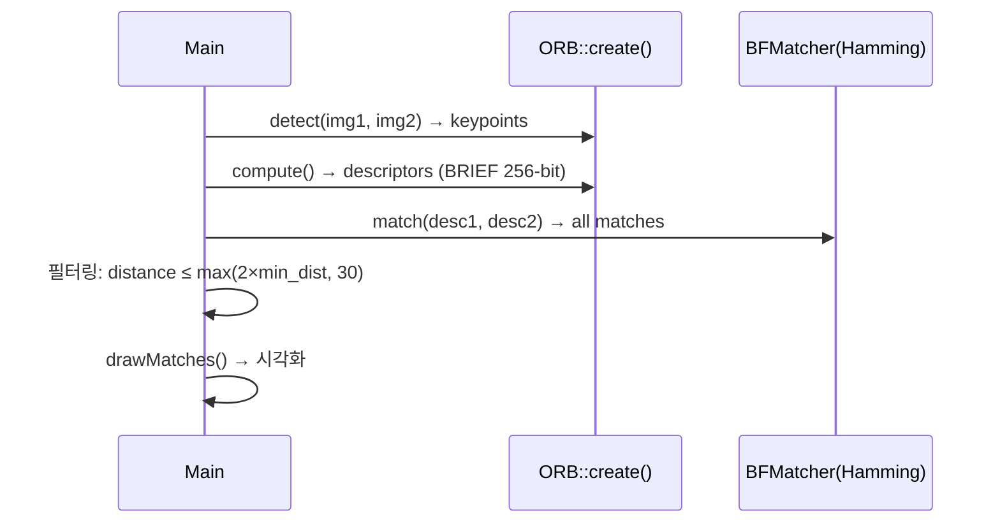
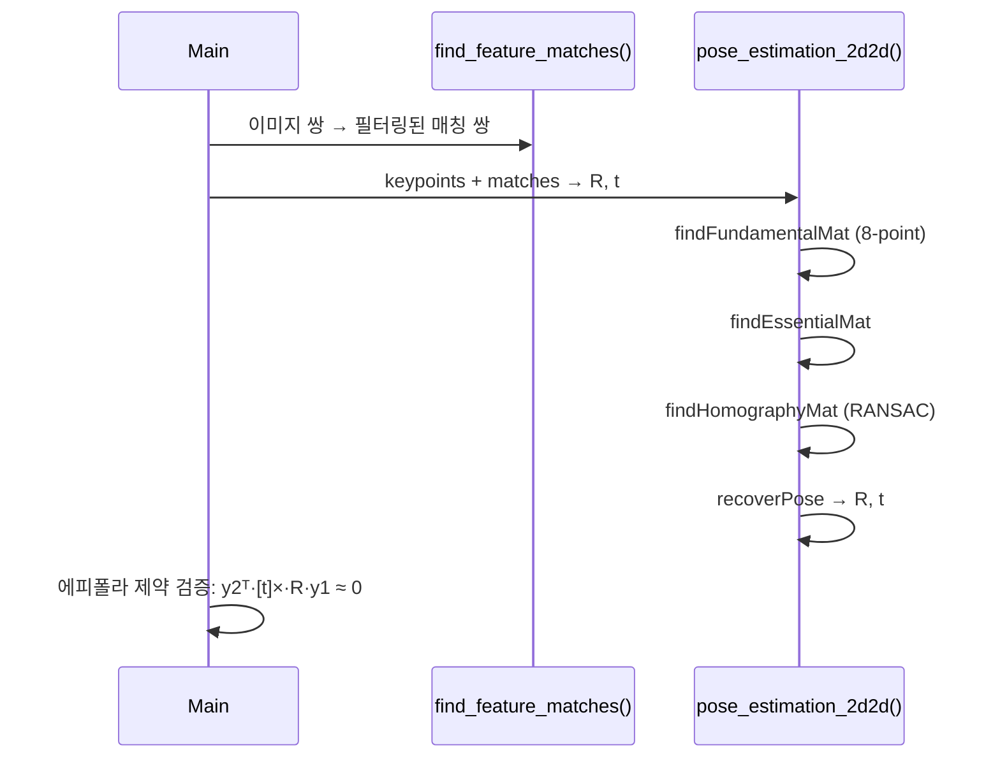
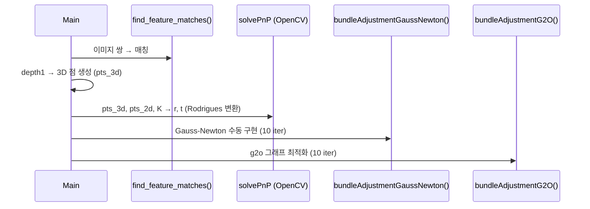
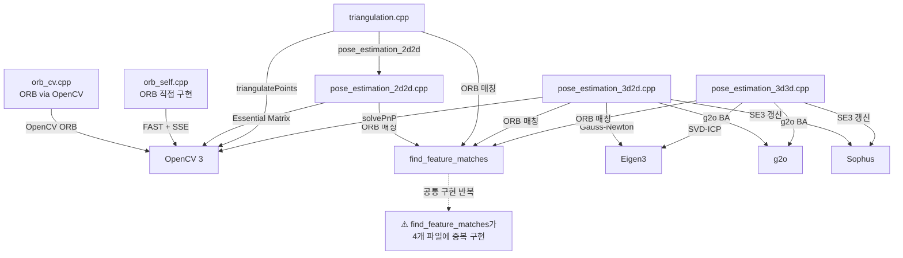

# slambook2 Chapter 7 전체 분석

## Phase 1: 프로젝트 개요

### 프로젝트 목적

이 챕터는 **특징점 기반 시각적 주행 거리계(Visual Odometry, VO)** 의 핵심 알고리즘들을 단계별로 구현한다.  
두 장의 RGB-D 이미지로부터 카메라의 상대적인 자세(회전 R, 평행이동 t)를 추정하는 다양한 방법을 다루며,  
최종적으로 Bundle Adjustment(BA)를 통한 비선형 최적화까지 실습할 수 있다.

### 기술 스택

| 항목 | 내용 |
|---|---|
| 언어 | C++11 |
| 빌드 | CMake 2.8+ |
| 컴퓨터비전 | OpenCV 3 (features2d, calib3d, highgui) |
| 선형대수 | Eigen3 |
| 비선형 최적화 | g2o (Gauss-Newton / Levenberg-Marquardt) |
| Lie 군 | Sophus (SE3d, SO3d) |
| SIMD | SSE4 (`_mm_popcnt_u32`) |

### 디렉토리 구조

```
ch7/
├── CMakeLists.txt            # 빌드 설정 (6개 실행 파일 생성)
├── cmake/                    # FindG2O.cmake 등 커스텀 Find 모듈
├── orb_cv.cpp                # ORB 특징점 추출/매칭 (OpenCV API 사용)
├── orb_self.cpp              # ORB 직접 구현 (FAST + 직접 구현한 BRIEF + SSE 팝카운트)
├── pose_estimation_2d2d.cpp  # 2D-2D: Essential/Fundamental/Homography 행렬 → R, t
├── triangulation.cpp         # 삼각화 → 3D 점 복원 + 깊이 시각화
├── pose_estimation_3d2d.cpp  # 3D-2D: PnP (OpenCV) + Gauss-Newton BA + g2o BA
├── pose_estimation_3d3d.cpp  # 3D-3D: SVD-ICP + g2o BA
├── 1.png, 2.png              # TUM Freiburg 데이터셋 RGB 이미지 샘플
└── 1_depth.png, 2_depth.png  # 대응 깊이 맵 (16-bit unsigned)
```

### 아키텍처 패턴

- **직접 실행 파일 패턴**: 각 알고리즘 접근법이 독립적인 `main()` 실행 파일로 분리
- **교육용 순차 복잡도 증가**: ORB → 2D-2D → 삼각화 → 3D-2D(PnP) → 3D-3D(ICP) 순서로 난이도가 증가
- **비선형 최적화 이중 구현**: g2o 그래프와 직접 구현한 Gauss-Newton을 병렬 제공하여 비교 가능

---

## Phase 2: 진입점 및 실행 흐름

모든 실행 파일은 `main(argc, argv)` 에서 시작하며, 공통 파이프라인을 공유한다.

### 유스케이스 1: ORB 특징점 추출 및 매칭 (`orb_cv`)



### 유스케이스 2: 2D-2D 자세 추정 (`pose_estimation_2d2d`)



### 유스케이스 3: 3D-2D PnP + Bundle Adjustment (`pose_estimation_3d2d`)



---

## Phase 3: 핵심 모듈 심층 분석

### 3.1 `orb_self.cpp` (417줄)

**책임**: OpenCV 없이 ORB를 직접 구현 — FAST 검출 → 모멘트 기반 방향 계산 → 회전 보정 BRIEF 디스크립터 → SSE 팝카운트 BF 매칭

**핵심 알고리즘 — ComputeORB()**:
1. 경계 8픽셀 안에 있는 키포인트는 skip (bad point)
2. `m10 = Σ(dx·pixel)`, `m01 = Σ(dy·pixel)` → 이미지 모멘트로 키포인트 방향 계산
3. `cos_theta = m10/|m|`, `sin_theta = m01/|m|` → 회전 행렬
4. 256비트 디스크립터: 8개의 uint32\_t × 32비트. 각 비트는 회전 보정된 `ORB_pattern` 패턴 쌍의 밝기 비교
5. 디스크립터 표: 하드코딩된 `ORB_pattern[256*4]` — 논문에서 학습된 비교 패턴

**핵심 알고리즘 — BfMatch()**:
- `_mm_popcnt_u32(a ^ b)` — SSE4.2 하드웨어 팝카운트로 Hamming 거리 계산
- 거리 임계값 `d_max = 40`, 각 query에서 최근접 neighbor 하나만 선택

### 3.2 `pose_estimation_2d2d.cpp` (165줄)

**책임**: 깊이 정보 없이 두 이미지의 2D 매칭만으로 카메라 자세 추정 (스케일 모호성 존재)

**핵심 수학**:
- 기초 행렬 F: `x2ᵀ·F·x1 = 0` (8-point 알고리즘)
- 본질 행렬 E: `E = Kᵀ·F·K`, 카메라 내부 파라미터 필요
- `recoverPose()` → R, t (단위 벡터; 스케일 미복원)
- 에피폴라 검증: `y2ᵀ·[t]×·R·y1` ≈ 0

**카메라 내부 파라미터** (TUM Freiburg2 기준, 모든 파일 공통):
```
K = [520.9,   0,   325.1]
    [  0,   521.0, 249.7]
    [  0,     0,     1  ]
깊이 스케일: 5000 (1 unit = 0.2mm)
```

### 3.3 `triangulation.cpp` (203줄)

**책임**: 2D-2D 자세 추정 결과(R, t)를 이용해 특징점의 3D 좌표 복원, 깊이 기반 컬러 시각화

**핵심 알고리즘**:
1. 두 카메라의 투영 행렬 구성: T1 = [I|0], T2 = [R|t]
2. `cv::triangulatePoints()` → 4D 동차 좌표
3. `x /= x.at<float>(3,0)` → 비동차 3D 좌표로 변환
4. `get_color(depth)` — 깊이 10~50 범위를 청-적 그라디언트로 매핑

### 3.4 `pose_estimation_3d2d.cpp` (359줄) ★ 핵심 파일

**책임**: RGB-D 이미지에서 3D-2D 매칭으로 PnP 자세 추정 + 수동 Gauss-Newton + g2o BA 비교

**bundleAdjustmentGaussNewton() 알고리즘**:
```
for iter in range(10):
    H = 0, b = 0
    for each 3D-2D pair:
        pc = T * P3d              # 카메라 좌표계 변환
        proj = K * pc / pc.z      # 투영
        e = p2d - proj            # 재투영 오차
        J = ∂e/∂ξ                 # SE3 Jacobian (2×6)
        H += JᵀJ,  b += -Jᵀe
    dx = H.ldlt().solve(b)        # LDLT 분해로 Δξ 계산
    T = exp(dx) * T               # 왼쪽 곱 갱신
    if |dx| < 1e-6: break
```

**Jacobian ∂e/∂ξ** (2×6 행렬, 카메라 모델의 핵심):
```
J = [-fx/Z,    0,  fx·X/Z²,  fx·X·Y/Z²,  -fx-fx·X²/Z²,  fx·Y/Z  ]
    [   0,  -fy/Z, fy·Y/Z²,  fy+fy·Y²/Z², -fy·X·Y/Z²,  -fy·X/Z ]
```

**g2o 그래프 구조**:
- Vertex: `VertexPose` — SE3d (6-DOF), `oplusImpl`에서 `exp(dx) * T` 좌측 갱신
- Edge: `EdgeProjection` — 3D 점 → 2D 투영 오차 (단항 에지, 2D 측정값)
- Solver: `BlockSolver<6,3>` + `LinearSolverDense` + `GaussNewton`

### 3.5 `pose_estimation_3d3d.cpp` (300줄)

**책임**: 두 RGB-D 이미지의 3D-3D 매칭으로 ICP 자세 추정 + g2o 비선형 정제

**SVD-ICP 알고리즘**:
```
1. 질량 중심 계산: p1̄, p2̄
2. 중심 제거: q1ᵢ = p1ᵢ - p1̄, q2ᵢ = p2ᵢ - p2̄
3. W = Σ(q1ᵢ · q2ᵢᵀ)  [3×3 크로스 공분산]
4. SVD: W = UΣVᵀ
5. R = U·Vᵀ  (det(R) < 0 → R = -R)
6. t = p1̄ - R·p2̄
```

**g2o Edge — EdgeProjectXYZRGBDPoseOnly**:
- 측정값: 3D 점 p1 (target)
- 오차: `e = p1 - T * p2`
- Jacobian: `[−I₃ | [T·p2]×]` (6×3 블록)
- Solver: `BlockSolverX` + `LinearSolverDense` + `Levenberg-Marquardt`

---

## Phase 4: 모듈 관계도



> **순환 의존 없음.** 단, `find_feature_matches`와 `pixel2cam`이 4개 파일에 동일하게 복사되어 있음 (교육 목적의 자기완결성 우선).

---

## Phase 5: 상태 관리 및 데이터 흐름

### 데이터 흐름 방향

```
이미지 파일 (1.png, 2.png)
        ↓  imread()
  cv::Mat (RGB, Depth 16-bit)
        ↓  ORB detect + compute
  KeyPoints + Descriptors
        ↓  BFMatcher + 필터링
  Good Matches (DMatch 벡터)
        ↓  (경로에 따라 분기)
 ┌──────────────────────────────────┐
 │2D-2D        │ 삼각화  │ 3D-2D/3D │
 │Essential    │ DLT     │ PnP/ICP  │
 │→ R, t       │→ pts3d  │→ R, t    │
 └──────────────────────────────────┘
        ↓  g2o / Gauss-Newton
  최적화된 SE3d 자세 행렬 T (4×4)
        ↓
  stdout 출력 (R, t, cost, 반복 횟수)
```

### 전역 상태

- **전역 변수**: `orb_self.cpp`에서 `first_file`, `second_file` 문자열만 전역. 나머지 파일은 전역 상태 없음.
- **외부 연동**: 파일 I/O만 사용 (imread/imshow). 네트워크, DB 없음.

---

## Phase 6: 설정 및 환경

### 빌드 시스템

```bash
mkdir build && cd build
cmake ..      # OpenCV 3, G2O, Sophus, Eigen3 필요
make -j4
```

### 생성되는 실행 파일 및 사용법

| 실행 파일 | 인수 |
|---|---|
| `orb_cv` | `img1 img2` |
| `orb_self` | 없음 (하드코딩: `./1.png`, `./2.png`) |
| `pose_estimation_2d2d` | `img1 img2` |
| `triangulation` | `img1 img2` |
| `pose_estimation_3d2d` | `img1 img2 depth1 depth2` |
| `pose_estimation_3d3d` | `img1 img2 depth1 depth2` |

### 주요 환경 변수 / CMake 옵션

- `CMAKE_BUILD_TYPE=Release`
- `CMAKE_CXX_FLAGS`: `-std=c++11 -O2 -msse4 -DENABLE_SSE`
- `CMAKE_MODULE_PATH`: `cmake/` 디렉토리 (FindG2O.cmake 등 포함)

### 샘플 실행

```bash
cd build
./pose_estimation_3d2d ../1.png ../2.png ../1_depth.png ../2_depth.png
./pose_estimation_3d3d ../1.png ../2.png ../1_depth.png ../2_depth.png
```

---

## Phase 7: 코드 품질 관찰

### 잘된 점

1. **Jacobian 직접 유도**: `bundleAdjustmentGaussNewton()`에서 SE3 Jacobian을 직접 구현하여 최적화 내부 동작을 명확히 이해할 수 있게 함.
2. **이중 구현 비교**: 수동 Gauss-Newton과 g2o BA를 동일 데이터로 실행하고 시간을 측정 — 교육적 효과 최대.
3. **SSE 최적화**: `_mm_popcnt_u32`로 Hamming 거리 계산 가속. 교육용 코드에서 보기 드문 수준.
4. **에러 검증 코드**: 에피폴라 제약, SVD-ICP 재검증(p1 ≈ R·p2+t)을 출력으로 확인.
5. **한국어 주석**: 알고리즘 단계가 명확히 주석으로 설명되어 있어 학습 접근성 높음.

### 개선 가능한 점

1. **find_feature_matches 중복**: 동일 함수가 4개 파일(`pose_estimation_2d2d`, `triangulation`, `pose_estimation_3d2d`, `pose_estimation_3d3d`)에 완전히 복사되어 있음. 공통 헤더로 분리 가능.
2. **하드코딩된 카메라 파라미터**: K 행렬이 각 파일마다 별도 정의됨. 공통 상수 헤더나 파일 인수로 분리 권장.
3. **orb_self.cpp의 하드코딩된 파일명**: `./1.png`, `./2.png`가 코드에 고정 — 다른 데이터로 테스트 불편.
4. **깊이 스케일 하드코딩**: `d / 5000.0` 상수가 TUM 데이터셋 전용 — 다른 센서(RealSense 등)에서 재컴파일 필요.
5. **g2o read/write 미구현**: `VertexPose`, `EdgeProjection` 등 모든 g2o 클래스의 `read()`/`write()`가 빈 함수 — 직렬화 불가.

### 복잡도가 높은 영역

- **bundleAdjustmentGaussNewton() Jacobian** (`pose_estimation_3d2d.cpp:200-213`): 투영 모델의 편미분을 6-DOF SE3 표현으로 표현한 부분. 수식 오류 시 수렴 실패 → SLAM 입문자에게 가장 어려운 부분.
- **ComputeORB() 회전 보정** (`orb_self.cpp:370-390`): 이미지 모멘트 → 각도 → sin/cos → 패턴 회전 → 비트 연산 순서가 짧지만 밀도 높음.
- **SVD-ICP 부호 보정** (`pose_estimation_3d3d.cpp:235-238`): `det(R) < 0`일 때 R = -R 처리는 반사 행렬 방지 목적이지만, 이 단순 처리는 특수 경우(두 집합이 거의 같은 평면에 있을 때)에 실패 가능.

### 잠재적 이슈

1. **스케일 모호성 (2D-2D)**: `pose_estimation_2d2d`의 t는 단위 벡터 — 실제 이동 거리 복원 불가. 이를 코드 주석에서 언급하지 않음.
2. **bad depth 처리**: 깊이값 0인 픽셀을 skip하지만, 노이즈가 심한 경우 few correspondences → degenerate 자세 추정 가능.
3. **RANSAC 미사용 (2D-2D 이후)**: 3D-2D Gauss-Newton과 3D-3D SVD-ICP에서 outlier 제거 없이 모든 매칭을 사용 → 잘못된 매칭에 취약.
4. **OpenCV 3 전용 API**: `CV_LOAD_IMAGE_COLOR`, `CV_FM_8POINT` 등 OpenCV 4에서 deprecated된 매크로 사용.

---

## Phase 8: 빠른 참조 가이드

### 필수 파일 읽기 순서

1. `orb_cv.cpp` — ORB 특징점 파이프라인 전체 흐름 파악
2. `pose_estimation_2d2d.cpp` — Essential/Fundamental 행렬과 R, t 복원 원리
3. `triangulation.cpp` — 2D → 3D 복원 방법 (DLT)
4. `pose_estimation_3d2d.cpp` — **핵심**: Gauss-Newton BA 수동 구현과 g2o 사용법 비교
5. `orb_self.cpp` — ORB 내부 동작 이해 (선택적 심화)

### 핵심 용어 사전

| 용어 | 설명 |
|---|---|
| Epipolar Constraint | 에피폴라 제약: `y2ᵀ·E·y1 = 0`. 두 카메라 간의 기하학적 관계 |
| Essential Matrix (E) | 본질 행렬: 카메라 정규화 좌표계에서의 기초 행렬 |
| Fundamental Matrix (F) | 기초 행렬: 픽셀 좌표계에서의 에피폴라 관계 |
| Homography (H) | 단응 행렬: 동일 평면 상의 두 이미지 간 변환 (평면 장면에만 유효) |
| PnP | Perspective-n-Point: 3D-2D 매칭에서 카메라 자세 추정 |
| ICP | Iterative Closest Point: 3D-3D 매칭 기반 자세 추정 |
| Bundle Adjustment (BA) | 재투영 오차를 최소화하는 비선형 최적화 |
| SE3d | 3D 특수 유클리드 군: 회전(SO3) + 평행이동. 6-DOF 자세 표현 |
| ξ (xi) | SE3의 Lie 대수 벡터 (ω₁,ω₂,ω₃,v₁,v₂,v₃) |
| g2o | General Graph Optimization. 정점+에지 기반 비선형 최적화 프레임워크 |
| ORB Pattern | 사전 학습된 픽셀 쌍 비교 패턴 (256×4 배열) |
| Depth Scale (5000) | TUM 데이터셋 깊이 단위: 원시값 ÷ 5000 = 미터 |

### 자주 수정되는 파일

- **카메라 파라미터 변경 시**: 각 `.cpp` 파일 내 `Mat K` 정의 (동일 값이 여러 곳에 하드코딩)
- **반복 횟수 조정**: `pose_estimation_3d2d.cpp:178` (`const int iterations = 10`)
- **매칭 필터 임계값 변경**: `find_feature_matches()` 내 `max(2 * min_dist, 30.0)` 기준
- **BF 매칭 임계값**: `orb_self.cpp:398` (`const int d_max = 40`)

### 디버깅 팁

1. **매칭 수가 너무 적을 때**: `good_matches` 개수 확인, `d_max` 또는 `2*min_dist` 임계값 완화
2. **PnP/ICP 자세가 발산할 때**: `pts_3d.size()` 확인 (depth=0 skip 후 너무 적으면 degenerate)
3. **Gauss-Newton 수렴 실패**: `dx.norm()` 로그 출력이 계속 증가하면 초기값 문제 — `pose` 초기화 확인
4. **g2o cost가 nan**: `vertex_pose`의 `setEstimate` 초기값 확인, Jacobian 부호 검토
5. **OpenCV 4 빌드 오류**: `CV_LOAD_IMAGE_COLOR` → `cv::IMREAD_COLOR`, `CV_FM_8POINT` → `cv::FM_8POINT` 로 교체
