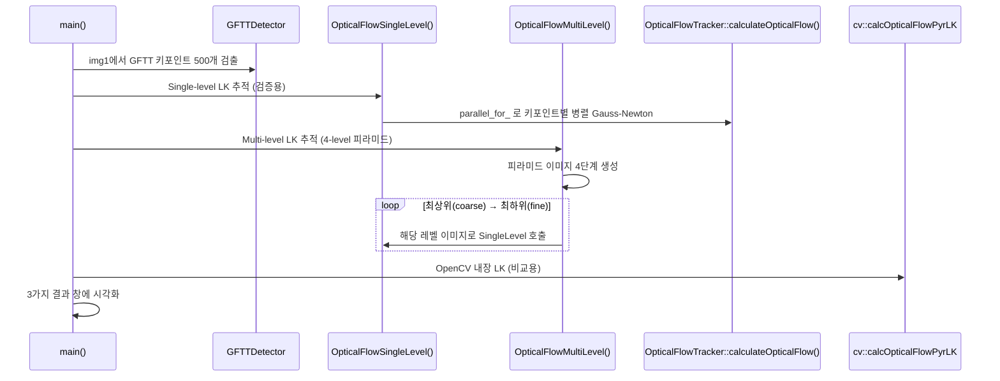
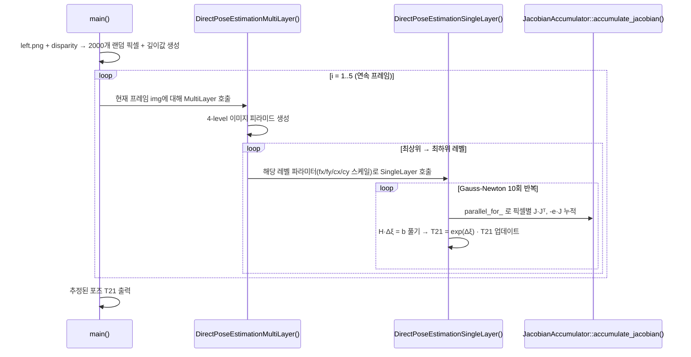
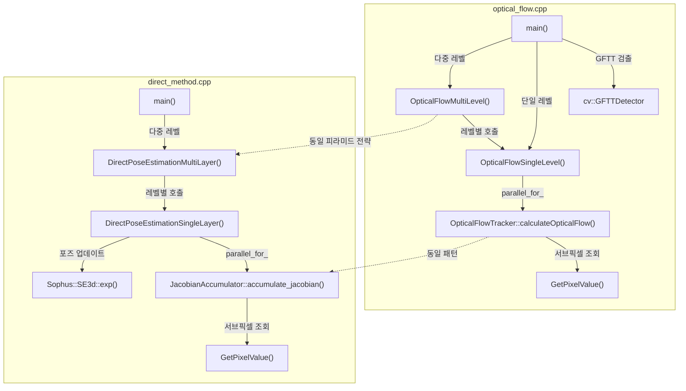

# slambook2 ch8: Optical Flow & Direct Method 분석

## Phase 1: 프로젝트 개요

### 프로젝트 목적

「视觉SLAM十四讲 (Visual SLAM: From Theory to Practice)」 2판의 8장 예제 코드다.
**특징점 없이 화소(픽셀) 강도만으로** 두 프레임 사이의 카메라 움직임(포즈)을 추정하는 두 가지 기법, 즉 **Lucas-Kanade 옵티컬 플로우**와 **직접법(Direct Method)**을 C++로 구현한다.
실제 KITTI 스타일 스테레오 이미지(left.png + disparity.png + 연속 프레임 5장)와 LK 테스트 이미지 쌍을 데이터로 사용한다.

### 기술 스택

| 항목 | 내용 |
|------|------|
| 언어 | C++11 |
| 빌드 | CMake 2.8+ |
| 핵심 라이브러리 | OpenCV 4 (이미지 처리, GFTT 검출, `parallel_for_`) |
| 선형대수 | Eigen3 (행렬/벡터 연산) |
| 리 군 | Sophus (SE3 포즈 표현 및 지수/로그 맵) |
| 시각화 | Pangolin (direct_method 시각화) |
| 최적화 기법 | Gauss-Newton (수동 구현) |

### 디렉토리 구조

```
ch8/
├── CMakeLists.txt          # 빌드 설정 (2개 실행 파일)
├── optical_flow.cpp        # LK 옵티컬 플로우 구현
├── direct_method.cpp       # 직접법 포즈 추정 구현
├── LK1.png                 # 옵티컬 플로우용 첫 번째 이미지
├── LK2.png                 # 옵티컬 플로우용 두 번째 이미지
├── left.png                # 직접법용 기준 스테레오 좌측 이미지
├── disparity.png           # 스테레오 시차(disparity) 맵
└── 000001~000005.png       # 직접법용 연속 프레임 (5장)
```

### 아키텍처 패턴

- **클래스 기반 Accumulator 패턴**: 병렬 연산의 부분 결과(Hessian, bias, cost)를 누적 후 합산
- **Coarse-to-Fine (이미지 피라미드)**: 큰 움직임에 대한 강건성 확보
- **OpenCV `parallel_for_`**: 키포인트/픽셀 단위 독립 연산을 멀티스레드로 처리

---

## Phase 2: 진입점 및 실행 흐름

두 실행 파일 모두 `main()` 이 진입점이다.

### 2-1. optical_flow: LK 옵티컬 플로우



### 2-2. direct_method: 직접법 포즈 추정



---

## Phase 3: 핵심 모듈 심층 분석

### 3-1. `optical_flow.cpp` (349 lines)

**책임**: LK 옵티컬 플로우를 수동 Gauss-Newton으로 구현하고 OpenCV와 비교

#### 주요 함수/클래스

| 이름 | 역할 |
|------|------|
| `GetPixelValue(img, x, y)` | 쌍선형 보간으로 서브픽셀 강도 반환 |
| `OpticalFlowTracker` | 단일 레벨 플로우 계산의 병렬 worker 클래스 |
| `OpticalFlowTracker::calculateOpticalFlow(range)` | 할당된 키포인트 범위에 대해 Gauss-Newton 수행 |
| `OpticalFlowSingleLevel()` | `parallel_for_`로 tracker를 병렬 실행 |
| `OpticalFlowMultiLevel()` | 4단계 피라미드 생성 후 coarse-to-fine으로 SingleLevel 호출 |

#### 핵심 알고리즘: LK Inverse Compositional

`calculateOpticalFlow`의 핵심 루프:

1. **패치 오류 계산**: `e = I₁(x) - I₂(x + Δ)` (8×8 패치)
2. **Jacobian 계산**:
   - **Forward**: `J = -∇I₂(x + Δ)` (반복마다 재계산)
   - **Inverse** (`inverse=true`): `J = -∇I₁(x)` (첫 번째 반복에만 계산, 이후 고정 → 속도 향상)
3. **Hessian/bias 누적**: `H += JJᵀ`, `b += -eJ`
4. **업데이트**: `[dx, dy] += H⁻¹b` (LDLT 분해)
5. **수렴 조건**: `||update|| < 1e-2` 또는 비용 증가 시 중단

**Inverse formulation의 장점**: Jacobian이 고정이므로 첫 반복에만 계산 → O(n) → O(1) (반복당)

#### 데이터 모델

```
OpticalFlowTracker {
    img1, img2: const Mat&          // 입력 이미지 쌍
    kp1: const vector<KeyPoint>&    // 소스 키포인트
    kp2: vector<KeyPoint>&          // 추적 결과 (출력)
    success: vector<bool>&          // 추적 성공 여부
    inverse: bool                   // inverse formulation 사용 여부
    has_initial: bool               // kp2 초기값 존재 여부 (피라미드 레벨 간 전파)
}
```

---

### 3-2. `direct_method.cpp` (339 lines)

**책임**: 픽셀 강도 차이를 최소화하여 SE3 카메라 포즈를 직접 추정

#### 주요 함수/클래스

| 이름 | 역할 |
|------|------|
| `GetPixelValue(img, x, y)` | 쌍선형 보간 (포인터 연산으로 최적화) |
| `JacobianAccumulator` | 픽셀별 J·Jᵀ와 -e·J를 병렬 누적하는 클래스 |
| `JacobianAccumulator::accumulate_jacobian(range)` | 3D→2D 투영 + 광도 오류 + Jacobian 계산 |
| `DirectPoseEstimationSingleLayer()` | Gauss-Newton 10회로 단일 레벨 포즈 최적화 |
| `DirectPoseEstimationMultiLayer()` | 4단계 피라미드로 coarse-to-fine 포즈 추정 |

#### 핵심 알고리즘: 직접법 포즈 추정

`accumulate_jacobian`의 처리 순서:

1. **3D 포인트 복원**: 깊이 × 역투영
   ```
   P_ref = depth × K⁻¹ · [u, v, 1]ᵀ
   P_cur = T₂₁ · P_ref
   ```
2. **2D 투영**:
   ```
   u = fx · X/Z + cx,  v = fy · Y/Z + cy
   ```
3. **광도 오류**:
   ```
   e = I₁(px_ref) - I₂(u, v)
   ```
4. **Jacobian 계산** (체인 룰):
   ```
   J = ∂e/∂ξ = -(∂I₂/∂u · ∂u/∂ξ)ᵀ
   ```
   여기서 `∂u/∂ξ` (2×6 행렬 `J_pixel_xi`)는 SE3 리 대수에 대한 투영의 편미분:
   ```
   J_pixel_xi =
   [ fx/Z,     0,  -fx·X/Z², -fx·X·Y/Z²,  fx+fx·X²/Z²,  -fx·Y/Z ]
   [     0,  fy/Z, -fy·Y/Z², -fy-fy·Y²/Z², fy·X·Y/Z²,    fy·X/Z ]
   ```
5. **누적**: `H += JJᵀ`, `b += -e·J` (mutex로 스레드 안전)
6. **포즈 업데이트**: `T₂₁ = exp(H⁻¹b) · T₂₁`

#### 카메라 내부 파라미터 (KITTI 기준)

```cpp
fx = 718.856, fy = 718.856, cx = 607.1928, cy = 185.2157
baseline = 0.573  // 스테레오 기저선 (미터)
// 깊이 복원: depth = fx * baseline / disparity
```

---

## Phase 4: 모듈 관계도



> 순환 의존 없음. 두 파일은 완전히 독립적인 실행 파일이며 공유 헤더 없음.

---

## Phase 5: 상태 관리 및 데이터 흐름

### 전역 상태

`direct_method.cpp`의 전역 변수는 주의가 필요하다:

```cpp
// 전역 카메라 파라미터 — DirectPoseEstimationMultiLayer()에서 레벨별로 수정됨
double fx = 718.856, fy = 718.856, cx = 607.1928, cy = 185.2157;
```

`DirectPoseEstimationMultiLayer()`는 피라미드 레벨마다 이 전역 값을 스케일링하고 원래 값을 `fxG/fyG/cxG/cyG`로 백업 후 복원한다. **멀티스레드 환경에서는 data race가 발생할 수 있는 패턴**이다.

### 데이터 흐름

```
[이미지 파일] ─imread─→ cv::Mat
                              │
              ┌───────────────┴────────────────┐
              ▼ optical_flow                    ▼ direct_method
    GFTT 검출 → kp1                  disparity → depth_ref
              │                                │
    피라미드 생성 (4레벨)           피라미드 생성 (4레벨)
              │                                │
    Gauss-Newton (병렬)             Gauss-Newton (병렬)
    → kp2 (픽셀 변위)               → T21 (SE3 포즈)
              │                                │
    [시각화: imshow]                [시각화: imshow + 콘솔 출력]
```

### 외부 I/O

- **입력**: PNG 이미지 파일 (하드코딩된 경로, 상대 경로 `./`)
- **출력**: OpenCV `imshow` 창 + 콘솔 타이밍/비용 출력
- DB/네트워크 없음, 파일 쓰기 없음

---

## Phase 6: 설정 및 환경

### 빌드 설정

```cmake
CMAKE_BUILD_TYPE = Release
CMAKE_CXX_FLAGS = -std=c++11 -DENABLE_SSE -g -O3 -march=native
```

- SSE 활성화 및 네이티브 아키텍처 최적화 (`-march=native`)
- 디버그 심볼 포함 (`-g`)

### 빌드 방법

```bash
cd /Users/swcho/projects/swcho/slambook2/ch8
mkdir build && cd build
cmake ..
make -j$(nproc)

# 실행
./optical_flow    # LK1.png, LK2.png 필요
./direct_method   # left.png, disparity.png, 000001~000005.png 필요
```

### 의존성 설치 (macOS)

```bash
brew install opencv eigen sophus
# Pangolin은 소스 빌드 필요
```

---

## Phase 7: 코드 품질 관찰

### 잘된 점

1. **교육적 완결성**: Forward/Inverse LK를 동일 클래스에서 `inverse` 플래그로 구분하여 비교 실험이 쉽다.
2. **병렬화**: `cv::parallel_for_`를 사용하여 O(N) 키포인트/픽셀 연산을 쉽게 멀티코어화. worker 클래스(`Tracker`, `JacobianAccumulator`) 패턴이 깔끔하다.
3. **명시적 수학**: Jacobian의 각 원소(`J_pixel_xi`)를 행/열/의미별로 명확히 구현하여 수식과 코드를 대조하기 좋다.
4. **타이밍 측정**: `chrono::steady_clock`으로 각 단계의 실행 시간을 측정하여 성능 비교가 가능하다.

### 개선 가능한 점

1. **전역 카메라 파라미터** (`fx`, `fy`, `cx`, `cy`): `DirectPoseEstimationMultiLayer` 내부에서 수정되므로 재진입(reentrant) 불가. 구조체로 캡슐화하거나 함수 파라미터로 전달하는 것이 안전하다.

2. **하드코딩된 파일 경로**: 실행 파일과 이미지가 같은 디렉토리에 있어야 동작. `argc/argv`나 설정 파일로 받는 것이 유연하다.

3. **`direct_method.cpp`의 `GetPixelValue` 경계 처리**:
   ```cpp
   if (x >= img.cols) x = img.cols - 1;  // cols - 1이 맞지만 x+1 접근 시 범위 초과 가능
   ```
   `optical_flow.cpp`는 `cols - 2`로 처리하는 반면 `direct_method.cpp`는 `cols - 1`로 처리 — 단일 픽셀 차이나 포인터 산술(`data[1]`, `data[img.step + 1]`)에서 경계 초과 가능성이 있다.

4. **피라미드 빌드 중복**: 두 파일 모두 동일한 피라미드 생성 로직을 반복. 유틸리티 함수로 분리하면 유지보수가 쉬워진다 (이 책의 예제 코드라는 맥락에서는 의도적 중복일 수 있음).

5. **`kp2` 초기값 버그 가능성** (`OpticalFlowMultiLevel`):
   ```cpp
   kp2_pyr.push_back(kp_top);  // 최상위 레벨 초기값
   ```
   `kp2_pyr`는 `kp1_pyr`의 복사본으로 초기화되므로 `has_initial=true`로 올바르게 전달. 하지만 레벨 업스케일 시 `kp2_pyr[i].pt /= pyramid_scale`으로 복원하는데, 추적 실패한 포인트도 함께 스케일링된다.

### 복잡도가 높은 영역

- `JacobianAccumulator::accumulate_jacobian`: SE3 리 대수에 대한 투영 Jacobian (`J_pixel_xi`)의 6개 열이 수식 없이는 이해하기 어렵다. 책의 식 (8.19)~(8.22) 참조 필요.

### 잠재적 이슈

- **성능**: `half_patch_size = 1` (direct_method) vs `half_patch_size = 4` (optical_flow). 직접법은 3×3 패치만 사용하므로 노이즈에 취약할 수 있다.
- **수렴 안정성**: Gauss-Newton은 초기값에 민감. 큰 움직임에는 피라미드가 필수적이며 레벨이 부족하면 발산할 수 있다.

---

## Phase 8: 빠른 참조 가이드

### 필수 파일 읽기 순서

1. `CMakeLists.txt` — 의존성과 빌드 대상 파악
2. `optical_flow.cpp:88-104` — `GetPixelValue` 쌍선형 보간 이해
3. `optical_flow.cpp:193-285` — `calculateOpticalFlow` Gauss-Newton 루프 (LK의 핵심)
4. `direct_method.cpp:221-293` — `accumulate_jacobian` (직접법의 핵심, Jacobian 유도)
5. `direct_method.cpp:295-339` — `DirectPoseEstimationMultiLayer` 피라미드 전략

### 핵심 용어 사전

| 용어 | 설명 |
|------|------|
| **Optical Flow** | 두 프레임 사이 픽셀의 겉보기 움직임 벡터 |
| **LK (Lucas-Kanade)** | 밝기 불변 가정 하에 패치 내 픽셀을 이용해 움직임을 Gauss-Newton으로 추정 |
| **Inverse Formulation** | Jacobian을 img1 기준으로 고정하여 매 반복 재계산 불필요 |
| **Image Pyramid** | 원본 이미지를 절반씩 축소한 다단계 표현 — 큰 움직임 포착용 |
| **Coarse-to-Fine** | 최상위(작은) 레벨부터 추적 → 결과를 하위 레벨 초기값으로 전파 |
| **Direct Method** | 특징점 매칭 없이 픽셀 강도 차이를 직접 최소화하여 포즈 추정 |
| **SE3 / Sophus** | 3D 강체 변환 (회전+이동)을 리 군으로 표현; `exp(ξ)`로 업데이트 |
| **Jacobian Accumulator** | 병렬 스레드가 부분 Hessian/bias를 독립 계산 후 mutex로 합산하는 패턴 |
| **Disparity** | 스테레오 이미지에서 같은 점의 좌우 픽셀 차이 — 깊이 계산에 사용 |
| **GFTT** | Good Features to Track — 해리스 코너 기반 키포인트 검출기 |

### 자주 수정되는 파일

- **알고리즘 파라미터 변경**: `optical_flow.cpp:194-195` (`half_patch_size`, `iterations`), `direct_method.cpp:224` (`half_patch_size`)
- **피라미드 레벨 변경**: `optical_flow.cpp:296-297`, `direct_method.cpp:303-305`
- **데이터 경로 변경**: `optical_flow.cpp:14-15`, `direct_method.cpp:15-17`
- **Forward ↔ Inverse 전환**: `optical_flow.cpp:127` (`true` → `false`)
- **Single ↔ Multi layer 전환**: `direct_method.cpp:151-153` (주석 처리된 라인)

### 디버깅 팁

1. **"update is nan"** 출력 → 패치가 너무 평탄(Hessian 특이행렬). `half_patch_size` 증가 또는 최소 그래디언트 임계값 추가.
2. **추적 실패율 높음** → `inverse=false`(forward)로 변경하여 비교, 또는 `iterations` 증가.
3. **직접법 포즈 발산** → `nPoints` 감소 또는 `boarder` 증가로 가장자리 노이즈 픽셀 제거.
4. **빌드 오류 `CV_GRAY2BGR`** → OpenCV 4에서는 `cv::COLOR_GRAY2BGR` 사용 (레거시 상수 제거됨).
5. **Pangolin 링크 실패** → `direct_method.cpp`는 Pangolin을 include하지만 실제로 시각화 코드는 없음. CMake에서 `target_link_libraries`에서 Pangolin 제거해도 빌드 가능.
