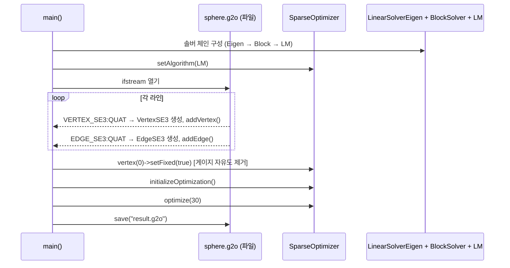
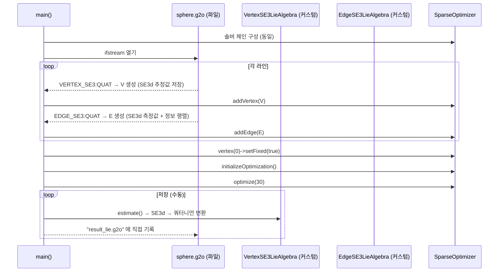
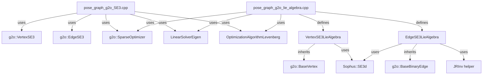

# ch10: Pose Graph Optimization (포즈 그래프 최적화)

## Phase 1: 프로젝트 개요

### 프로젝트 목적

ch10은 "SLAM 14강" 교재(slambook2)의 10장 예제 코드로, **Pose Graph Optimization(포즈 그래프 최적화)** 를 두 가지 방식으로 구현한다. 루프 클로저 등으로 얻어진 상대 포즈 제약 조건들을 비선형 최소 제곱 문제로 정식화하고, g2o의 Levenberg-Marquardt 알고리즘으로 전체 포즈를 동시 최적화한다. 두 구현의 차이는 SE3 표현 방식으로, 한 쪽은 g2o 내장 SE3 타입(쿼터니언)을, 다른 쪽은 직접 구현한 Lie 대수 파라미터화를 사용한다.

### 기술 스택

| 항목 | 내용 |
|---|---|
| 언어 | C++11 |
| 빌드 시스템 | CMake 2.8+ |
| 최적화 프레임워크 | g2o (General Graph Optimization) |
| 선형 대수 | Eigen3 |
| 희소 솔버 | CHOLMOD |
| Lie 군 연산 | Sophus (SE3d, SO3d) |
| 데이터 포맷 | `.g2o` 포즈 그래프 텍스트 포맷 |

### 디렉토리 구조

```
ch10/
├── CMakeLists.txt                    # 빌드 설정
├── cmake_modules/
│   └── FindG2O.cmake                 # g2o 라이브러리 탐색 모듈
├── pose_graph_g2o_SE3.cpp            # SE3 (쿼터니언) 방식 구현 (78줄)
├── pose_graph_g2o_lie_algebra.cpp    # Lie 대수 방식 구현 (209줄)
└── sphere.g2o                        # 합성 구면 궤적 데이터 (1.7MB)
```

- `pose_graph_g2o_SE3.cpp`: g2o 내장 `VertexSE3` / `EdgeSE3` 타입을 그대로 사용하는 최소 구현
- `pose_graph_g2o_lie_algebra.cpp`: Lie 대수 기반 커스텀 Vertex / Edge 클래스를 직접 구현하여 Adjoint Jacobian까지 명시적으로 계산
- `sphere.g2o`: 2500개 포즈, 9799개 엣지를 포함하는 합성 구면 포즈 그래프 데이터셋

### 아키텍처 패턴

- **Factor Graph / Pose Graph**: 포즈를 노드, 상대 포즈 제약을 엣지로 표현
- **플러그인 패턴**: g2o의 `BaseVertex` / `BaseBinaryEdge`를 상속해 커스텀 타입 주입
- **Manifold 최적화**: Lie 대수 접선 공간에서 업데이트 후 지수 사상으로 Lie 군으로 복귀

---

## Phase 2: 진입점 및 실행 흐름

두 실행 파일 모두 `main()` 에서 시작하며 구조가 유사하다.

### pose_graph_g2o_SE3 실행 흐름



### pose_graph_g2o_lie 실행 흐름



---

## Phase 3: 핵심 모듈 심층 분석

### 3.1 pose_graph_g2o_SE3.cpp

**책임**: g2o 내장 SE3 타입을 이용한 최소 코드의 포즈 그래프 최적화 데모

**주요 타입**:

| 타입 | 역할 |
|---|---|
| `g2o::VertexSE3` | 3D 포즈 노드 (쿼터니언 + 평행이동) |
| `g2o::EdgeSE3` | 두 포즈 간 상대 변환 제약 엣지 |
| `BlockSolverTraits<6,6>` | 포즈 6DOF, 랜드마크 없음 |
| `OptimizationAlgorithmLevenberg` | LM 최적화 알고리즘 |

**파일 파싱 로직**:
```cpp
// VERTEX_SE3:QUAT id tx ty tz qx qy qz qw
if (type == "VERTEX_SE3:QUAT") {
    g2o::VertexSE3 *v = new g2o::VertexSE3();
    v->setId(index);
    v->read(fin);
    optimizer.addVertex(v);
    if (index == 0) v->setFixed(true);  // 기준 좌표계 고정
}
// EDGE_SE3:QUAT id1 id2 tx ty tz qx qy qz qw <정보행렬 상삼각>
if (type == "EDGE_SE3:QUAT") {
    g2o::EdgeSE3 *e = new g2o::EdgeSE3();
    e->setVertex(0, optimizer.vertices()[indices[0]]);
    e->setVertex(1, optimizer.vertices()[indices[1]]);
    e->read(fin);
    optimizer.addEdge(e);
}
```

---

### 3.2 pose_graph_g2o_lie_algebra.cpp

**책임**: Lie 대수 파라미터화와 Adjoint Jacobian을 직접 구현한 포즈 그래프 최적화 데모

#### VertexSE3LieAlgebra

```cpp
class VertexSE3LieAlgebra : public g2o::BaseVertex<6, SE3d>
```

| 메서드 | 설명 |
|---|---|
| `setToOriginImpl()` | 추정값을 SE3d 단위원소로 초기화 |
| `oplusImpl(update)` | `_estimate = SE3d::exp(update) * _estimate` (좌측 곱) |
| `read(is)` | 쿼터니언 7개 값 파싱 → SE3d 생성 |
| `write(os)` | g2o_viewer 호환 쿼터니언 포맷으로 출력 |

**Lie 대수 업데이트 규칙**:

$$T \leftarrow \exp(\delta\xi) \cdot T, \quad \delta\xi \in \mathfrak{se}(3)$$

#### EdgeSE3LieAlgebra

```cpp
class EdgeSE3LieAlgebra :
    public g2o::BaseBinaryEdge<6, SE3d, VertexSE3LieAlgebra, VertexSE3LieAlgebra>
```

**오차 계산** (`computeError`):
```cpp
// 오차 = log(측정값^-1 * T_i^-1 * T_j)
// → Lie 대수 공간의 6D 잔차 벡터
_error = (_measurement.inverse() * v1->estimate().inverse() * v2->estimate()).log();
```

**Jacobian 계산** (`linearizeOplus`):
```cpp
Matrix6d J = JRInv(SE3d::exp(_error));
_jacobianOplusXi = -J * v2->estimate().inverse().Adj();  // ∂e/∂T_i
_jacobianOplusXj =  J * v2->estimate().inverse().Adj();  // ∂e/∂T_j
```

#### JRInv() 함수

```cpp
Matrix6d JRInv(const SE3d &e) {
    // 우측 Jacobian 역행렬 근사
    // 회전 성분 φ에 대한 6x6 블록 행렬 구성
    Matrix6d J;
    J.block(0,0,3,3) = SO3d::hat(e.so3().log());  // [φ]×
    J.block(0,3,3,3) = SO3d::hat(e.translation()); // [ρ]×
    J.block(3,0,3,3) = Eigen::Matrix3d::Zero();
    J.block(3,3,3,3) = SO3d::hat(e.so3().log());
    J = J * 0.5 + Matrix6d::Identity();
    return J;
}
```

---

## Phase 4: 모듈 관계도



---

## Phase 5: 상태 관리 및 데이터 흐름

```
[sphere.g2o 파일]
    ↓ ifstream 파싱
[메모리: Vertex 맵, Edge 리스트]
    ↓ g2o addVertex / addEdge
[g2o SparseOptimizer 내부 그래프]
    ↓ initializeOptimization()
[희소 Hessian 행렬 구조 확정]
    ↓ optimize(30) - LM 반복
      ├── computeError() → 잔차 벡터
      ├── linearizeOplus() → Jacobian 블록
      ├── Block Solver → 블록 구조 선형계 구성
      └── CHOLMOD → 희소 Cholesky 분해 → Δx 계산
[최적화된 포즈 추정값]
    ↓ save() 또는 수동 직렬화
[result.g2o / result_lie.g2o]
```

**전역 상태**: 없음. 모든 상태는 `g2o::SparseOptimizer` 내부에 캡슐화.

**데이터 흐름**: 단방향 (파일 → 최적화기 → 파일)

---

## Phase 6: 설정 및 환경

### 주요 의존성

| 라이브러리 | 용도 | 설치 위치 |
|---|---|---|
| Eigen3 | 행렬 연산 | `/usr/include/eigen3` |
| Sophus | Lie 군/대수 연산 | 시스템 또는 소스 빌드 |
| g2o | 그래프 최적화 프레임워크 | `G2O_ROOT` 환경변수 또는 시스템 |
| CHOLMOD | 희소 Cholesky 분해 | SuiteSparse 패키지 |

### 빌드 및 실행

```bash
cd ch10
mkdir build && cd build
cmake ..
make

# SE3 (쿼터니언) 방식
./pose_graph_g2o_SE3 ../sphere.g2o
# 출력: result.g2o

# Lie 대수 방식
./pose_graph_g2o_lie ../sphere.g2o
# 출력: result_lie.g2o

# 시각화 (g2o_viewer 설치 필요)
g2o_viewer result.g2o
```

### 컴파일 플래그

```cmake
set(CMAKE_BUILD_TYPE "Release")
set(CMAKE_CXX_FLAGS "-std=c++11 -O2")
```

---

## Phase 7: 코드 품질 관찰

### 잘된 점

1. **두 방식의 대비**: 동일한 문제를 내장 타입과 커스텀 Lie 대수 구현으로 나란히 보여줘 교육적 가치가 높다
2. **g2o 플러그인 구조 활용**: `BaseVertex` / `BaseBinaryEdge` 상속을 통해 최소한의 코드로 커스텀 타입을 통합
3. **명확한 Jacobian 유도**: `linearizeOplus()`에서 Adjoint 기반 Jacobian을 명시적으로 구현해 이론과 코드의 연결이 명확
4. **게이지 자유도 처리**: `vertex(0)->setFixed(true)`로 기준 좌표계를 고정해 under-determined 시스템 방지

### 개선 가능한 점

1. **오류 처리 부재**: 파일 열기 실패, 잘못된 포맷에 대한 예외 처리 없음
2. **하드코딩된 반복 횟수**: `optimize(30)` 고정값 — 수렴 판정 기준으로 조기 종료 조건 추가 가능
3. **JRInv 주석 부족**: 수학적 유도 과정이 코드 내에 설명되지 않아 이론서 없이는 이해 어려움

### 잠재적 이슈

1. **메모리 관리**: `new`로 생성한 Vertex / Edge 객체를 `SparseOptimizer`가 소유권 가져가므로 명시적 `delete` 불필요하나, 코드상 불명확
2. **쿼터니언 순서 혼용 주의**: g2o 포맷은 `(qx qy qz qw)`, Eigen은 `(qw qx qy qz)` 순서 — `read()`에서 수동 변환 필요
3. **result_lie.g2o 수동 직렬화**: 커스텀 타입은 g2o가 자동 직렬화 불가능해 수동 변환 코드 작성 필요 (유지보수 부담)

---

## Phase 8: 빠른 참조 가이드

### 필수 파일 읽기 순서

1. **`CMakeLists.txt`** — 의존성과 빌드 타겟 파악
2. **`pose_graph_g2o_SE3.cpp`** — 단순한 전체 흐름 파악 (78줄)
3. **`pose_graph_g2o_lie_algebra.cpp`** — Lie 대수 커스텀 구현 상세 (209줄)
4. **`sphere.g2o` (첫 10줄)** — 데이터 포맷 확인

### 핵심 용어 사전

| 용어 | 설명 |
|---|---|
| **Pose Graph** | 로봇 포즈를 노드, 상대 포즈 측정을 엣지로 표현한 그래프 |
| **Loop Closure** | 이전에 방문한 장소를 재인식해 누적 오차를 제거하는 과정 |
| **SE(3)** | 3D 강체 변환 군 (회전 + 평행이동) |
| **se(3)** | SE(3)의 Lie 대수 (접선 공간, 6D 벡터) |
| **Adjoint (Ad_g)** | Lie 대수 벡터를 그룹 켤레로 변환하는 선형 사상 |
| **Levenberg-Marquardt** | Newton법과 gradient descent의 혼합 비선형 최소 제곱 알고리즘 |
| **Information Matrix** | 공분산 행렬의 역행렬, 측정 신뢰도 가중치 |
| **Gauge Freedom** | 절대 좌표계가 정의되지 않아 발생하는 시스템의 자유도 |
| **CHOLMOD** | 희소 대칭 양정치 행렬의 Cholesky 분해 라이브러리 |

### 자주 수정되는 파일

- **최적화 반복 횟수 변경**: `pose_graph_g2o_SE3.cpp:72`, `pose_graph_g2o_lie_algebra.cpp:176` 의 `optimize(30)`
- **솔버 교체**: `BlockSolverTraits` 또는 `LinearSolverEigen` 부분

### 디버깅 팁

1. **수렴 확인**: `optimizer.setVerbose(true)` 가 이미 설정되어 있으므로 각 반복의 chi2(오차 제곱합)가 출력됨
2. **시각화**: `g2o_viewer`로 최적화 전후 `.g2o` 파일을 비교
3. **정보 행렬 문제**: 정보 행렬이 양정치가 아니면 CHOLMOD 분해 실패 — `sphere.g2o`는 대각선만 사용하므로 안전
4. **Lie 대수 수치 안정성**: `JRInv()` 내 `SO3d::hat()` 입력이 0벡터에 가까울 경우 단위행렬 근사가 유효

---

## 두 구현 방식 비교

| 비교 항목 | SE3 (내장 타입) | Lie 대수 (커스텀 타입) |
|---|---|---|
| 코드 길이 | 78줄 | 209줄 |
| 구현 난이도 | 낮음 | 높음 |
| 최적화 공간 | Lie 군 (쿼터니언 제약 포함) | Lie 대수 (비제약 6D 벡터) |
| Jacobian 계산 | g2o 내장 (수치 미분 또는 자동) | Adjoint 기반 해석적 Jacobian |
| 이론 정확도 | 실용적 | 교재 이론에 충실 |
| 출력 직렬화 | `optimizer.save()` 자동 | 수동 변환 코드 필요 |
| 적합한 용도 | 실무 빠른 프로토타이핑 | Lie 군 이론 학습 |
