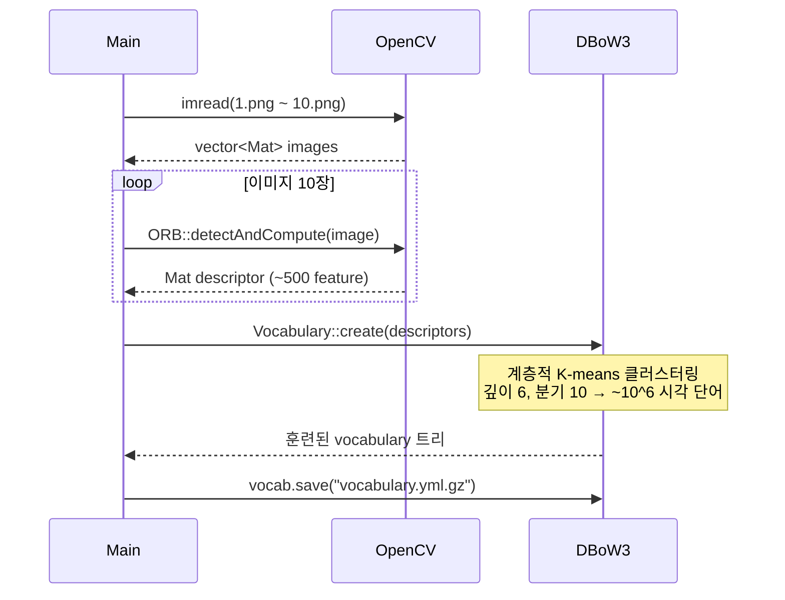
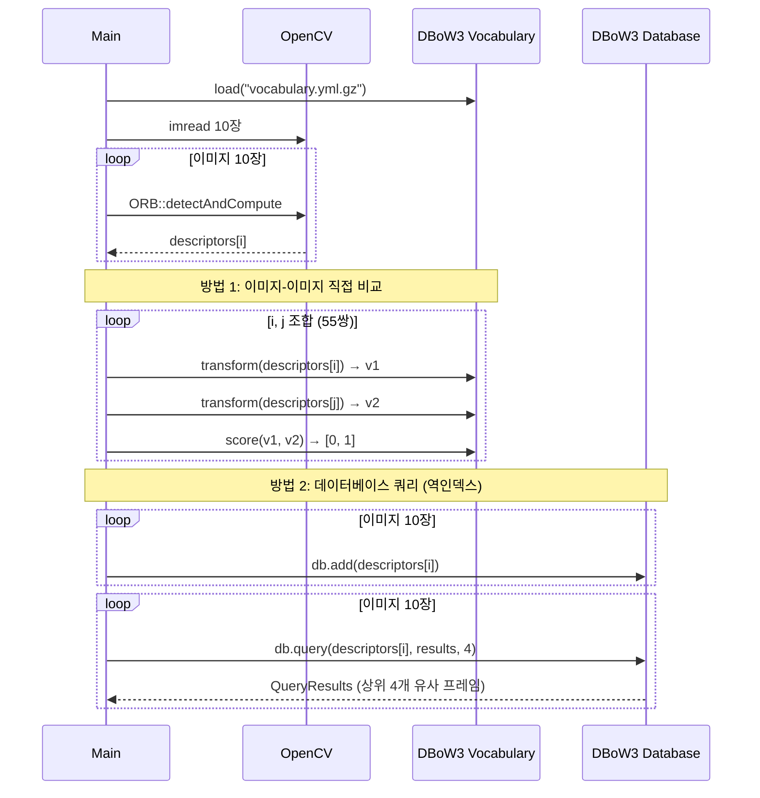
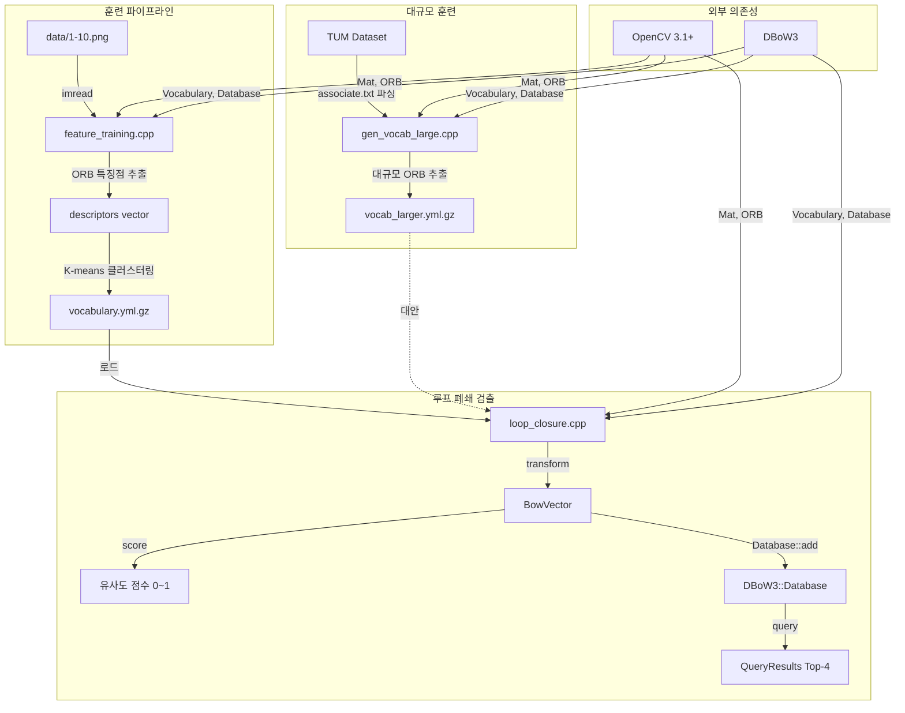

# Chapter 11: Loop Closure Detection (루프 폐쇄 검출)

## 프로젝트 개요

Chapter 11은 **루프 폐쇄 검출(Loop Closure Detection)** 을 다룬다. SLAM 시스템에서 로봇이 이전에 방문한 장소를 재방문했을 때 이를 인식하는 핵심 모듈이다. 이 인식이 없으면 드리프트(drift)가 누적되어 전역 지도가 틀어지지만, 루프를 검출하면 포즈 그래프(Ch10)에 에지를 추가해 전역 최적화가 가능해진다.

**핵심 라이브러리**: DBoW3 (Hierarchical Bag-of-Words)  
**특징점**: ORB (Oriented FAST and Rotated BRIEF)  
**총 코드**: 3개 C++ 파일, 176 라인

---

## 디렉토리 구조

```
ch11/
├── CMakeLists.txt          (23 lines) - 빌드 설정
├── feature_training.cpp    (46 lines) - 소규모 사전 훈련
├── loop_closure.cpp        (70 lines) - 루프 폐쇄 검출 데모
├── gen_vocab_large.cpp     (63 lines) - 대규모 사전 생성 (RGB-D 데이터셋)
├── cmake_modules/
│   └── FindDBoW3.cmake     - 빈 스텁 (수동 경로 하드코딩 사용)
└── data/
    ├── 1.png ~ 10.png      (~5.2 MB) - 훈련용 이미지 640×480 RGB
    ├── vocabulary.yml.gz   (322 KB)  - 소규모 사전 (10장으로 훈련)
    └── vocab_larger.yml.gz (6.5 MB)  - 대규모 사전 (전체 데이터셋으로 훈련)
```

---

## 빌드 설정 (CMakeLists.txt)

```cmake
cmake_minimum_required(VERSION 2.8)
project(loop_closure)

set(CMAKE_BUILD_TYPE "Release")
set(CMAKE_CXX_FLAGS "-std=c++11 -O3")

find_package(OpenCV 3.1 REQUIRED)

# DBoW3 경로 하드코딩
set(DBoW3_INCLUDE_DIRS "/usr/local/include")
set(DBoW3_LIBS "/usr/local/lib/libDBoW3.a")

add_executable(feature_training feature_training.cpp)
add_executable(loop_closure     loop_closure.cpp)
add_executable(gen_vocab        gen_vocab_large.cpp)
```

빌드 타겟:
| 실행 파일 | 소스 파일 | 역할 |
|-----------|-----------|------|
| `feature_training` | feature_training.cpp | 소규모 사전 훈련 |
| `loop_closure` | loop_closure.cpp | 루프 폐쇄 검출 데모 |
| `gen_vocab` | gen_vocab_large.cpp | 대규모 사전 생성 |

---

## Phase 2: 실행 흐름

### 흐름 1: 사전 훈련 (feature_training.cpp)



### 흐름 2: 루프 폐쇄 검출 (loop_closure.cpp)



---

## Phase 3: 핵심 모듈 심층 분석

### 모듈 1: feature_training.cpp

**책임**: 10장의 샘플 이미지에서 ORB 특징점을 추출하여 DBoW3 사전(vocabulary)을 훈련하고 파일로 저장한다.

**핵심 알고리즘 - 계층적 K-means 클러스터링**:

```
Input: 전체 descriptor 집합 D (≈5000개, 각 256비트 바이너리)
Output: vocabulary 트리 (leaf node = 시각 단어)

1. Root 노드: 전체 D에서 k=10 클러스터 생성 (K-means)
2. Level 1: 각 클러스터를 다시 k=10 클러스터로 분할
3. 반복 (깊이 D=6까지):
   - 각 중간 노드의 할당 descriptor를 k=10으로 재분할
4. Leaf 노드: 더 이상 분할하지 않고 "시각 단어"로 지정
   - 총 단어 수 ≈ 10^6

단어 가중치:
  TF-IDF 또는 빈도 기반 가중치 적용
  - 드문 단어(구별력 높음) = 높은 가중치
  - 흔한 단어(판별력 낮음) = 낮은 가중치
```

### 모듈 2: loop_closure.cpp

**책임**: 훈련된 사전을 이용해 이미지 간 유사도를 계산하고, 두 가지 방식(직접 비교 / 데이터베이스 쿼리)으로 루프 폐쇄 후보를 검출한다.

**핵심 알고리즘 - BowVector 변환**:

```
Input: image i의 descriptor 집합 {d₁, ..., dₘ}
Output: BowVector (희소 히스토그램)

1. 각 descriptor dᵢ에 대해:
   a. vocabulary 트리 루트에서 시작
   b. 각 레벨에서 자식 노드 k개와의 해밍 거리 계산
   c. 가장 가까운 자식으로 이동
   d. 리프 노드 도달 시 해당 word w 식별
   e. count[w] += 1

2. 정규화:
   weight[w] = count[w] / Σcount

3. 희소 BowVector 생성:
   {(word_id₁, weight₁), (word_id₂, weight₂), ...}
   (0이 아닌 항목만 저장)
```

**핵심 알고리즘 - L1 유사도 점수**:

```
Input: BowVector v1, v2
Output: score ∈ [0, 1]

score = 1 - (Σ|v1[w] - v2[w]|) / 2

- 1.0: 완전히 동일한 이미지
- 0.0: 완전히 다른 이미지
- > 0.9: 매우 높은 가능성으로 동일 장소
```

**핵심 알고리즘 - 역인덱스 데이터베이스 쿼리**:

```
사전 구축 (offline):
  inverted_index[word_id] → [(image_id, weight), ...]

쿼리 (online):
  1. query descriptor → BowVector v_query
  2. v_query의 각 word w에 대해:
     - inverted_index[w]에서 해당 이미지들 조회
     - 각 이미지의 점수 누적
  3. 점수 내림차순 정렬
  4. 상위 k개 반환

복잡도: O(공유 단어 수) << O(전체 이미지 수)
→ 대규모 데이터셋에서 수백배 빠름
```

### 모듈 3: gen_vocab_large.cpp

**책임**: TUM RGB-D 데이터셋의 associate.txt 파일을 파싱하여 수천 장의 이미지에서 대규모 vocabulary를 생성한다.

**입력 형식 (associate.txt)**:
```
rgb_timestamp    rgb_path    depth_timestamp    depth_path
1341847980.7636  rgb/xxx.png 1341847980.7847   depth/xxx.png
```

**feature_training.cpp 대비 차이점**:
- 수천 장 이미지 지원 (확장성)
- RGB-D 데이터셋 파싱 (associate.txt)
- 타임스탬프 동기화 포함
- 출력: `vocab_larger.yml.gz` (6.5 MB vs 322 KB)

---

## Phase 4: 모듈 관계도



---

## Phase 5: 상태 관리 및 데이터 흐름

**전역 상태**: 없음 (각 실행 파일이 독립적인 main() 함수)

**데이터 흐름 (단방향)**:
```
이미지 파일 (PNG)
    ↓ imread()
Mat (OpenCV 행렬)
    ↓ ORB::detectAndCompute()
vector<Mat> descriptors (각 이미지의 특징 행렬)
    ↓ vocab.transform()
DBoW3::BowVector (희소 히스토그램)
    ↓ vocab.score() 또는 db.query()
float score / DBoW3::QueryResults (루프 폐쇄 후보)
```

**외부 연동**:
- 파일 I/O: PNG 이미지 읽기, YAML.gz 사전 저장/로드
- 텍스트 파싱: associate.txt (gen_vocab_large.cpp)

---

## Phase 6: 설정 및 환경

**의존성 설치**:
```bash
# OpenCV 3.1+
sudo apt install libopencv-dev

# DBoW3 소스 빌드
git clone https://github.com/rmsalinas/DBow3
cd DBow3 && mkdir build && cd build
cmake .. && make -j4
sudo make install  # → /usr/local/lib/libDBoW3.a
```

**빌드**:
```bash
cd ch11
mkdir build && cd build
cmake ..
make -j4
```

**실행 순서**:
```bash
# 1. 사전 훈련
./feature_training

# 2. 루프 폐쇄 검출 데모
./loop_closure

# 3. 대규모 사전 생성 (TUM 데이터셋 필요)
./gen_vocab /path/to/tum_dataset
```

---

## Phase 7: 코드 품질 관찰

**잘된 점**:
- 두 가지 비교 방법(직접 비교 vs 데이터베이스)을 같은 파일에서 명확하게 대조하여 교육적 효과가 높다
- 역인덱스 방식의 필요성을 소규모(10장 직접 비교)와 대규모(DB 쿼리)로 자연스럽게 동기부여한다
- DBoW3 API를 최소한의 코드로 보여줘 라이브러리 사용법 학습이 쉽다

**개선 가능한 점**:
- DBoW3 경로가 `/usr/local`에 하드코딩 → `FindDBoW3.cmake`를 실제 구현하면 이식성 향상
- 루프 폐쇄 판별 임계값(threshold)이 코드에 없음 → 사용자가 점수를 보고 판단해야 함
- 기하학적 검증(epipolar geometry / RANSAC) 없음 → 완전한 루프 폐쇄 파이프라인의 후속 단계 필요
- `gen_vocab_large.cpp`에서 depth 이미지를 로드하지만 실제로는 사용하지 않음 (타임스탬프만 파싱)

**복잡도가 높은 영역**:
- `DBoW3::Vocabulary::create()` 내부의 계층적 K-means → 라이브러리 내부 구현이므로 블랙박스
- L1 유사도가 왜 `1 - distance/2` 형태인지는 DBoW3 문서 참조 필요

**잠재적 이슈**:
- `images.size()`가 int와 비교될 때 signed/unsigned 경고 가능 (`loop_closure.cpp:43`)
- 훈련 이미지와 테스트 이미지가 동일해 오버피팅 주석이 코드에 명시되어 있음 (교육용이므로 의도적)

---

## Phase 8: 빠른 참조 가이드

### 필수 파일 읽기 순서

1. `CMakeLists.txt` — 의존성과 빌드 구조 파악
2. `feature_training.cpp` — ORB 추출 + vocabulary 훈련 흐름
3. `loop_closure.cpp` — BowVector 변환, 직접 비교, DB 쿼리
4. `gen_vocab_large.cpp` — 실제 데이터셋 확장 방법

### 핵심 용어 사전

| 용어 | 설명 |
|------|------|
| **Vocabulary / 사전** | ORB descriptor 공간을 시각 단어로 양자화한 계층 트리 |
| **Visual Word / 시각 단어** | K-means 클러스터의 leaf node, 유사한 descriptor 집합을 대표 |
| **BowVector** | 이미지를 시각 단어 히스토그램으로 표현한 희소 벡터 |
| **Inverted Index / 역인덱스** | 단어 → 해당 단어를 포함하는 이미지 목록 (검색 가속) |
| **Loop Closure / 루프 폐쇄** | 이전 방문 장소를 재방문했을 때의 인식 → 드리프트 보정 |
| **TF-IDF** | 단어 빈도(TF) × 역문서빈도(IDF), 구별력 높은 단어에 높은 가중치 |
| **QueryResults** | DB 쿼리 결과: `(score, image_id)` 쌍의 정렬된 리스트 |

### 자주 수정되는 파일

- `loop_closure.cpp` — 유사도 임계값 실험, 비교 방법 변경
- `CMakeLists.txt` — DBoW3 설치 경로, OpenCV 버전 조정

### 디버깅 팁

1. **Vocabulary가 비어 있다고 오류**: `./data/` 디렉토리 경로 확인, `feature_training` 먼저 실행
2. **낮은 유사도 점수**: 사전이 테스트 환경과 다른 장면으로 훈련됨 → 재훈련 필요
3. **DBoW3 링크 오류**: `/usr/local/lib/libDBoW3.a` 존재 여부 확인, CMakeLists.txt 경로 수정
4. **associate.txt 오류**: TUM 데이터셋의 `associate.py` 스크립트로 먼저 파일 생성 필요

---

## 완전한 SLAM 파이프라인에서의 위치

```
Ch1-6: SLAM 기초 (특징 매칭, 포즈 추정)
Ch7-9: 로컬 SLAM (ORB-SLAM 파이프라인)
Ch10:  포즈 그래프 최적화 ← 루프 폐쇄 에지를 소비
Ch11:  루프 폐쇄 검출 (THIS CHAPTER) ← 루프 폐쇄 에지를 생산
Ch12:  Dense Mapping (포인트 클라우드)
Ch13:  완전한 비주얼 SLAM 시스템 통합
```

루프 폐쇄 후 전체 흐름:
```
현재 프레임 descriptors
    ↓ transform() → BowVector
    ↓ db.query() → 유사 프레임 후보
    ↓ 기하학적 검증 (RANSAC, Fundamental Matrix) [Ch11 이후]
    ↓ 루프 폐쇄 에지 생성
    ↓ 포즈 그래프 최적화 (Ch10 방법 적용)
    ↓ 드리프트 보정 완료
```
