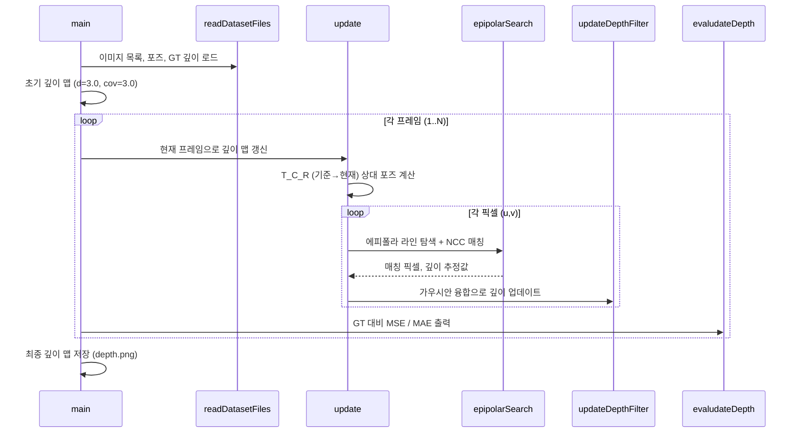
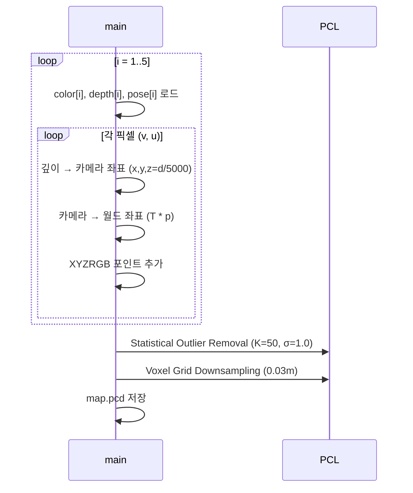
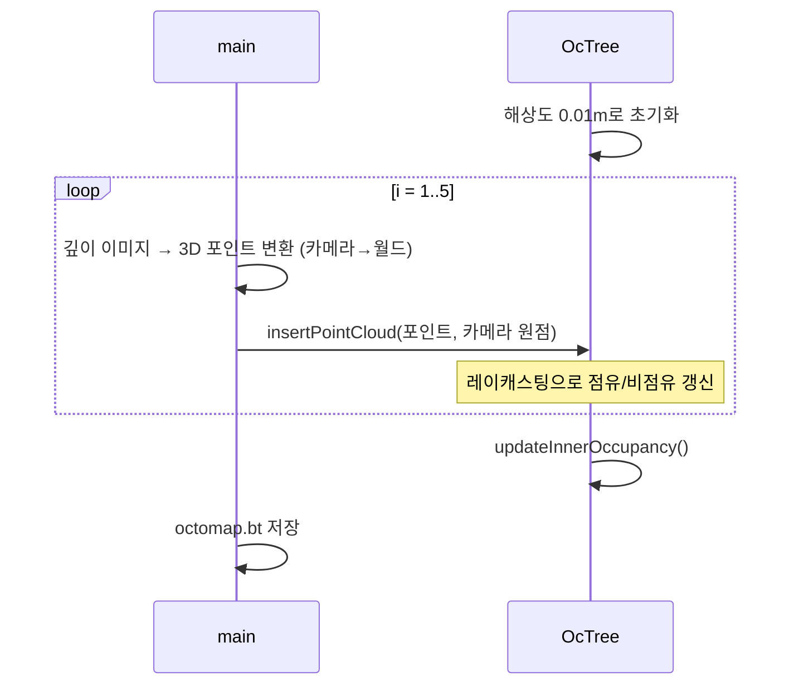
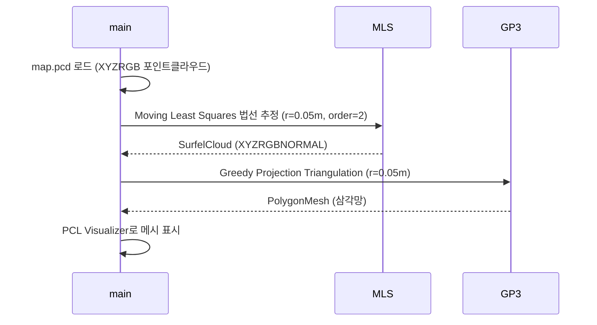
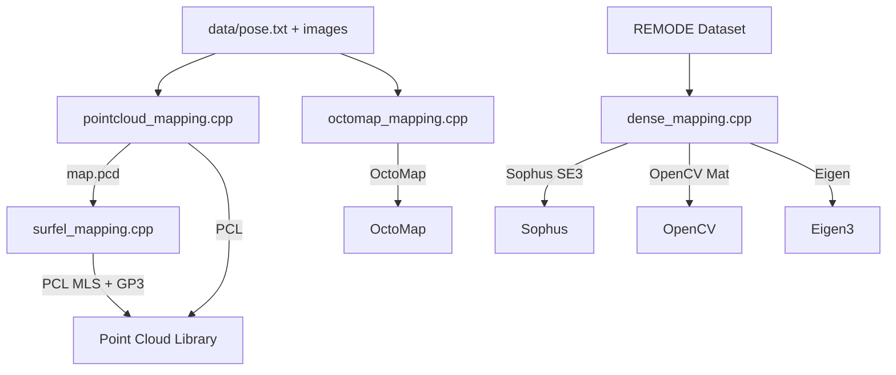

# Chapter 12: Dense Mapping (밀집 지도 생성)

## 프로젝트 목적

시각 SLAM 14강 2판의 12장 실습 코드. 단안 카메라와 RGB-D 카메라를 이용한 **밀집(Dense) 3D 지도 생성** 기법 세 가지를 구현한다.
- 단안 카메라 + 에피폴라 탐색으로 깊이 추정 (REMODE 방식)
- RGB-D 포인트 클라우드 지도 생성
- RGB-D 볼류메트릭(OcTree) 지도 생성

---

## 기술 스택

| 라이브러리 | 용도 |
|-----------|------|
| **Eigen3** | 선형대수 (행렬, 벡터, 쿼터니언) |
| **Sophus** | SE(3) Lie 군 포즈 연산 |
| **OpenCV 3.1** | 이미지 입출력 및 시각화 |
| **PCL** | 포인트 클라우드 처리, 필터링, 메시 재구성 |
| **OctoMap** | 옥트리 기반 점유격자 지도 |
| **Boost** | 문자열 포맷 (boost::format) |

---

## 디렉토리 구조

```
ch12/
├── CMakeLists.txt              # 두 서브디렉토리 포함
├── dense_mono/                 # 단안 밀집 깊이 추정
│   ├── CMakeLists.txt          # Eigen + OpenCV + Sophus
│   └── dense_mapping.cpp       # 487줄 — 에피폴라 탐색 + NCC 매칭
└── dense_RGBD/                 # RGB-D 밀집 지도
    ├── CMakeLists.txt          # OpenCV + Eigen + PCL + OctoMap
    ├── pointcloud_mapping.cpp  # 108줄 — XYZRGB 포인트클라우드
    ├── surfel_mapping.cpp      # 91줄 — 서펠 + 삼각망 재구성
    ├── octomap_mapping.cpp     # 82줄 — 옥트리 점유격자
    └── data/
        ├── pose.txt            # 5장 카메라 포즈 (tx ty tz qx qy qz qw)
        ├── color/              # 1.png ~ 5.png (RGB 640×480)
        └── depth/              # 1.png ~ 5.png (16-bit 깊이)
```

---

## Phase 2: 진입점 및 실행 흐름

### 2-1. 단안 밀집 깊이 추정 (`dense_mono/dense_mapping.cpp`)



**깊이 필터 동작 원리 (Gaussian Fusion)**:
```
초기: μ = 3.0m, σ² = 3.0
에피폴라 탐색 → 새 깊이 z_obs, 불확도 σ_obs²
    ↓
가우시안 융합:
  μ_new  = (σ² · z_obs + σ_obs² · μ) / (σ² + σ_obs²)
  σ²_new = (σ² · σ_obs²) / (σ² + σ_obs²)
    ↓
수렴 조건: σ² < min_cov(0.1) → 확정
발산 조건: σ² > max_cov(10)  → 리셋
```

---

### 2-2. RGB-D 포인트 클라우드 (`dense_RGBD/pointcloud_mapping.cpp`)



---

### 2-3. RGB-D OctoMap (`dense_RGBD/octomap_mapping.cpp`)



---

### 2-4. 서펠 메시 재구성 (`dense_RGBD/surfel_mapping.cpp`)



---

## Phase 3: 핵심 모듈 심층 분석

### `dense_mapping.cpp` — 핵심 함수 목록

| 함수 | 역할 |
|------|------|
| `readDatasetFiles()` | REMODE 데이터셋 이미지/포즈/GT 깊이 로드 |
| `update()` | 전체 깊이 맵 한 프레임치 업데이트 |
| `epipolarSearch()` | 에피폴라 라인을 따라 NCC로 매칭 픽셀 탐색 |
| `updateDepthFilter()` | 삼각측량 후 가우시안 융합으로 깊이 갱신 |
| `NCC()` | Zero-mean Normalized Cross-Correlation (3×3 창) |
| `getBilinearInterpolatedValue()` | 서브픽셀 보간 (bilinear) |
| `evaludateDepth()` | GT 대비 MSE/MAE 계산 및 출력 |
| `px2cam()` / `cam2px()` | 픽셀↔카메라 좌표 변환 |
| `plotDepth()` | 깊이 맵 실시간 시각화 |
| `showEpipolarMatch()` | 에피폴라 매칭 결과 시각화 |

**카메라 내부 파라미터** (REMODE 데이터셋):
```
fx = 481.2,  fy = -480.0  ← fy가 음수인 점 주의
cx = 319.5,  cy = 239.5
해상도: 640 × 480
```

### `pointcloud_mapping.cpp` — 깊이→3D 변환

```cpp
// 깊이 스케일: 16-bit PNG → 미터
double z = d / 5000.0;
double x = (u - cx) * z / fx;
double y = (v - cy) * z / fy;
// 월드 변환: T(SE3) * (x,y,z)
```

---

## Phase 4: 모듈 관계도



---

## Phase 5: 상태 관리 및 데이터 흐름

- **전역 상태**: `depth`, `depth_cov` (cv::Mat) — 픽셀별 깊이/분산
- **포즈**: `poses` 벡터 (Sophus::SE3d) — 프레임별 카메라 자세
- **데이터 흐름**: 순차적 단방향 (이미지 → 깊이 업데이트 → 출력)
- **파일 I/O**: 입력(PNG/txt) → 처리 → 출력(PCD/BT/PNG)

---

## Phase 6: 빌드 설정

### dense_mono
```cmake
set(CMAKE_CXX_FLAGS "-std=c++11 -march=native -O3")
find_package(Eigen3)
find_package(OpenCV 3.1)
# Sophus는 header-only, 직접 include_directories 경로 지정
```

### dense_RGBD
```cmake
set(CMAKE_CXX_FLAGS "-std=c++11 -O2")
find_package(OpenCV)
find_package(Eigen3)
find_package(PCL 1.7)
find_package(octomap)

add_executable(pointcloud_mapping pointcloud_mapping.cpp)
add_executable(octomap_mapping    octomap_mapping.cpp)
add_executable(surfel_mapping     surfel_mapping.cpp)
```

### 빌드 및 실행
```bash
cd ch12 && mkdir build && cd build
cmake .. && make -j4

# 단안 깊이 추정 (REMODE 데이터셋 필요)
./dense_mono/dense_mapping /path/to/remode_dataset

# RGB-D 포인트 클라우드 (데이터 내장)
cd dense_RGBD && ./pointcloud_mapping

# 옥트리 지도
cd dense_RGBD && ./octomap_mapping

# 서펠 메시 (map.pcd 먼저 생성 후)
cd dense_RGBD && ./surfel_mapping map.pcd
```

---

## Phase 7: 코드 품질 관찰

### 잘된 점
- **단계적 학습 구조**: 단안(어려운 문제) → RGB-D(쉬운 입력)로 난이도 점증
- **알고리즘 명확성**: 에피폴라 기하학, 가우시안 융합이 수식과 코드가 1:1 대응
- **시각화 내장**: `plotDepth()`, `showEpipolarMatch()`로 중간 결과 즉시 확인 가능
- **세 가지 표현 비교**: 포인트클라우드/옥트리/서펠을 동일 데이터로 비교 가능

### 주의할 점
- **fy 음수**: `dense_mapping.cpp`의 `fy = -480.0` — 표준이 아니므로 다른 데이터셋 적용 시 주의
- **epipolarSearch의 TODO 주석**: 의도적으로 미완성 구간 존재 (교재 학습용)
- **데이터 경로 하드코딩**: REMODE 데이터셋 경로를 코드에 직접 지정해야 함
- **`surfel_mapping.cpp`**: `map.pcd` 파일 선행 생성 필요 (의존성 순서 중요)

### 잠재적 이슈
- **fy 음수 처리**: `cam2px`에서 `fy`가 음수이면 y픽셀 좌표 반전 발생 — 의도적이지만 혼동 가능
- **옥트리 해상도 0.01m**: 넓은 공간 적용 시 메모리 급증 가능
- **PCL 버전**: PCL 1.7+ 필요, Ubuntu 18.04 기본 패키지로 충족 가능

---

## Phase 8: 빠른 참조 가이드

### 필수 파일 읽기 순서
1. `ch12/CMakeLists.txt` — 전체 구조 파악
2. `dense_RGBD/data/pose.txt` — 입력 데이터 형식 이해
3. `dense_RGBD/pointcloud_mapping.cpp` — 가장 단순한 RGB-D 파이프라인
4. `dense_RGBD/octomap_mapping.cpp` — 점유격자 차이점 비교
5. `dense_mono/dense_mapping.cpp` — 에피폴라 기하학 핵심 알고리즘

### 핵심 용어 사전

| 용어 | 정의 |
|------|------|
| **에피폴라 라인** | 한 카메라의 픽셀이 다른 카메라에서 투영되는 직선 |
| **NCC** | Normalized Cross-Correlation — 조명 변화에 강인한 패치 유사도 |
| **가우시안 융합** | 두 가우시안 분포의 곱 → 더 좁은 분포 (불확도 감소) |
| **서펠(Surfel)** | Surface Element — 위치+법선+색상을 가진 원판 형태 표면 요소 |
| **MLS** | Moving Least Squares — 포인트 클라우드에서 부드러운 법선 추정 |
| **GP3** | Greedy Projection Triangulation — 포인트→삼각망 변환 |
| **OcTree** | 3D 공간을 재귀적으로 8분할하는 트리 구조 |
| **TWC** | World → Camera 변환 행렬 (pose.txt 저장 형식) |
| **REMODE** | REgularized MOnocular Depth Estimation 데이터셋 |

### 디버깅 팁
- `plotDepth()` 출력에서 수렴하지 않는 픽셀 → `min_cov`, `max_cov` 튜닝
- 서펠 메시가 이상할 때 → MLS 반경(`0.05m`)과 GP3 탐색 반경 조정
- 옥트리 메모리 과다 → 해상도를 `0.05m`으로 낮춰 테스트
- `fy=-480.0` 관련 오류 → 다른 데이터셋 사용 시 양수 값으로 변경 필요
