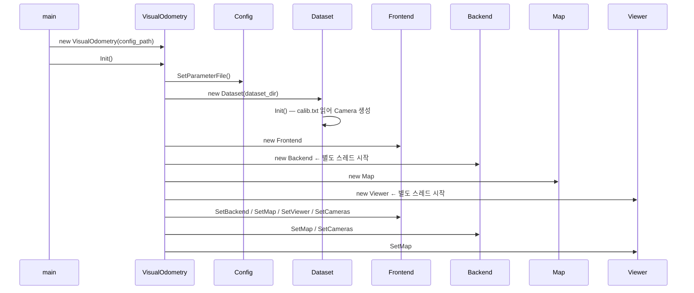
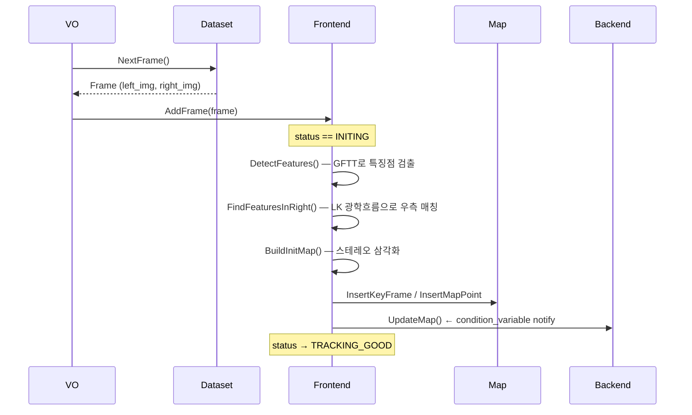
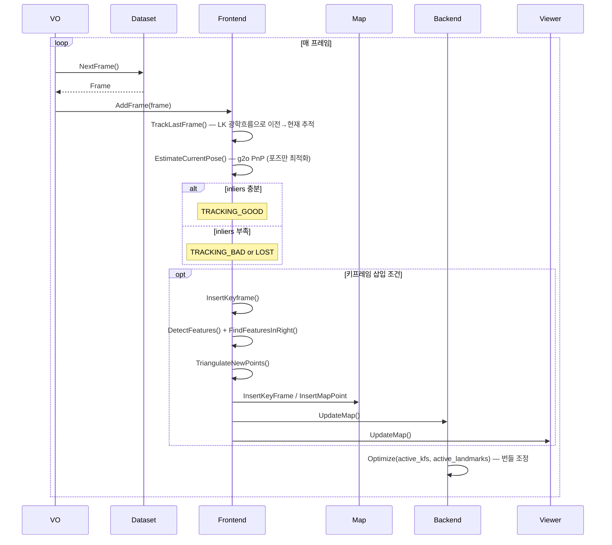
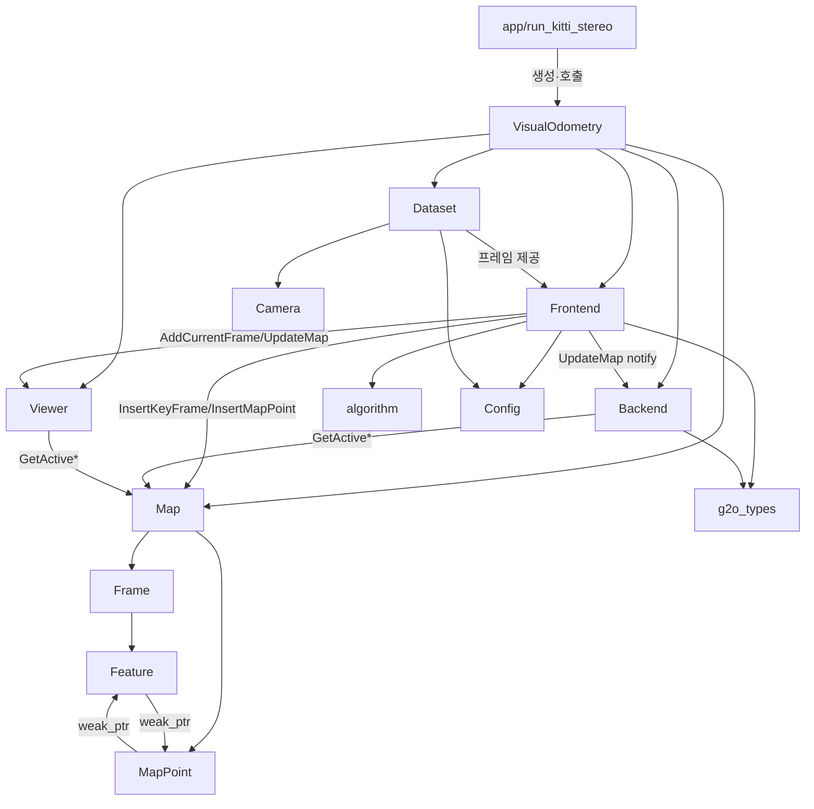

# slambook2 ch13 — myslam 스테레오 비주얼 오도메트리 전체 분석

## 프로젝트 목적

《14강으로 배우는 SLAM》(slambook2) 13장의 완전한 스테레오 VO(Visual Odometry) 구현입니다.  
KITTI 스테레오 이미지 시퀀스를 입력으로 받아, 광학 흐름(LK) 특징 추적 + g2o 비선형 최적화를 통해 카메라 궤적과 3D 지도를 실시간으로 구축합니다.  
프론트엔드(추적)와 백엔드(번들 조정)를 별도 스레드로 분리해 실시간성을 확보합니다.

---

## 기술 스택

| 항목 | 내용 |
|------|------|
| 언어 | C++11 |
| 빌드 | CMake 2.8+ |
| 선형대수 | Eigen3 |
| 리 군/대수 | Sophus (SE3, SO3) |
| 컴퓨터 비전 | OpenCV 3.1+ |
| 그래프 최적화 | G2O + CSparse |
| 시각화 | Pangolin (OpenGL) |
| 로깅 | glog |
| CLI 플래그 | gflags |
| 테스트 | GTest |

---

## 디렉토리 구조

```
ch13/
├── CMakeLists.txt          # 루트 빌드 설정
├── app/
│   ├── CMakeLists.txt
│   └── run_kitti_stereo.cpp   # 진입점 (main)
├── config/
│   └── default.yaml           # 런타임 설정 (데이터셋 경로, 특징점 수 등)
├── include/myslam/
│   ├── common_include.h    # Eigen/Sophus/OpenCV 공통 타입 typedef
│   ├── algorithm.h         # SVD 삼각화 유틸리티
│   ├── camera.h            # 핀홀 카메라 모델
│   ├── config.h            # YAML 파라미터 싱글톤
│   ├── dataset.h           # KITTI 데이터 로더
│   ├── feature.h           # 2D 특징점 구조체
│   ├── frame.h             # 스테레오 이미지 프레임
│   ├── mappoint.h          # 3D 랜드마크 점
│   ├── map.h               # 키프레임/랜드마크 컨테이너
│   ├── frontend.h          # 프론트엔드 (추적·초기화)
│   ├── backend.h           # 백엔드 (번들 조정 스레드)
│   ├── viewer.h            # Pangolin 시각화 스레드
│   ├── g2o_types.h         # g2o 커스텀 정점·엣지
│   └── visual_odometry.h   # VO 외부 인터페이스
├── src/                    # 위 헤더들의 구현
└── test/
    └── test_triangulation.cpp  # GTest: SVD 삼각화 단위 테스트
```

---

## 아키텍처 패턴

- **파이프라인 패턴**: `Dataset → Frontend → Map ← Backend`, `Map → Viewer`
- **생산자-소비자 패턴**: 프론트엔드가 지도를 업데이트하면 `condition_variable`로 백엔드를 깨웁니다
- **팩토리 메서드**: `Frame::CreateFrame()`, `MapPoint::CreateNewMappoint()`로 전역 ID를 자동 부여합니다
- **shared_ptr/weak_ptr 소유권**: Feature ↔ MapPoint 간 순환 참조를 `weak_ptr`로 차단합니다

---

## Phase 2: 진입점 및 실행 흐름

### 진입점

`app/run_kitti_stereo.cpp:main()`

```cpp
VisualOdometry::Ptr vo(new VisualOdometry(FLAGS_config_file));
vo->Init();   // 컴포넌트 생성 + 연결
vo->Run();    // 루프 실행
```

### 주요 실행 흐름

#### 흐름 1: 시스템 초기화



#### 흐름 2: 스테레오 초기화 (첫 키프레임)



#### 흐름 3: 정상 추적 루프



---

## Phase 3: 핵심 모듈 심층 분석

### 1. `Frontend` (393 + 142줄)

**책임**: 프레임 단위로 카메라 포즈를 추정하고, 키프레임 결정 및 새 맵포인트 삼각화를 수행합니다.

**상태 머신**:
```
INITING → (충분한 특징점) → TRACKING_GOOD
TRACKING_GOOD ↔ TRACKING_BAD
TRACKING_BAD → (inliers < 20) → LOST
```

**핵심 알고리즘 — EstimateCurrentPose (PnP)**:
1. g2o 그래프 구성: VertexPose 1개 + EdgeProjectionPoseOnly N개
2. 반복 최적화 × 4 라운드, chi² > 5.991이면 아웃라이어 마킹
3. 3라운드 이후 RobustKernel 제거 → 수렴 정밀도 향상

**핵심 알고리즘 — TrackLastFrame (LK)**:
- 맵포인트가 있으면 투영점을 초기 추정치로 사용해 수렴 속도 개선

**파라미터**:
| 이름 | 기본값 | 의미 |
|------|--------|------|
| `num_features` | 150 | GFTT 최대 특징점 수 |
| `num_features_init` | 50 | 초기화 최소 매칭 수 |
| `num_features_tracking` | 50 | 정상 추적 임계값 |
| `num_features_tracking_bad` | 20 | 불량 추적 임계값 |
| `num_features_needed_for_keyframe` | 80 | 키프레임 삽입 임계값 |

---

### 2. `Backend` (180 + 62줄)

**책임**: 활성 키프레임 창(window) 내의 번들 조정을 백그라운드 스레드에서 수행합니다.

**핵심 알고리즘 — Optimize**:
1. VertexPose(6-DOF SE3) + VertexXYZ(3D) 정점 추가
2. EdgeProjection(이항 엣지)으로 재투영 오차 연결
3. VertexXYZ에 `setMarginalized(true)` → Schur 보완 적용으로 포즈 우선 최적화
4. 아웃라이어 비율 > 50%이면 chi² 임계값을 2배씩 늘려 적응적 조정 (최대 5회)
5. 최적화 후 Feature의 `is_outlier_` 갱신 + 맵포인트 관측 제거

**사용 선형 솔버**: CSparse (희소 행렬 특화)

---

### 3. `Map` (73 + 113줄)

**책임**: 전체/활성 키프레임과 랜드마크를 관리하며 sliding window를 유지합니다.

**슬라이딩 윈도우 전략**:
- `num_active_keyframes_ = 7` (최대 7개 유지)
- 초과 시 `RemoveOldKeyframe()` 호출:
  - 현재 프레임과 거리가 매우 가까운 프레임(중복) 우선 제거
  - 없으면 가장 먼 프레임 제거 (공간 다양성 유지)

**스레드 안전**: 모든 읽기/쓰기에 `data_mutex_` 잠금 적용

---

### 4. `g2o_types.h` (156줄)

**책임**: SLAM 특화 g2o 정점·엣지를 정의합니다.

| 클래스 | 종류 | 용도 |
|--------|------|------|
| `VertexPose` | BaseVertex<6, SE3> | 카메라 포즈 (Li군 왼쪽 곱셈 업데이트) |
| `VertexXYZ` | BaseVertex<3, Vec3> | 3D 랜드마크 위치 |
| `EdgeProjectionPoseOnly` | BaseUnaryEdge<2> | 포즈만 최적화 (프론트엔드 PnP) |
| `EdgeProjection` | BaseBinaryEdge<2> | 포즈+랜드마크 동시 최적화 (백엔드 BA) |

`EdgeProjection::linearizeOplus`는 포즈 야코비안 (2×6)과 랜드마크 야코비안 (2×3)을 해석적으로 계산합니다.

---

### 5. `algorithm.h` (45줄)

**책임**: SVD 기반 선형 삼각화를 인라인 함수로 제공합니다.

**알고리즘**:
1. 각 관측에 대해 2개의 선형 방정식 생성: `[x·m3 - m1; y·m3 - m2] * X = 0`
2. 행렬 A(2N×4)에 쌓아 BDC-SVD 분해
3. 최소 특이값 벡터(V의 마지막 열)가 해
4. `σ₄/σ₃ < 0.01`이면 해 품질 불량으로 false 반환

**주의**: 현재 반환 로직이 반전되어 있습니다. 품질이 좋을 때 `false`를 반환하고, 나쁠 때 `true`를 반환합니다 (원서 버그로 알려진 사항).

---

### 6. `Dataset` (39 + 77줄)

**책임**: KITTI 형식 스테레오 데이터셋을 읽어 Frame 객체를 순차 제공합니다.

- `calib.txt` 파싱: P0~P3 (3×4 투영 행렬) 읽어 fx, fy, cx, cy, baseline 추출
- 이미지 해상도를 0.5배로 다운샘플링 (처리 속도 개선)
- 파일 경로 형식: `{dataset_dir}/image_{0,1}/{index:06d}.png`

---

## Phase 4: 모듈 관계도



**순환 참조 없음**: Feature ↔ MapPoint 간 weak_ptr 사용으로 순환 차단

---

## Phase 5: 상태 관리 및 데이터 흐름

### 전역 상태

| 상태 | 위치 | 보호 |
|------|------|------|
| 모든 키프레임/랜드마크 | `Map::keyframes_`, `Map::landmarks_` | `data_mutex_` |
| 활성 키프레임/랜드마크 | `Map::active_keyframes_`, `Map::active_landmarks_` | `data_mutex_` |
| 프레임 포즈 | `Frame::pose_` | `pose_mutex_` |
| 랜드마크 위치 | `MapPoint::pos_` | `data_mutex_` |
| 뷰어 현재 프레임 | `Viewer::current_frame_` | `viewer_data_mutex_` |

### 데이터 흐름

```
KITTI 디스크
  ↓ Dataset::NextFrame()
Frame (left_img, right_img)
  ↓ Frontend::AddFrame()
Feature 검출·추적 → 포즈 추정 (g2o PnP)
  ↓ (키프레임 조건 충족 시)
삼각화 → MapPoint 생성
  ↓ Map::InsertKeyFrame/InsertMapPoint
  ├→ Backend (condition_variable wakeup) → 번들 조정 → 포즈/랜드마크 업데이트
  └→ Viewer (Pangolin) → 실시간 3D 렌더링
```

### 스레드 구성

| 스레드 | 역할 | 동기화 |
|--------|------|--------|
| Main | Dataset 읽기 + Frontend 호출 | - |
| Backend | 번들 조정 루프 | `condition_variable map_update_` |
| Viewer | Pangolin 렌더링 루프 | `viewer_data_mutex_` |

---

## Phase 6: 설정 및 환경

### 주요 환경 변수 / 설정

`config/default.yaml`:

| 키 | 의미 |
|----|------|
| `dataset_dir` | KITTI 시퀀스 경로 (예: `.../sequences/05`) |
| `num_features` | GFTT 검출 최대 특징점 수 (기본 150) |
| `num_features_init` | 초기화 최소 스테레오 매칭 수 (기본 50) |
| `num_features_tracking` | 정상 추적 inlier 임계값 (기본 50) |

### 빌드 방법

```bash
cd ch13
mkdir build && cd build
cmake .. -DCMAKE_BUILD_TYPE=Release
make -j4
```

### 실행 방법

```bash
./bin/run_kitti_stereo --config_file ./config/default.yaml
```

### 의존성 설치 필요 항목

- OpenCV 3.1+
- Eigen3
- Sophus
- G2O (g2o_core, g2o_types_sba, g2o_solver_csparse)
- Pangolin
- glog, gflags, GTest, CSparse

---

## Phase 7: 코드 품질 관찰

### 잘된 점

1. **명확한 프론트엔드/백엔드 분리**: 추적과 최적화를 독립 스레드로 분리해 실시간성 확보
2. **shared_ptr/weak_ptr 소유권 설계**: Feature ↔ MapPoint 순환 참조를 weak_ptr로 정확히 차단
3. **팩토리 패턴 ID 관리**: `CreateFrame()`, `CreateNewMappoint()`로 원자적 ID 부여
4. **적응적 아웃라이어 임계값**: 백엔드 최적화에서 inlier 비율에 따라 chi² 임계값 동적 조정
5. **투영 초기 추정치 활용**: LK 추적 시 맵포인트 투영값을 초기 추정치로 사용해 수렴 안정화

### 개선 가능한 점

1. **`Reset()` 미구현**: `LOST` 상태에서 단순 로그만 출력하고 실제 재초기화 없음
2. **`algorithm.h` 삼각화 반환 로직 버그**: `σ₄/σ₃ < 1e-2`일 때(해 품질 나쁨) `true` 반환, 품질 좋을 때 `false` 반환 — 의미가 반전됨
3. **오른쪽 카메라 features_right_ 정렬 의존성**: `features_left_[i]`와 `features_right_[i]`의 인덱스 1:1 대응을 vector로 강제하는 방식은 취약함 (nullptr 체크 필수)
4. **하드코딩된 Viewer 카메라 파라미터**: `DrawFrame()`의 fx, fy, cx, cy, width, height가 하드코딩됨

### 복잡도가 높은 영역

- **`EstimateCurrentPose()` (frontend.cpp:~104줄)**: 반복 최적화 + 아웃라이어 마킹 + RobustKernel 제거 로직이 중첩됨
- **`Backend::Optimize()`**: 정점 삭제 없이 엣지만 `setLevel(1)`로 비활성화하는 g2o 관용구에 익숙하지 않으면 이해 어려움

### 잠재적 이슈

- **`viewer.cpp`의 `usleep(5000)`**: 하드코딩된 슬립으로 시스템 부하에 따라 실시간성 저하 가능
- **`map.cpp`의 중국어 주석 혼재**: 일부 주석이 중국어로 남아 있음 (번역 미완)
- **`Config` 싱글톤**: 멀티스레드 환경에서 첫 초기화 시 race condition 가능성 (SetParameterFile 이후는 읽기만 하므로 실용적으로 안전)

---

## Phase 8: 빠른 참조 가이드

### 필수 파일 읽기 순서

1. `include/myslam/common_include.h` — 프로젝트 전체 타입 시스템 이해
2. `include/myslam/frame.h` + `mappoint.h` + `feature.h` — 핵심 데이터 모델
3. `include/myslam/frontend.h` + `src/frontend.cpp` — 추적 알고리즘 핵심
4. `include/myslam/g2o_types.h` — 최적화 수식 이해
5. `src/backend.cpp` — 번들 조정 구현

### 핵심 용어 사전

| 용어 | 설명 |
|------|------|
| **Frame** | 한 시점의 스테레오 이미지 쌍 (left + right) |
| **KeyFrame** | 지도 최적화 기준이 되는 대표 프레임 |
| **MapPoint / Landmark** | 삼각화로 생성된 3D 세계 좌표계 점 |
| **Feature** | 이미지 상의 2D 특징점 관측값 |
| **SE3** | Sophus의 특수 유클리드 군 (회전 + 병진, 4×4 변환 행렬) |
| **Tcw** | 세계→카메라 변환 (frame.pose_ 저장 방식) |
| **Twc** | 카메라→세계 변환 (`pose_.inverse()`) |
| **Active Window** | 최근 N개의 키프레임 집합 (슬라이딩 윈도우 BA) |
| **Inlier/Outlier** | chi² 임계값 기준 재투영 오차 정상/이상 분류 |
| **LK Flow** | Lucas-Kanade 피라미드 광학 흐름 |

### 자주 수정되는 파일

| 목적 | 파일 |
|------|------|
| 추적 파라미터 조정 | `config/default.yaml` |
| 키프레임 삽입 정책 변경 | `src/frontend.cpp:InsertKeyframe()` |
| 번들 조정 반복 수 조정 | `src/backend.cpp:Optimize()` |
| 슬라이딩 윈도우 크기 변경 | `include/myslam/map.h:num_active_keyframes_` |
| 데이터셋 형식 변경 | `src/dataset.cpp` |

### 디버깅 팁

1. **추적 실패**: `LOG(INFO) "Outlier/Inlier in pose estimating"` 로그로 inlier 수 확인
2. **초기화 실패**: `num_features_init` 값을 낮추거나 첫 프레임 텍스처 확인
3. **백엔드 과부하**: `optimizer.optimize(10)` 반복 수를 줄이거나 active window 크기 축소
4. **삼각화 실패**: `pworld[2] > 0` 조건 실패 시 스테레오 기선(baseline) 값 확인
5. **빌드 오류**: G2O의 `make_unique` 지원 여부 — C++14 이상 필요할 수 있음
