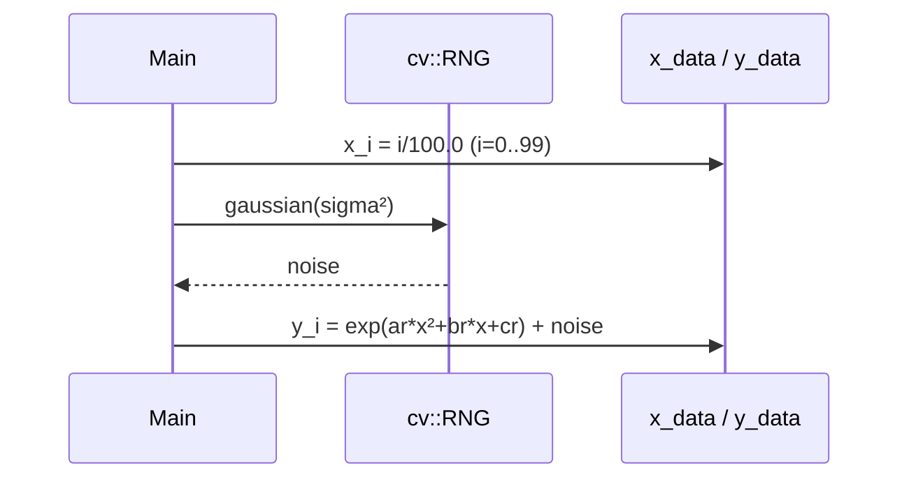
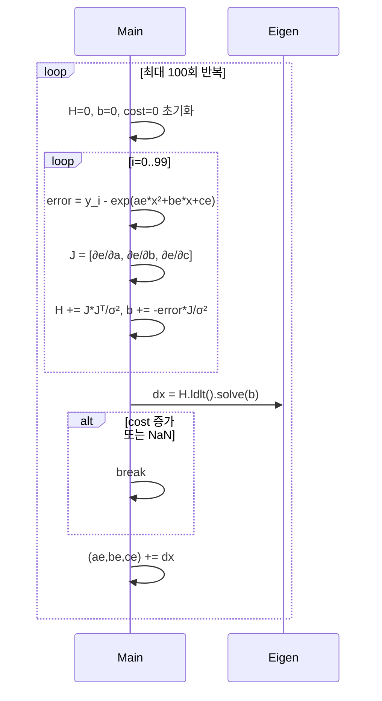
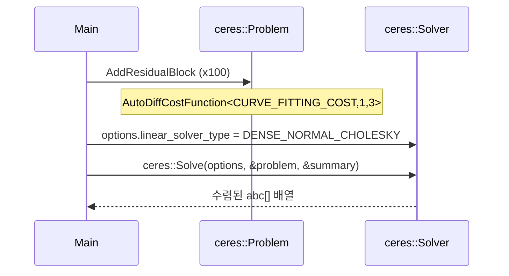
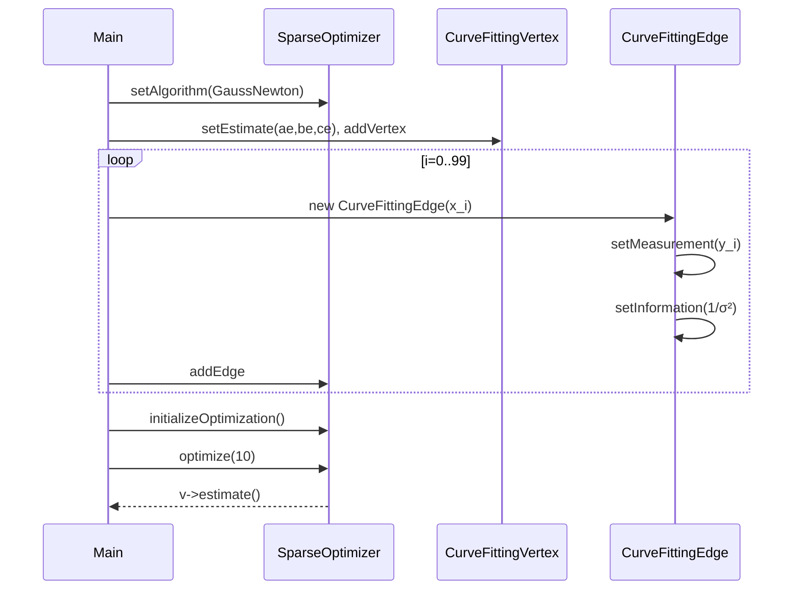
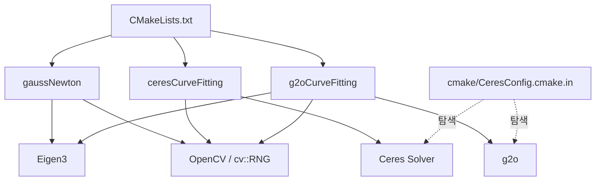

# Chapter 6 — 비선형 최적화 (Nonlinear Optimization)

## Phase 1: 프로젝트 개요

### 프로젝트 목적
Chapter 6은 SLAM의 핵심인 **비선형 최소제곱 최적화**를 세 가지 방법으로 비교·구현한다.
모델 `y = exp(ax² + bx + c)`에 가우시안 노이즈를 더해 생성한 100개 관측값에서 파라미터 (a, b, c)를 역추정하는 곡선 피팅(curve fitting) 문제를 공통 실험 대상으로 사용한다.
초기 추정값 (a=2, b=-1, c=5)에서 시작해 실제값 (a=1, b=2, c=1)으로 수렴하는 과정을 통해 각 최적화 기법의 동작 원리와 API 사용법을 직접 체득하는 것이 목적이다.

### 기술 스택

| 항목 | 내용 |
|---|---|
| 언어 | C++14 |
| 빌드 | CMake 2.8+ |
| 선형대수 | Eigen 3 |
| 랜덤 노이즈 생성 | OpenCV (`cv::RNG`) |
| 최적화 라이브러리 1 | Ceres Solver |
| 최적화 라이브러리 2 | g2o |

### 디렉토리 구조

```
ch6/
├── CMakeLists.txt          # 빌드 설정 (3개 실행파일 정의)
├── gaussNewton.cpp         # 직접 구현한 Gauss-Newton
├── ceresCurveFitting.cpp   # Ceres Solver 기반 최적화
├── g2oCurveFitting.cpp     # g2o 그래프 최적화
└── cmake/
    ├── FindG2O.cmake       # g2o 라이브러리 탐색 모듈
    └── CeresConfig.cmake.in # Ceres 설정 템플릿
```

### 아키텍처 패턴
세 파일 모두 독립적인 `main()` 실행 프로그램으로, 동일한 문제에 대한 **세 가지 솔버 비교 구조**다.
- `gaussNewton`: 교육용 직접 구현 (first-principles)
- `ceresCurveFitting`: 함수형 비용 모델 + 자동 미분 패턴
- `g2oCurveFitting`: 그래프 모델 (정점 + 엣지 클래스) 패턴

---

## Phase 2: 진입점 및 실행 흐름

세 파일 모두 동일한 데이터 생성 → 최적화 → 결과 출력의 3단계 흐름을 공유한다.

### 공통 데이터 생성 흐름



### gaussNewton 실행 흐름



### ceresCurveFitting 실행 흐름



### g2oCurveFitting 실행 흐름



---

## Phase 3: 핵심 모듈 심층 분석

### 1. `gaussNewton.cpp` (78줄)

**책임**: 야코비와 헤시안을 직접 계산하여 Gauss-Newton 알고리즘을 처음부터 구현한다.

**핵심 알고리즘** (수식 기반 설명):
1. 오차 정의: `e_i = y_i − exp(a·xᵢ² + b·xᵢ + c)`
2. 야코비: `J = [−xᵢ²·f, −xᵢ·f, −f]` where `f = exp(a·xᵢ² + b·xᵢ + c)`
3. 헤시안 근사: `H ≈ Σ Jᵢ Jᵢᵀ / σ²` (Gauss-Newton 근사, 2차 미분 무시)
4. 업데이트: `Δx = H⁻¹b` via LDLT 분해
5. 수렴 조건: cost가 증가하거나 NaN이면 조기 종료

**특징**:
- 외부 최적화 라이브러리 없이 Eigen만 사용
- 모든 수식이 코드에 명시적으로 드러나 학습 목적에 최적
- 정보 행렬(`1/σ²`)을 수동으로 가중치로 적용

---

### 2. `ceresCurveFitting.cpp` (76줄)

**책임**: Ceres Solver의 자동 미분(Auto Differentiation) 기능을 이용해 동일한 커브 피팅을 수행한다.

**핵심 구조 — `CURVE_FITTING_COST`**:
```cpp
struct CURVE_FITTING_COST {
  template<typename T>
  bool operator()(const T *const abc, T *residual) const {
    residual[0] = T(_y) - ceres::exp(abc[0]*T(_x)*T(_x) + abc[1]*T(_x) + abc[2]);
    return true;
  }
};
```
- 잔차 함수 하나만 정의하면 Ceres가 자동으로 야코비를 계산
- 템플릿 기반으로 작성해야 auto diff의 `Jet` 타입과 호환됨

**솔버 설정**:
- `DENSE_NORMAL_CHOLESKY`: 정규방정식 `JᵀJ·Δx = Jᵀr`을 dense Cholesky 분해로 풀기
- 파라미터가 3개뿐이라 dense 솔버가 적합

---

### 3. `g2oCurveFitting.cpp` (126줄)

**책임**: g2o의 그래프 최적화 프레임워크로 동일한 문제를 정점(vertex)·엣지(edge) 모델로 표현한다.

**주요 클래스**:

| 클래스 | 부모 | 역할 |
|---|---|---|
| `CurveFittingVertex` | `g2o::BaseVertex<3, Vector3d>` | 최적화 변수 (a,b,c) 보유 |
| `CurveFittingEdge` | `g2o::BaseUnaryEdge<1, double, CurveFittingVertex>` | 각 관측값에 대한 오차 계산 |

**`CurveFittingVertex::oplusImpl`**:
```cpp
_estimate += Eigen::Vector3d(update);  // 덧셈 업데이트 (Lie group 불필요)
```

**`CurveFittingEdge::linearizeOplus`** (수동 야코비):
```cpp
_jacobianOplusXi[0] = -_x * _x * y;  // ∂e/∂a
_jacobianOplusXi[1] = -_x * y;        // ∂e/∂b
_jacobianOplusXi[2] = -y;             // ∂e/∂c
```
- g2o는 수동 야코비를 선호 (자동 미분도 지원하지만 별도 설정 필요)

**정보 행렬**: `setInformation(I * 1/σ²)` — 1×1 단위 행렬 × 역분산

---

## Phase 4: 모듈 관계도



순환 의존 없음. 세 실행파일은 모두 독립적이며 공유 헤더 없음.

---

## Phase 5: 상태 관리 및 데이터 흐름

- **전역 상태 없음**: 모든 변수는 `main()` 스택 혹은 힙 로컬
- **데이터 흐름**: 단방향 파이프라인
  ```
  [데이터 생성] → [최적화 라이브러리] → [파라미터 추정값 출력]
  ```
- **외부 I/O**: 표준 출력(`cout`)만 사용. 파일 읽기/쓰기 없음
- **시간 측정**: `chrono::steady_clock`으로 최적화 시간만 측정

---

## Phase 6: 설정 및 환경

### 빌드 요구 사항

| 의존성 | 최소 버전 | 용도 |
|---|---|---|
| CMake | 2.8 | 빌드 시스템 |
| C++ 컴파일러 | C++14 | `auto`, 람다 등 |
| OpenCV | (any) | `cv::RNG` 가우시안 노이즈 |
| Eigen3 | 3.x | 선형대수 (`/usr/include/eigen3`) |
| Ceres Solver | (any) | `ceresCurveFitting` 빌드 |
| g2o | (any) | `g2oCurveFitting` 빌드 |

### 빌드 절차
```bash
mkdir build && cd build
cmake .. -DCMAKE_BUILD_TYPE=Release
make -j4
```

### 빌드 플래그
- `-std=c++14 -O3`: C++14 표준 + 최고 최적화 수준

---

## Phase 7: 코드 품질 관찰

### 잘된 점
1. **교육적 점진적 전개**: 직접 구현(gaussNewton) → 라이브러리 추상화(Ceres) → 그래프 모델(g2o) 순서로 추상화 수준이 높아져 개념 이해가 자연스럽다.
2. **동일한 문제 재사용**: 세 파일이 완전히 동일한 데이터 생성 코드를 가져 결과를 1:1로 비교할 수 있다.
3. **한국어 주석**: `_x`, `_y`, `ae/ar` 같은 짧은 변수명도 주석으로 의미가 명확히 설명되어 있다.
4. **조기 종료 로직** (gaussNewton): cost가 증가하거나 NaN 발생 시 즉시 break — 발산 방지 처리가 포함되어 있다.

### 개선 가능한 점
1. **데이터 생성 코드 중복**: 세 파일 모두 동일한 20줄 데이터 생성 블록을 복사·붙여넣기했다. 공통 헤더로 추출하면 수정 시 한 곳만 바꾸면 된다.
2. **Gauss-Newton 반복 횟수 하드코딩**: `iterations = 100`이 매직 넘버로 고정되어 있다. 수렴 기준(예: `‖dx‖ < ε`)을 별도 조건으로 두는 것이 더 견고하다.
3. **g2o `optimize(10)`**: 10회 고정 반복이다. `optimizer.activeEdges()` 기반 수렴 판단 또는 더 많은 반복이 필요할 수 있다.
4. **빈 read/write 구현**: g2o vertex·edge의 `read()`/`write()` 메서드가 빈 채로 남아 있어 컴파일러 경고가 발생할 수 있다. `{ return true; }` 정도로 채워주면 깔끔하다.

### 복잡도가 높은 영역
- **g2oCurveFitting의 타입 별칭**: `BlockSolverType`, `LinearSolverType`의 중첩 템플릿이 초심자에게 어렵게 느껴진다. g2o의 블록 솔버 아키텍처(3×1 블록)를 이해해야 의미가 명확해진다.
- **Ceres AutoDiff의 템플릿 트릭**: `operator()(const T* const abc, T* residual)` 에서 `T`가 `double` 또는 `ceres::Jet`이 될 수 있다는 사실을 모르면 왜 템플릿인지 이해하기 어렵다.

### 잠재적 이슈
- `g2o::BlockSolverTraits<3,1>`의 숫자(3, 1)는 문제 구조에 맞게 수동으로 설정해야 하는데, 파라미터 차원이 바뀌면 이 숫자도 함께 수정해야 한다는 점이 오류를 유발하기 쉽다.
- `Eigen` include 경로가 `/usr/include/eigen3`으로 하드코딩되어 있어 환경에 따라 빌드 실패 가능.

---

## Phase 8: 빠른 참조 가이드

### 필수 파일 읽기 순서
1. **`gaussNewton.cpp`** — Gauss-Newton의 수식을 코드로 직접 확인
2. **`ceresCurveFitting.cpp`** — 비용 함수 구조체 + AutoDiff 패턴 습득
3. **`g2oCurveFitting.cpp`** — g2o의 Vertex/Edge 클래스 상속 구조 이해
4. **`CMakeLists.txt`** — 라이브러리 링킹 방법 확인

### 핵심 용어 사전

| 용어 | 설명 |
|---|---|
| `ar, br, cr` | 실제(reference) 파라미터 값 (a=1, b=2, c=1) |
| `ae, be, ce` | 추정(estimated) 파라미터 값, 초기값 (2, -1, 5) |
| `H` (Hessian) | `JᵀJ` 근사. 3×3 행렬. 뉴턴 방정식 `HΔx=b`의 좌변 |
| `b` (bias) | `−Jᵀe`. 뉴턴 방정식의 우변 |
| `inv_sigma` | 정보 행렬의 가중치 `1/σ` |
| `BlockSolverTraits<3,1>` | g2o에서 pose 차원 3, 랜드마크 차원 1을 의미 |
| `AutoDiffCostFunction<F,1,3>` | Ceres에서 잔차 차원 1, 파라미터 차원 3 |
| `BaseUnaryEdge` | 정점 하나에만 연결된 엣지 (단항 에러 항) |

### 자주 수정되는 파일
- **`gaussNewton.cpp`**: 최적화 알고리즘 직접 수정 실험용
- **`g2oCurveFitting.cpp`**: g2o 솔버를 `GaussNewton → Levenberg → Dogleg`으로 교체 실험 (89~91번째 줄)

### 디버깅 팁
- **수렴 실패 시**: 초기값 (`ae, be, ce`)을 실제값에 더 가깝게 조정하거나, gaussNewton의 `iterations`를 늘려 확인
- **g2o 빌드 실패 시**: `cmake/FindG2O.cmake`를 먼저 확인. 라이브러리 설치 경로가 비표준이면 `G2O_ROOT` 환경변수 설정 필요
- **Ceres 빌드 실패 시**: `find_package(Ceres)` 실패 메시지에서 `CERES_ROOT_DIR` 힌트 경로 확인
- **최적화 결과 비교**: 세 프로그램 모두 동일한 난수 시드(`cv::RNG rng`는 고정 시드 0)를 사용하므로 결과가 항상 동일하며, 알고리즘 간 수렴 속도 비교 가능
