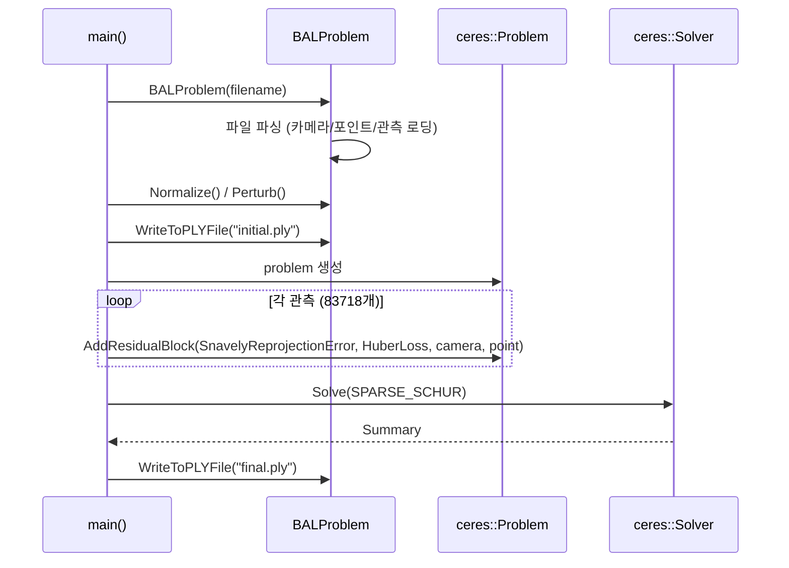
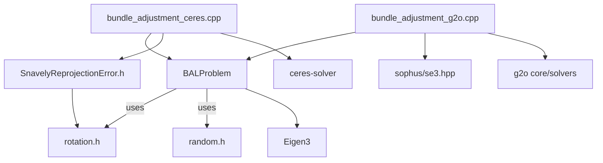

# ch9: Bundle Adjustment (번들 조정)

## Phase 1: 프로젝트 개요

### 프로젝트 목적

ch9는 "SLAM 14강" 교재(slambook2)의 9장 예제 코드로, **Bundle Adjustment(BA)** 를 두 가지 최적화 프레임워크(Ceres, g2o)로 구현한다. BAL(Bundle Adjustment in the Large) 데이터셋을 입력으로 받아 카메라 포즈·내부 파라미터·3D 포인트를 동시에 최적화함으로써 재투영 오차를 최소화하는 것이 목표다.

### 기술 스택

| 항목 | 내용 |
|---|---|
| 언어 | C++11 |
| 빌드 시스템 | CMake 2.8+ |
| 최적화 프레임워크 | Ceres Solver, g2o |
| 선형 대수 | Eigen3 |
| 희소 행렬 | CSparse |
| Lie 군 연산 | Sophus (SO3, se3) |
| 데이터 포맷 | BAL `.txt`, PLY 포인트 클라우드 |

### 디렉토리 구조

```
ch9/
├── CMakeLists.txt               # 빌드 설정
├── cmake/                       # CMake Find 모듈들
│   ├── FindG2O.cmake
│   ├── FindEigen3.cmake
│   ├── FindCSparse.cmake
│   ├── FindCeres.cmake (CeresConfig.cmake.in)
│   ├── FindBLAS.cmake
│   └── FindLAPACK.cmake
├── common.h                     # BALProblem 클래스 선언
├── common.cpp                   # BALProblem 구현 (데이터 로딩, 정규화, 파일 저장)
├── random.h                     # 가우시안 난수 생성
├── rotation.h                   # 회전 변환 유틸리티 (AngleAxis ↔ Quaternion, 점 회전)
├── SnavelyReprojectionError.h   # Ceres 자동 미분용 재투영 오차 함수
├── bundle_adjustment_ceres.cpp  # Ceres를 이용한 BA 실행
├── bundle_adjustment_g2o.cpp    # g2o를 이용한 BA 실행
└── problem-16-22106-pre.txt     # BAL 데이터셋 (16 카메라, 22106 포인트, 83718 관측)
```

### 아키텍처 패턴

- **데이터-알고리즘 분리**: `BALProblem`이 데이터 관리, 각 실행 파일이 최적화 로직 담당
- **Functor 패턴** (Ceres): `SnavelyReprojectionError`가 템플릿 functor로 자동 미분 지원
- **그래프 최적화 패턴** (g2o): Vertex/Edge 클래스 상속으로 인수분해 구조 명시

---

## Phase 2: 진입점 및 실행 흐름

### 진입점

두 실행 파일 모두 동일한 흐름으로 시작:

```
main(argc, argv)
  └─ BALProblem(filename)   // 데이터 로딩
  └─ Normalize()            // 장면 스케일 정규화
  └─ Perturb(0.1, 0.5, 0.5)// 초기화 노이즈 추가
  └─ WriteToPLYFile("initial.ply")
  └─ SolveBA(bal_problem)   // 최적화
  └─ WriteToPLYFile("final.ply")
```

### Ceres BA 실행 흐름



### g2o BA 실행 흐름

```mermaid
sequenceDiagram
    participant Main as main()
    participant BAL as BALProblem
    participant Opt as g2o::SparseOptimizer
    participant LM as LevenbergMarquardt

    Main->>BAL: BALProblem(filename)
    Main->>BAL: Normalize() / Perturb()
    Main->>Opt: setAlgorithm(LM + CSparse)
    loop 각 카메라 (16개)
        Main->>Opt: addVertex(VertexPoseAndIntrinsics)
    end
    loop 각 3D 포인트 (22106개)
        Main->>Opt: addVertex(VertexPoint, marginalized=true)
    end
    loop 각 관측 (83718개)
        Main->>Opt: addEdge(EdgeProjection + HuberKernel)
    end
    Main->>Opt: initializeOptimization()
    Main->>Opt: optimize(40 iterations)
    Main->>BAL: 결과를 parameters_ 배열에 복사
    Main->>BAL: WriteToPLYFile("final.ply")
```

---

## Phase 3: 핵심 모듈 심층 분석

### 1. `BALProblem` (common.h / common.cpp)

**책임**: BAL 형식 데이터셋의 로딩, 전처리(정규화·노이즈 추가), PLY/텍스트 저장을 담당하는 데이터 컨테이너.

**주요 메서드**:

| 메서드 | 역할 |
|---|---|
| `BALProblem(filename, use_quaternions)` | 파일 파싱, 선택적으로 AngleAxis → Quaternion 변환 |
| `Normalize()` | 3D 포인트 중앙값 기반 정규화 (scale = 100 / MAD) |
| `Perturb(rot_σ, trans_σ, pt_σ)` | 랜덤 노이즈 추가로 최적화 조건 테스트 |
| `WriteToPLYFile(filename)` | 카메라 센터(초록)와 3D 포인트(흰색)를 PLY로 출력 |
| `mutable_cameras() / mutable_points()` | 최적화 프레임워크가 직접 수정하는 raw 포인터 반환 |

**카메라 파라미터 레이아웃** (9차원):

```
[0,1,2] angle-axis rotation (또는 [0..3] quaternion)
[3,4,5] translation
[6]     focal length
[7]     k1 (2차 방사 왜곡)
[8]     k2 (4차 방사 왜곡)
```

**핵심 알고리즘 - Normalize()**:
1. 3D 포인트 좌표별 중앙값(median) 계산 → `median` 벡터
2. 각 포인트에서 median까지 L1 거리 계산 → Median Absolute Deviation(MAD)
3. `scale = 100 / MAD` 로 포인트 스케일링: `X = scale * (X - median)`
4. 카메라 센터도 동일 변환 적용 (AngleAxis ↔ center 변환 활용)

### 2. `SnavelyReprojectionError` (SnavelyReprojectionError.h)

**책임**: Ceres AutoDiff용 카메라 재투영 오차 functor.

**투영 파이프라인** (`CamProjectionWithDistortion`):
1. `AngleAxisRotatePoint(camera, point, p)` — 3D 점을 카메라 좌표로 회전
2. `p += translation` — 평행이동 적용
3. `xp = -p[0]/p[2], yp = -p[1]/p[2]` — 핀홀 투영 (앞축이 z-, 이미지 원점 중앙)
4. `r² = xp² + yp²`, `distortion = 1 + k1·r² + k2·r⁴` — 방사 왜곡
5. `pred = focal * distortion * [xp, yp]` — 최종 픽셀 예측

**잔차**: `predictions - observed`

### 3. g2o Vertex/Edge (bundle_adjustment_g2o.cpp)

**`VertexPoseAndIntrinsics`** (9-DOF):
- `_estimate`: `PoseAndIntrinsics` 구조체 (SO3 + t + f + k1 + k2)
- `oplusImpl`: SO3 Lie 군 업데이트 (`exp(δ) * R`), 나머지는 덧셈
- `project(point)`: 위 투영 파이프라인과 동일 로직

**`VertexPoint`** (3-DOF):
- `_estimate`: `Vector3d`
- `setMarginalized(true)`: Schur complement로 포인트 변수 소거

**`EdgeProjection`** (2차원 오차):
- `computeError()`: `proj - measurement`
- **수치 미분** 사용 (야코비안 직접 구현 없음)

### 4. `rotation.h`

**책임**: 회전 표현 변환 및 점 회전 유틸리티 (템플릿으로 `double`, Ceres `Jet` 모두 지원).

| 함수 | 설명 |
|---|---|
| `AngleAxisToQuaternion` | θ=0 근방 수치 안정성을 위한 테일러 근사 적용 |
| `QuaternionToAngleAxis` | `cos_theta < 0` 처리로 각도 범위 보장 |
| `AngleAxisRotatePoint` | Rodrigues 공식; θ≈0 에서 1차 테일러 전환 (Jet 미분 안정성) |

---

## Phase 4: 모듈 관계도



순환 의존 없음.

---

## Phase 5: 상태 관리 및 데이터 흐름

- **전역 상태 없음**: 모든 상태는 `BALProblem` 인스턴스 내 raw 배열(`parameters_`)에 집중
- **데이터 흐름**: 단방향
  ```
  BAL 파일 → parameters_[] (flat double array)
               ↓
       최적화 프레임워크가 raw 포인터로 직접 수정
               ↓
         PLY / txt 파일 출력
  ```
- **외부 연동**: 파일 I/O만 사용 (`fopen`/`fprintf`, `std::ofstream`)

---

## Phase 6: 설정 및 환경

### 의존성

```
Eigen3      >= 3.x     (선형 대수)
g2o                    (비선형 최소제곱 그래프 최적화)
Ceres Solver           (비선형 최소제곱)
Sophus                 (Lie 군 SO3/SE3)
CSparse                (희소 행렬 솔버)
```

### 빌드

```bash
mkdir build && cd build
cmake ..
make -j4
```

### 실행

```bash
./bundle_adjustment_ceres ../problem-16-22106-pre.txt
./bundle_adjustment_g2o   ../problem-16-22106-pre.txt
# 결과: initial.ply, final.ply 생성
```

### 데이터셋 형식 (BAL)

```
<num_cameras> <num_points> <num_observations>
<camera_idx> <point_idx> <u> <v>   # 관측 목록
...
<9 doubles per camera>              # 카메라 파라미터
...
<3 doubles per point>               # 3D 포인트
```

---

## Phase 7: 코드 품질 관찰

### 잘된 점

- **템플릿 기반 rotation.h**: `double`과 Ceres `Jet` 타입을 모두 지원하여 자동 미분이 원활하게 동작
- **θ≈0 수치 안정성**: `AngleAxisRotatePoint`와 변환 함수들이 소각도에서 테일러 근사로 전환, NaN 방지
- **두 프레임워크 병렬 구현**: 동일 데이터·동일 문제를 Ceres/g2o 양쪽으로 구현해 교육적 비교가 명확
- **Schur complement 활용**: g2o에서 포인트 정점을 marginalize, BA의 희소 구조를 명시적으로 활용

### 개선 가능한 점

- **raw 포인터 사용**: `new[]`/`delete[]`로 관리되는 `parameters_`, `observations_` 등은 `std::vector`로 교체하면 안전성 향상
- **오류 처리 부재**: 파일 파싱 실패 시 `std::cerr`만 출력하고 계속 실행 (UB 위험)
- **`WriteToFile` 버그**: `common.cpp:106` — `fprintf`에 `num_cameras_`가 두 번 출력됨 (`%d %d %d %d` 포맷에 `num_cameras_, num_cameras_, num_points_, num_observations_`)
- **g2o 수치 미분**: `EdgeProjection`이 야코비안을 직접 구현하지 않고 수치 미분에 의존 → 정밀도 및 성능 저하 가능

### 복잡도가 높은 영역

- **`Normalize()`**: 카메라를 정규화할 때 `CameraToAngelAxisAndCenter` → 변환 → `AngleAxisAndCenterToCamera` 왕복이 필요한 이유가 주석 없이 암묵적
- **g2o 포인트 Marginalization**: `setMarginalized(true)` 한 줄이지만 그 의미(Schur complement block elimination)는 g2o 내부 구조 이해 없이는 불투명

### 잠재적 이슈

- **`random.h`의 `rand()`**: thread-unsafe, 시드 미설정으로 매 실행마다 동일 시퀀스 가능성
- **g2o `read()`/`write()` 미구현**: `virtual bool read/write` 반환값 없이 종료 (UB)
- **대형 데이터 성능**: `problem-16-22106-pre.txt` (약 4.6MB)는 소규모지만, 더 큰 BAL 데이터셋에서는 메모리 레이아웃 최적화가 필요할 수 있음

---

## Phase 8: 빠른 참조 가이드

### 필수 파일 읽기 순서

1. `common.h` — BALProblem 구조와 인터페이스 파악
2. `common.cpp` — 데이터 로딩·정규화 로직 이해
3. `rotation.h` — 회전 변환 수학 기초
4. `SnavelyReprojectionError.h` — 투영 모델(Ceres 버전)
5. `bundle_adjustment_g2o.cpp` — g2o Vertex/Edge 설계 패턴

### 핵심 용어 사전

| 용어 | 정의 |
|---|---|
| BAL | Bundle Adjustment in the Large — 대규모 BA 벤치마크 데이터셋 형식 |
| AngleAxis | 회전축·각도를 3D 벡터로 표현 (벡터 크기 = 각도) |
| SO3 | 3D 회전군; Sophus에서 Lie 군 연산 지원 |
| Schur Complement | BA에서 포인트 변수를 소거하여 카메라 변수만의 선형 시스템을 구성하는 기법 |
| MAD | Median Absolute Deviation — 이상치에 강인한 스케일 추정량 |
| Huber Loss | 이상치에 강인한 로버스트 손실 함수 (L2→L1 전환) |
| PLY | Polygon File Format — 포인트 클라우드 저장 형식 |

### 자주 수정되는 파일

- **새 최적화 백엔드 추가**: `bundle_adjustment_*.cpp` 패턴 복사 + `CMakeLists.txt`에 실행파일 추가
- **투영 모델 변경**: `SnavelyReprojectionError.h`의 `CamProjectionWithDistortion` 및 `VertexPoseAndIntrinsics::project()`를 동시에 수정
- **카메라 파라미터 구조 변경**: `camera_block_size()` 반환값 + `PoseAndIntrinsics` 구조체 + `SnavelyReprojectionError` 인덱싱 모두 수정 필요

### 디버깅 팁

- **최적화가 발산할 때**: `Perturb()` 노이즈 값을 줄이거나 (0.1, 0.1, 0.1), `Normalize()` 후 PLY를 시각화해 초기 장면 확인
- **PLY 시각화**: MeshLab 또는 CloudCompare로 `initial.ply` / `final.ply` 열어 카메라(초록 점)와 포인트(흰 점) 분포 확인
- **Ceres 수렴 정보**: `summary.FullReport()` 출력의 `Initial cost` vs `Final cost` 비율 확인
- **g2o 반복 추적**: `optimizer.setVerbose(true)` 가 설정되어 있어 각 LM 반복의 chi2 값 출력됨
